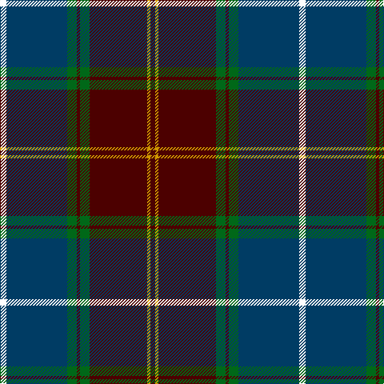

In pattern [BYBGBGBW](/stripes/bybgbgbw/).

This was sourced from register-of-tartans.  It is a [8 stripe tartan](/stripes/stripes8/).

Original link https://www.tartanregister.gov.uk/tartanDetails.aspx?ref=3677

## Register references

External register numbers recorded for this tartan.

- Scottish Register of Tartans: [3677](https://www.tartanregister.gov.uk/tartanDetails.aspx?ref=3677)
- Scottish Tartans Authority (ITI): 2514
- Scottish Tartans World Register: 2514

## Thread count
W/8 DB76 G12 DR4 G12 DR72 DY4 DR/6

## Palette
Each colour and the base-6 reference it is a variant of.

| Colour | Shade | Base |
|---|---|---|
| DB | <code style="background-color:#003C64;">#003C64</code> `oklch(34.5% 0.089 246.0)` <small>#003C64</small> | B <code style="background-color:#2A418A;">#2A418A</code> |
| DR | <code style="background-color:#4C0000;">#4C0000</code> `oklch(26.2% 0.107 29.2)` <small>#4C0000</small> | B <code style="background-color:#2A418A;">#2A418A</code> |
| DY | <code style="background-color:#D09800;">#D09800</code> `oklch(71.4% 0.147 82.1)` <small>#D09800</small> | Y <code style="background-color:#F2BF00;">#F2BF00</code> |
| G | <code style="background-color:#006818;">#006818</code> `oklch(45.0% 0.142 145.0)` <small>#006818</small> | G <code style="background-color:#006100;">#006100</code> |
| W | <code style="background-color:#FFFFFF;">#FFFFFF</code> `oklch(100.0% 0.000 89.9)` <small>#FFFFFF</small> | W <code style="background-color:#F7F7F7;">#F7F7F7</code> |

# Sample pattern

## Nearest tartans

The nearest existing variants by ΔTartan distance.

1. [Scotland 2000 (Commemorative)](/setts/s8/lb4dt38g6dr2g6dr36lo2dr3~x2/) — ΔT 0.62
1. [21st Century (Fashion)](/setts/s8/w4dt38g6r2g6r38lo2r3~x2/) — ΔT 0.79
1. [Singh](/setts/s8/dp3r3dp34g18lo2g18lb2r3~x2/) — ΔT 0.95
1. [Milne-Murtagh (2009)](/setts/s7/m5y2k30y26y2y2k4~x2/) — ΔT 1.01
1. [Milne-Murtaugh (Personal)](/setts/s7/r5t2k30n26ly2n2db4~x2/) — ΔT 1.06
1. [New Hampshire](/setts/s11/g28k1g1k6w1k6dp1k1dp4r3dp14~x4/) — ΔT 1.10
1. [Kormylo (Personal)](/setts/s12/w2db2r18db2dg20r2db40r2dg12db3r9ly2~x2/) — ΔT 1.11
1. [Bennett, J P. (Personal)](/setts/s7/r2y18k2y3k20dy30w2~x2/) — ΔT 1.12
1. [Scottish Association for Neurological Sciences](/setts/s9/db46ly4db4ly4db6k16n66lb11r6/) — ΔT 1.15
1. [Ware/Warr (Name)](/setts/s8/b9w2dg30o6r2o2r2o6~x2/) — ΔT 1.15

## Neighbour map

Every grey dot is one of 14299 variants placed by the first two principal components of the ΔTartan feature space (44% of its variance). Red is this tartan; blue dots are its nearest — click one to open its page.

<svg viewBox="0 0 640 380" role="img" style="max-width:100%;height:auto;border:1px solid #e0e0e0;border-radius:4px;display:block" xmlns="http://www.w3.org/2000/svg"><image href="/nn/cloud.v1.png" width="640" height="380"/><a href="/setts/s8/lb4dt38g6dr2g6dr36lo2dr3~x2/"><circle cx="293.0" cy="157.0" r="4" fill="#3465a4"><title>Scotland 2000 (Commemorative)</title></circle></a><a href="/setts/s8/w4dt38g6r2g6r38lo2r3~x2/"><circle cx="291.8" cy="145.3" r="4" fill="#3465a4"><title>21st Century (Fashion)</title></circle></a><a href="/setts/s8/dp3r3dp34g18lo2g18lb2r3~x2/"><circle cx="288.4" cy="154.6" r="4" fill="#3465a4"><title>Singh</title></circle></a><a href="/setts/s7/m5y2k30y26y2y2k4~x2/"><circle cx="243.5" cy="148.3" r="4" fill="#3465a4"><title>Milne-Murtagh (2009)</title></circle></a><a href="/setts/s7/r5t2k30n26ly2n2db4~x2/"><circle cx="235.4" cy="144.2" r="4" fill="#3465a4"><title>Milne-Murtaugh (Personal)</title></circle></a><a href="/setts/s11/g28k1g1k6w1k6dp1k1dp4r3dp14~x4/"><circle cx="275.0" cy="106.5" r="4" fill="#3465a4"><title>New Hampshire</title></circle></a><a href="/setts/s12/w2db2r18db2dg20r2db40r2dg12db3r9ly2~x2/"><circle cx="249.3" cy="120.2" r="4" fill="#3465a4"><title>Kormylo (Personal)</title></circle></a><a href="/setts/s7/r2y18k2y3k20dy30w2~x2/"><circle cx="232.2" cy="172.4" r="4" fill="#3465a4"><title>Bennett, J P. (Personal)</title></circle></a><a href="/setts/s9/db46ly4db4ly4db6k16n66lb11r6/"><circle cx="216.1" cy="127.9" r="4" fill="#3465a4"><title>Scottish Association for Neurological Sciences</title></circle></a><a href="/setts/s8/b9w2dg30o6r2o2r2o6~x2/"><circle cx="277.2" cy="144.8" r="4" fill="#3465a4"><title>Ware/Warr (Name)</title></circle></a><circle cx="274.6" cy="147.4" r="5" fill="#c00000"/></svg>

ID: /setts/s8/w4dt38g6dr2g6dr36lo2dr3~x2/
