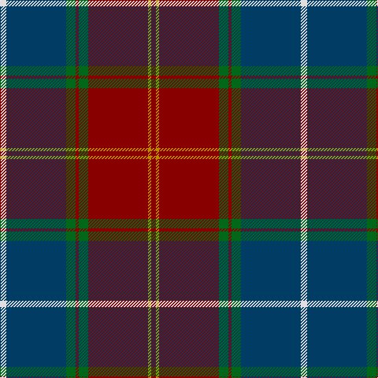

In pattern [RYRGRGBW](/stripes/ryrgrgbw/).

This was sourced from tartans-authority.  It is a [8 stripe tartan](/stripes/stripes8/).

Original link http://www.tartansauthority.com/tartan-ferret/display/6410/

## Thread count
LN/8 DB76 G12 DR4 G12 DR76 DY4 DR/6

## Palette
Each colour and its ΔE from the base-6 reference it is a variant of.

| Colour | Shade | Base | ΔE (OKLab) |
|---|---|---|---|
| DB | <code style="background-color:#003C64;">#003C64</code> `#003C64` | B <code style="background-color:#2A418A;">#2A418A</code> | 0.08 |
| DR | <code style="background-color:#880000;">#880000</code> `#880000` | R <code style="background-color:#CC0000;">#CC0000</code> | 0.15 |
| DY | <code style="background-color:#BC8C00;">#BC8C00</code> `#BC8C00` | Y <code style="background-color:#F2BF00;">#F2BF00</code> | 0.16 |
| G | <code style="background-color:#006818;">#006818</code> `#006818` | G <code style="background-color:#006100;">#006100</code> | 0.02 |
| LN | <code style="background-color:#E0E0E0;">#E0E0E0</code> `#E0E0E0` | W <code style="background-color:#F7F7F7;">#F7F7F7</code> | 0.07 |

# Sample pattern

## Nearest tartans

The nearest existing variants by ΔTartan distance.

1. [Singh](/setts/s8/dp3r3dp34g18lo2g18lb2r3~x2/) — ΔT 0.77
1. [Scotland 2000](/setts/s8/w4dt38g6dr2g6dr36lo2dr3~x2/) — ΔT 0.79
1. [Scotland 2000 (Commemorative)](/setts/s8/lb4dt38g6dr2g6dr36lo2dr3~x2/) — ΔT 0.80
1. [Scotland 2000](/setts/s8/m5ly2m35g6m2g6db38w4~x2/) — ΔT 0.85
1. [Ormiston (Personal)](/setts/s9/dg26db3r3db20r3db3r30lb3k2~x2/) — ΔT 0.98
1. [Bennett, J P. (Personal)](/setts/s7/r2y18k2y3k20dy30w2~x2/) — ΔT 1.12
1. [Spragg, Andrew](/setts/s7/r2dg16r1r2r12ly1y1~x2/) — ΔT 1.20
1. [Kormylo (Personal)](/setts/s12/w2db2r18db2dg20r2db40r2dg12db3r9ly2~x2/) — ΔT 1.21
1. [Rattay](/setts/s9/dg71k4r4db9r4db4r36db4lr4~x2/) — ΔT 1.21
1. [Rattay](/setts/s9/dg71k4r4db9r4db4r36db4lr4/) — ΔT 1.21

## Neighbour map

Every grey dot is one of 14299 variants placed by the first two principal components of the ΔTartan feature space (44% of its variance). Red is this tartan; blue dots are its nearest — click one to open its page.

<svg viewBox="0 0 640 380" role="img" style="max-width:100%;height:auto;border:1px solid #e0e0e0;border-radius:4px;display:block" xmlns="http://www.w3.org/2000/svg"><image href="/nn/cloud.v1.png" width="640" height="380"/><a href="/setts/s8/dp3r3dp34g18lo2g18lb2r3~x2/"><circle cx="288.4" cy="154.6" r="4" fill="#3465a4"><title>Singh</title></circle></a><a href="/setts/s8/w4dt38g6dr2g6dr36lo2dr3~x2/"><circle cx="274.6" cy="147.4" r="4" fill="#3465a4"><title>Scotland 2000</title></circle></a><a href="/setts/s8/lb4dt38g6dr2g6dr36lo2dr3~x2/"><circle cx="293.0" cy="157.0" r="4" fill="#3465a4"><title>Scotland 2000 (Commemorative)</title></circle></a><a href="/setts/s8/m5ly2m35g6m2g6db38w4~x2/"><circle cx="287.4" cy="148.4" r="4" fill="#3465a4"><title>Scotland 2000</title></circle></a><a href="/setts/s9/dg26db3r3db20r3db3r30lb3k2~x2/"><circle cx="254.3" cy="164.6" r="4" fill="#3465a4"><title>Ormiston (Personal)</title></circle></a><a href="/setts/s7/r2y18k2y3k20dy30w2~x2/"><circle cx="232.2" cy="172.4" r="4" fill="#3465a4"><title>Bennett, J P. (Personal)</title></circle></a><a href="/setts/s7/r2dg16r1r2r12ly1y1~x2/"><circle cx="302.5" cy="154.1" r="4" fill="#3465a4"><title>Spragg, Andrew</title></circle></a><a href="/setts/s12/w2db2r18db2dg20r2db40r2dg12db3r9ly2~x2/"><circle cx="249.3" cy="120.2" r="4" fill="#3465a4"><title>Kormylo (Personal)</title></circle></a><a href="/setts/s9/dg71k4r4db9r4db4r36db4lr4~x2/"><circle cx="320.2" cy="132.4" r="4" fill="#3465a4"><title>Rattay</title></circle></a><a href="/setts/s9/dg71k4r4db9r4db4r36db4lr4/"><circle cx="320.2" cy="132.4" r="4" fill="#3465a4"><title>Rattay</title></circle></a><circle cx="291.8" cy="145.3" r="5" fill="#c00000"/></svg>

ID: /setts/s8/w4dt38g6r2g6r38lo2r3~x2/
