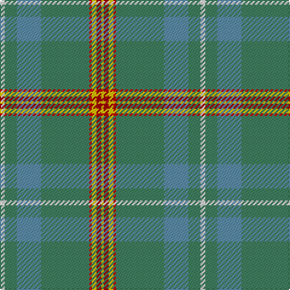

In pattern [WGBGRYRY](/patterns/wgbgryry/).

This was sourced from tartans-authority.  It is a [8 stripes tartan](/stripes/stripes8/).

Original link http://www.tartansauthority.com/tartan-ferret/display/1799/

## Attestations

This cloth appears in 2 source records; the oldest owns this page.

- 1961 — Muskoka (District) (tartans-authority, [record](http://www.tartansauthority.com/tartan-ferret/display/1799/))
- 01/01/1963 — Muskoka (register-of-tartans, [record](https://www.tartanregister.gov.uk/tartanDetails.aspx?ref=3083))

## Thread count
LN/4 G10 B20 G40 R2 Y4 DR4 Y/2

## Palette
Each colour and its ΔE from the base-6 reference it is a variant of.

| Colour | Shade | Base | ΔE (OKLab) |
|---|---|---|---|
| B | <code style="background-color:#5C8CA8;">#5C8CA8</code> `#5C8CA8` | B <code style="background-color:#2A418A;">#2A418A</code> | 0.23 |
| DR | <code style="background-color:#A00000;">#A00000</code> `#A00000` | R <code style="background-color:#CC0000;">#CC0000</code> | 0.09 |
| G | <code style="background-color:#408060;">#408060</code> `#408060` | G <code style="background-color:#006100;">#006100</code> | 0.14 |
| LN | <code style="background-color:#E0E0E0;">#E0E0E0</code> `#E0E0E0` | W <code style="background-color:#F7F7F7;">#F7F7F7</code> | 0.07 |
| R | <code style="background-color:#C80000;">#C80000</code> `#C80000` | R <code style="background-color:#CC0000;">#CC0000</code> | 0.01 |
| Y | <code style="background-color:#E8C000;">#E8C000</code> `#E8C000` | Y <code style="background-color:#F2BF00;">#F2BF00</code> | 0.02 |

# Sample pattern

## Nearest tartans

The nearest existing variants by ΔTartan distance.

1. [Glasgow High (School)](/setts/s8/g12y6b84w8ga36y4b24r6-b506878-g604000-ga006038-rc8002c-we0e0e0-ye8c000/) — ΔT 0.92
1. [Canuck Place](/setts/s9/w2b4y30b6y52r48y6ra4ya2-b1c1c50-r9c8098-ra901c38-we0e0e0-y889c5c-yabc8c00/) — ΔT 0.98
1. [Sheffield, City of (District)](/setts/s8/g124r6g6r62k8ga10b10ra6-b2888c4-g006818-ga289c18-k101010-r888888-rac80000/) — ΔT 1.25
1. [Chisholm hunting](/setts/s10/r12w2r48b12g4b2g4b2g24ra2-b304080-g008000-r806050-rac00000-we0e0e0/) — ΔT 1.47
1. [Nickel Lodge, Centennial](/setts/s9/g36y2g4y2g4b12w8r2ga12-b304080-g808080-ga008000-r806050-we0e0e0-yf0c000/) — ΔT 1.50
1. [Inchforth (Personal)](/setts/s9/r8g4r14b60r16b14ga10g2w4-b5c5c5c-g003820-ga006818-r888888-wfcfcfc/) — ΔT 1.59
1. [Burt #1 (Name)](/setts/s9/r4y26b16y6b66ya6b16ya26ra4-b5c649c-rb468ac-rac80000-y44ac64-yaa49058/) — ΔT 1.59
1. [Sarasota - Dunfermline (Commemorat)](/setts/s10/r4g12y4g6b8g28b72k4b6w4-b1870a4-g408060-k101010-rc80000-we0e0e0-ye8c000/) — ΔT 1.60
1. [Bressuire (District)](/setts/s7/r4g16y4g12r16b60w4-b506878-g006818-r880000-we0e0e0-ybc8c00/) — ΔT 1.62
1. [Kansai St Andrews Society (Corp)](/setts/s10/b66w4r6w4ba28ra6g30b40r4b6-b506878-ba2c2c80-g30644c-rc80000-rae87878-wfcfcfc/) — ΔT 1.69

## Neighbour map

Every grey dot is one of 15726 variants placed by the first two principal components of the ΔTartan feature space (44% of its variance). Red is this tartan; blue dots are its nearest — click one to open its page.

<svg viewBox="0 0 640 380" role="img" style="max-width:100%;height:auto;border:1px solid #e0e0e0;border-radius:4px;display:block" xmlns="http://www.w3.org/2000/svg"><image href="/nn/cloud.v1.png" width="640" height="380"/><a href="/setts/s8/g12y6b84w8ga36y4b24r6-b506878-g604000-ga006038-rc8002c-we0e0e0-ye8c000/"><circle cx="363.2" cy="144.3" r="4" fill="#3465a4"><title>Glasgow High (School)</title></circle></a><a href="/setts/s9/w2b4y30b6y52r48y6ra4ya2-b1c1c50-r9c8098-ra901c38-we0e0e0-y889c5c-yabc8c00/"><circle cx="380.6" cy="131.2" r="4" fill="#3465a4"><title>Canuck Place</title></circle></a><a href="/setts/s8/g124r6g6r62k8ga10b10ra6-b2888c4-g006818-ga289c18-k101010-r888888-rac80000/"><circle cx="359.7" cy="135.2" r="4" fill="#3465a4"><title>Sheffield, City of (District)</title></circle></a><a href="/setts/s10/r12w2r48b12g4b2g4b2g24ra2-b304080-g008000-r806050-rac00000-we0e0e0/"><circle cx="378.7" cy="144.4" r="4" fill="#3465a4"><title>Chisholm hunting</title></circle></a><a href="/setts/s9/g36y2g4y2g4b12w8r2ga12-b304080-g808080-ga008000-r806050-we0e0e0-yf0c000/"><circle cx="282.8" cy="126.1" r="4" fill="#3465a4"><title>Nickel Lodge, Centennial</title></circle></a><a href="/setts/s9/r8g4r14b60r16b14ga10g2w4-b5c5c5c-g003820-ga006818-r888888-wfcfcfc/"><circle cx="404.9" cy="152.2" r="4" fill="#3465a4"><title>Inchforth (Personal)</title></circle></a><a href="/setts/s9/r4y26b16y6b66ya6b16ya26ra4-b5c649c-rb468ac-rac80000-y44ac64-yaa49058/"><circle cx="368.1" cy="176.5" r="4" fill="#3465a4"><title>Burt #1 (Name)</title></circle></a><a href="/setts/s10/r4g12y4g6b8g28b72k4b6w4-b1870a4-g408060-k101010-rc80000-we0e0e0-ye8c000/"><circle cx="378.2" cy="137.7" r="4" fill="#3465a4"><title>Sarasota - Dunfermline (Commemorat)</title></circle></a><a href="/setts/s7/r4g16y4g12r16b60w4-b506878-g006818-r880000-we0e0e0-ybc8c00/"><circle cx="329.2" cy="177.1" r="4" fill="#3465a4"><title>Bressuire (District)</title></circle></a><a href="/setts/s10/b66w4r6w4ba28ra6g30b40r4b6-b506878-ba2c2c80-g30644c-rc80000-rae87878-wfcfcfc/"><circle cx="327.8" cy="149.0" r="4" fill="#3465a4"><title>Kansai St Andrews Society (Corp)</title></circle></a><circle cx="357.6" cy="145.6" r="5" fill="#c00000"/></svg>

ID: /setts/s8/w4g10b20g40r2y4ra4y2-b5c8ca8-g408060-rc80000-raa00000-we0e0e0-ye8c000/
