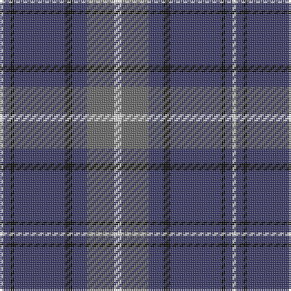

In pattern [WBKBKBGW](/patterns/wbkbkbgw/).

This was sourced from tartans-authority.  It is a [8 stripes tartan](/stripes/stripes8/).

Original link http://www.tartansauthority.com/tartan-ferret/display/7936/

## Thread count
LN/2 B4 K2 B28 K4 B8 N15 LN/4

## Palette
Each colour and its ΔE from the base-6 reference it is a variant of.

| Colour | Shade | Base | ΔE (OKLab) |
|---|---|---|---|
| B | <code style="background-color:#3C3C68;">#3C3C68</code> `#3C3C68` | B <code style="background-color:#2A418A;">#2A418A</code> | 0.06 |
| K | <code style="background-color:#101010;">#101010</code> `#101010` | K <code style="background-color:#000000;">#000000</code> | 0.17 |
| LN | <code style="background-color:#E0E0E0;">#E0E0E0</code> `#E0E0E0` | W <code style="background-color:#F7F7F7;">#F7F7F7</code> | 0.07 |
| N | <code style="background-color:#6C6C6C;">#6C6C6C</code> `#6C6C6C` | G <code style="background-color:#006100;">#006100</code> | 0.18 |

# Sample pattern

## Nearest tartans

The nearest existing variants by ΔTartan distance.

1. [Unnamed C20th - USA](/setts/s7/b2y1b18g7r7b1g1~b2c2c80-g006818-rc80000-ye8c000~x2/) — ΔT 0.77
1. [MacHardy Clan Tartan Tartan Number: 514. Earliest known date: 1906 The following is from an 1860 manuscript written by a Charles Andrew McHardy who was the Chief Constable of Dumbarton and an historian. The McHardy Tartan, for Kilting and Plaiding, according to coloured thread scale is as follows:-Warp, 6 red; 58 green; 58 blue; 4 white; 58 blue; 6 red; 6 green; 6 red; 58 blue; 4 white; 58 blue; 58 green; 6 red; 6 blue; 6 red; 58 green; 58 blue; 4 white; 58 blue; 6 red; 6 green; 6 red; 58 blue; 4 white; 58 blue; 58 green; 6 red; 6 blue; 6 red &c. The ordinary width of a web of tartan is about two feet two inches, and if made of double width the sets, as above, are to be repeated until the full width be obtained. The threads in the Woof must correspond with those in the Warp, and if this be attended to the sets and checks will be correct. The slightly smaller sett illustrated comes from Johnston book of 1906. See products available Copyright © Blair Urquhart, Comrie, 2015](/setts/s8/b3r3g18b16w2b26r3g3~b2c2c66-g006818-rc80000-we0e0e0~x2/) — ΔT 0.82
1. [Katsushika (Corporate)](/setts/s8/b22y2b1y2b10g2ga11g6~b2c2c80-g808080-ga006818-ye8c000~x2/) — ΔT 0.94
1. [Katsushika Corporate Tartan Tartan Number: 2343. Earliest known date: 1997 Designed for Katsushika Scottish country dancers from Hiroshima. See products available Copyright © Blair Urquhart, Comrie, 2015](/setts/s8/b22y2b1y2b10r2g11r6~b2c2c80-g006818-rc80000-ye8c000~x2/) — ΔT 0.97
1. [MacHardy](/setts/s8/b3r3g18b16w2b26r3g3~b304080-g008000-rc00000-we0e0e0~x2/) — ΔT 0.97
1. [Connecticut State Police PB (Cor.)](/setts/s6/b42ba2b2ba17y8ba4~b646464-ba00008c-yc88c00~x2/) — ΔT 0.99
1. [Fujisankei Serene (Corporate)](/setts/s9/r1w6b4w1b16ba1b4ba6w1~b2c2c80-ba5c5c5c-r888888-wc0c0c0~x4/) — ΔT 1.04
1. [Connaught Green](/setts/s6/r1b12g5b2g4w1~b202060-g5c6428-ra00000-wc0c0c0~x2/) — ΔT 1.04
1. [Perkins (2015)](/setts/s7/k3b10y5b29k10r6k2~b5f749c-k101010-rc80000-ye0a126~x2/) — ΔT 1.04
1. [Bedford Academy](/setts/s9/g8y4g35b2w8b2g4b21g4~b000080-g707070-w86c3e3-yeec327~x2/) — ΔT 1.06

## Neighbour map

Every grey dot is one of 15726 variants placed by the first two principal components of the ΔTartan feature space (44% of its variance). Red is this tartan; blue dots are its nearest — click one to open its page.

<svg viewBox="0 0 640 380" role="img" style="max-width:100%;height:auto;border:1px solid #e0e0e0;border-radius:4px;display:block" xmlns="http://www.w3.org/2000/svg"><image href="/nn/cloud.v1.png" width="640" height="380"/><a href="/setts/s7/b2y1b18g7r7b1g1~b2c2c80-g006818-rc80000-ye8c000~x2/"><circle cx="348.4" cy="172.5" r="4" fill="#3465a4"><title>Unnamed C20th - USA</title></circle></a><a href="/setts/s8/b3r3g18b16w2b26r3g3~b2c2c66-g006818-rc80000-we0e0e0~x2/"><circle cx="366.5" cy="200.0" r="4" fill="#3465a4"><title>MacHardy Clan Tartan Tartan Number: 514. Earliest known date: 1906 The following is from an 1860 manuscript written by a Charles Andrew McHardy who was the Chief Constable of Dumbarton and an historian. The McHardy Tartan, for Kilting and Plaiding, according to coloured thread scale is as follows:-Warp, 6 red; 58 green; 58 blue; 4 white; 58 blue; 6 red; 6 green; 6 red; 58 blue; 4 white; 58 blue; 58 green; 6 red; 6 blue; 6 red; 58 green; 58 blue; 4 white; 58 blue; 6 red; 6 green; 6 red; 58 blue; 4 white; 58 blue; 58 green; 6 red; 6 blue; 6 red &amp;c. The ordinary width of a web of tartan is about two feet two inches, and if made of double width the sets, as above, are to be repeated until the full width be obtained. The threads in the Woof must correspond with those in the Warp, and if this be attended to the sets and checks will be correct. The slightly smaller sett illustrated comes from Johnston book of 1906. See products available Copyright © Blair Urquhart, Comrie, 2015</title></circle></a><a href="/setts/s8/b22y2b1y2b10g2ga11g6~b2c2c80-g808080-ga006818-ye8c000~x2/"><circle cx="346.7" cy="171.8" r="4" fill="#3465a4"><title>Katsushika (Corporate)</title></circle></a><a href="/setts/s8/b22y2b1y2b10r2g11r6~b2c2c80-g006818-rc80000-ye8c000~x2/"><circle cx="341.7" cy="165.2" r="4" fill="#3465a4"><title>Katsushika Corporate Tartan Tartan Number: 2343. Earliest known date: 1997 Designed for Katsushika Scottish country dancers from Hiroshima. See products available Copyright © Blair Urquhart, Comrie, 2015</title></circle></a><a href="/setts/s8/b3r3g18b16w2b26r3g3~b304080-g008000-rc00000-we0e0e0~x2/"><circle cx="358.1" cy="196.6" r="4" fill="#3465a4"><title>MacHardy</title></circle></a><a href="/setts/s6/b42ba2b2ba17y8ba4~b646464-ba00008c-yc88c00~x2/"><circle cx="379.1" cy="177.4" r="4" fill="#3465a4"><title>Connecticut State Police PB (Cor.)</title></circle></a><a href="/setts/s9/r1w6b4w1b16ba1b4ba6w1~b2c2c80-ba5c5c5c-r888888-wc0c0c0~x4/"><circle cx="342.2" cy="168.2" r="4" fill="#3465a4"><title>Fujisankei Serene (Corporate)</title></circle></a><a href="/setts/s6/r1b12g5b2g4w1~b202060-g5c6428-ra00000-wc0c0c0~x2/"><circle cx="351.5" cy="217.6" r="4" fill="#3465a4"><title>Connaught Green</title></circle></a><a href="/setts/s7/k3b10y5b29k10r6k2~b5f749c-k101010-rc80000-ye0a126~x2/"><circle cx="331.9" cy="184.4" r="4" fill="#3465a4"><title>Perkins (2015)</title></circle></a><a href="/setts/s9/g8y4g35b2w8b2g4b21g4~b000080-g707070-w86c3e3-yeec327~x2/"><circle cx="334.6" cy="159.4" r="4" fill="#3465a4"><title>Bedford Academy</title></circle></a><circle cx="350.0" cy="185.2" r="5" fill="#c00000"/></svg>

ID: /setts/s8/w4g15b8k4b28k2b4w2~b3c3c68-g6c6c6c-k101010-we0e0e0/
