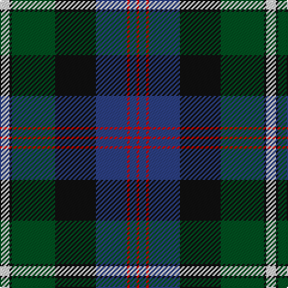

**Bands:** [RBRBKGKW](/stripes/rbrbkgkw/) · **Stripes:** [R DB R DB K DG K W](/stripes/stripes8/) R DB R DB K DG K W

This was sourced from register-of-tartans.  It is a [8 band tartan](/bands/bands8/).

Original link https://www.tartanregister.gov.uk/tartanDetails.aspx?ref=4618

## Register references

External register numbers recorded for this tartan.

- Scottish Register of Tartans: [4618](https://www.tartanregister.gov.uk/tartanDetails.aspx?ref=4618)
- Scottish Tartans World Register: 1423

## Thread count
LN/8 K2 G36 K34 B26 R2 B6 R/2

## Palette
Each colour and its ΔE from the base-6 reference it is a variant of.

| Colour | Shade | Base | ΔE (OKLab) |
|---|---|---|---|
| B | <code style="background-color:#2C4084;">#2C4084</code> `#2C4084` | B <code style="background-color:#2A418A;">#2A418A</code> | 0.01 |
| G | <code style="background-color:#005020;">#005020</code> `#005020` | G <code style="background-color:#006100;">#006100</code> | 0.07 |
| K | <code style="background-color:#101010;">#101010</code> `#101010` | K <code style="background-color:#000000;">#000000</code> | 0.17 |
| LN | <code style="background-color:#E0E0E0;">#E0E0E0</code> `#E0E0E0` | W <code style="background-color:#F7F7F7;">#F7F7F7</code> | 0.07 |
| R | <code style="background-color:#DC0000;">#DC0000</code> `#DC0000` | R <code style="background-color:#CC0000;">#CC0000</code> | 0.03 |

# Sample pattern

## Nearest tartans

The nearest existing variants by ΔTartan distance.

1. [MacCormick](/setts/s7/ly3k1db20k16g20k1w3~x2/) — ΔT 0.59
1. [Ofally, County](/setts/s10/r6db2g5db18g10db2k28db2g10lo3~x2/) — ΔT 0.70
1. [McWilliams Wedding (Personal)](/setts/s9/g2db1k1db14k2db1k12g10r2~x2/) — ΔT 0.74
1. [MacDonell of Glengarry #3](/setts/s11/db16r5db30r2k33g30r5g2r2g7w4/) — ΔT 0.79
1. [Cameron of Erracht (Clan)](/setts/s11/g8r1g1r3g16k16r1db16r3db8ly2~x2/) — ΔT 0.82
1. [Genet, Citizen (Commem)](/setts/s7/r2k9g12db8r1db1w1~x4/) — ΔT 0.84
1. [MacRae Hunting #2](/setts/s9/g14k2g4r2g4k14dp15k1w3~x2/) — ΔT 0.86
1. [Smith, Sir William (?)](/setts/s6/ly3k1g20k20db18t3~x2/) — ΔT 0.88
1. [Ferguson - 1830 of Atholl (Clan)](/setts/s7/db18k10g6r4g6k1w2~x2/) — ΔT 0.89
1. [MacWilliams Wedding Personal Tartan Tartan Number: 7667. Earliest known date: 2008 Designed by Bisell McWilliams for his wedding. Details from Matt Newsome. See products available Copyright © Blair Urquhart, Comrie, 2015](/setts/s9/g2n1k1n14k2n1k12g10r2~x2/) — ΔT 0.92

## Neighbour map

Every grey dot is one of 14313 variants placed by the first two principal components of the ΔTartan feature space (44% of its variance). Red is this tartan; blue dots are its nearest — click one to open its page.

<svg viewBox="0 0 640 380" role="img" style="max-width:100%;height:auto;border:1px solid #e0e0e0;border-radius:4px;display:block" xmlns="http://www.w3.org/2000/svg"><image href="/nn/cloud.v1.png" width="640" height="380"/><a href="/setts/s7/ly3k1db20k16g20k1w3~x2/"><circle cx="172.2" cy="160.6" r="4" fill="#3465a4"><title>MacCormick</title></circle></a><a href="/setts/s10/r6db2g5db18g10db2k28db2g10lo3~x2/"><circle cx="171.7" cy="163.8" r="4" fill="#3465a4"><title>Ofally, County</title></circle></a><a href="/setts/s9/g2db1k1db14k2db1k12g10r2~x2/"><circle cx="197.3" cy="165.8" r="4" fill="#3465a4"><title>McWilliams Wedding (Personal)</title></circle></a><a href="/setts/s11/db16r5db30r2k33g30r5g2r2g7w4/"><circle cx="182.0" cy="150.0" r="4" fill="#3465a4"><title>MacDonell of Glengarry #3</title></circle></a><a href="/setts/s11/g8r1g1r3g16k16r1db16r3db8ly2~x2/"><circle cx="175.1" cy="156.3" r="4" fill="#3465a4"><title>Cameron of Erracht (Clan)</title></circle></a><a href="/setts/s7/r2k9g12db8r1db1w1~x4/"><circle cx="170.8" cy="183.1" r="4" fill="#3465a4"><title>Genet, Citizen (Commem)</title></circle></a><a href="/setts/s9/g14k2g4r2g4k14dp15k1w3~x2/"><circle cx="183.7" cy="165.5" r="4" fill="#3465a4"><title>MacRae Hunting #2</title></circle></a><a href="/setts/s6/ly3k1g20k20db18t3~x2/"><circle cx="179.7" cy="184.0" r="4" fill="#3465a4"><title>Smith, Sir William (?)</title></circle></a><a href="/setts/s7/db18k10g6r4g6k1w2~x2/"><circle cx="189.5" cy="175.6" r="4" fill="#3465a4"><title>Ferguson - 1830 of Atholl (Clan)</title></circle></a><a href="/setts/s9/g2n1k1n14k2n1k12g10r2~x2/"><circle cx="199.6" cy="166.3" r="4" fill="#3465a4"><title>MacWilliams Wedding Personal Tartan Tartan Number: 7667. Earliest known date: 2008 Designed by Bisell McWilliams for his wedding. Details from Matt Newsome. See products available Copyright © Blair Urquhart, Comrie, 2015</title></circle></a><circle cx="179.0" cy="160.9" r="5" fill="#c00000"/></svg>

ID: /setts/s8/w4k1dg18k17db13r1db3r1~x2/
