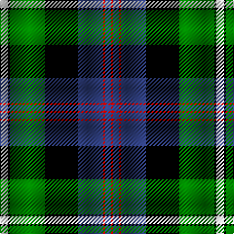

In pattern [RBRBKGKW](/patterns/rbrbkgkw/).

This was sourced from weddslist.  It is a [8 stripes tartan](/stripes/stripes8/).

Original link http://www.weddslist.com/cgi-bin/tartans/pg.pl?source=sts

## Thread count
LN/8 K2 G36 K34 B26 R2 B6 R/2

## Palette
Each colour and its ΔE from the base-6 reference it is a variant of.

| Colour | Shade | Base | ΔE (OKLab) |
|---|---|---|---|
| B | <code style="background-color:#304080;">#304080</code> `#304080` | B <code style="background-color:#2A418A;">#2A418A</code> | 0.02 |
| G | <code style="background-color:#008000;">#008000</code> `#008000` | G <code style="background-color:#006100;">#006100</code> | 0.10 |
| K | <code style="background-color:#000000;">#000000</code> `#000000` | K <code style="background-color:#000000;">#000000</code> | 0.00 |
| LN | <code style="background-color:#E0E0E0;">#E0E0E0</code> `#E0E0E0` | W <code style="background-color:#F7F7F7;">#F7F7F7</code> | 0.07 |
| R | <code style="background-color:#C00000;">#C00000</code> `#C00000` | R <code style="background-color:#CC0000;">#CC0000</code> | 0.03 |

# Sample pattern

## Nearest tartans

The nearest existing variants by ΔTartan distance.

1. [Lochaber](/setts/s8/g3r1g18k20r1b18ba1g2x4~b304080-ba5480b0-g008000-k000000-rc00000/) — ΔT 0.70
1. [Colgan, USA, Robert James](/setts/s10/r7b2g5b2k24b2g10b28g10w3x2~b304080-g30a010-k000000-rc00000-we0e0e0/) — ΔT 0.81
1. [MacDonell of Glengarry](/setts/s11/b16r5b30r2k33g30r5g2r2g7w2x2~b304080-g008000-k000000-rc00000-we0e0e0/) — ΔT 0.86
1. [Smith](/setts/s6/b3ba18k20g20k1y3x2~b5480b0-ba304080-g008000-k000000-yf0c000/) — ΔT 0.87
1. [Clerke of Ulva](/setts/s11/b3g3k4g14k4g3k14ba18r1ba4r2x2~b5480b0-ba304080-g008000-k000000-r900030/) — ΔT 0.88
1. [Cameron of Erracht](/setts/s11/g8r1g1r3g16k16r1b16r3b8y2x2~b304080-g008000-k000000-rc00000-yf0c000/) — ΔT 0.88
1. [MacCaskill](/setts/s7/k2r1g15k15b15y1k2x2~b304080-g008000-k000000-rc00000-yf0c000/) — ΔT 0.89
1. [Offally](/setts/s10/r7b2g5b18g10b2k24b2g10y3x2~b304080-g008000-k000000-r900030-yf0c000/) — ΔT 0.90
1. [Whitson](/setts/s9/w4k1g19y1k19b13r2b4r2x2~b304080-g008000-k000000-rc00000-we0e0e0-yf0c000/) — ΔT 0.92
1. [Wilson's, No 221](/setts/s6/b1ba14r2k14g14r1x2~b5480b0-ba304080-g008000-k000000-rc00000/) — ΔT 0.92

## Neighbour map

Every grey dot is one of 15726 variants placed by the first two principal components of the ΔTartan feature space (44% of its variance). Red is this tartan; blue dots are its nearest — click one to open its page.

<svg viewBox="0 0 640 380" role="img" style="max-width:100%;height:auto;border:1px solid #e0e0e0;border-radius:4px;display:block" xmlns="http://www.w3.org/2000/svg"><image href="/nn/cloud.v1.png" width="640" height="380"/><a href="/setts/s8/g3r1g18k20r1b18ba1g2x4~b304080-ba5480b0-g008000-k000000-rc00000/"><circle cx="185.5" cy="142.4" r="4" fill="#3465a4"><title>Lochaber</title></circle></a><a href="/setts/s10/r7b2g5b2k24b2g10b28g10w3x2~b304080-g30a010-k000000-rc00000-we0e0e0/"><circle cx="145.4" cy="141.7" r="4" fill="#3465a4"><title>Colgan, USA, Robert James</title></circle></a><a href="/setts/s11/b16r5b30r2k33g30r5g2r2g7w2x2~b304080-g008000-k000000-rc00000-we0e0e0/"><circle cx="154.4" cy="132.8" r="4" fill="#3465a4"><title>MacDonell of Glengarry</title></circle></a><a href="/setts/s6/b3ba18k20g20k1y3x2~b5480b0-ba304080-g008000-k000000-yf0c000/"><circle cx="144.8" cy="169.8" r="4" fill="#3465a4"><title>Smith</title></circle></a><a href="/setts/s11/b3g3k4g14k4g3k14ba18r1ba4r2x2~b5480b0-ba304080-g008000-k000000-r900030/"><circle cx="144.1" cy="142.7" r="4" fill="#3465a4"><title>Clerke of Ulva</title></circle></a><a href="/setts/s11/g8r1g1r3g16k16r1b16r3b8y2x2~b304080-g008000-k000000-rc00000-yf0c000/"><circle cx="140.6" cy="140.6" r="4" fill="#3465a4"><title>Cameron of Erracht</title></circle></a><a href="/setts/s7/k2r1g15k15b15y1k2x2~b304080-g008000-k000000-rc00000-yf0c000/"><circle cx="174.3" cy="166.9" r="4" fill="#3465a4"><title>MacCaskill</title></circle></a><a href="/setts/s10/r7b2g5b18g10b2k24b2g10y3x2~b304080-g008000-k000000-r900030-yf0c000/"><circle cx="114.8" cy="158.8" r="4" fill="#3465a4"><title>Offally</title></circle></a><a href="/setts/s9/w4k1g19y1k19b13r2b4r2x2~b304080-g008000-k000000-rc00000-we0e0e0-yf0c000/"><circle cx="116.6" cy="116.5" r="4" fill="#3465a4"><title>Whitson</title></circle></a><a href="/setts/s6/b1ba14r2k14g14r1x2~b5480b0-ba304080-g008000-k000000-rc00000/"><circle cx="138.0" cy="180.6" r="4" fill="#3465a4"><title>Wilson's, No 221</title></circle></a><circle cx="139.2" cy="143.8" r="5" fill="#c00000"/></svg>

ID: /setts/s8/w4k1g18k17b13r1b3r1x2~b304080-g008000-k000000-rc00000-we0e0e0/
