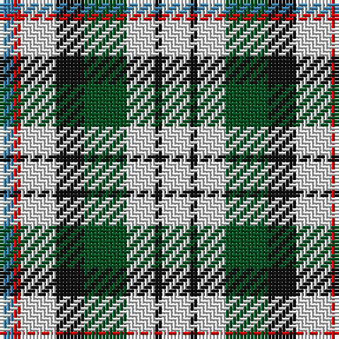

In pattern [BRWKGWKW](/patterns/brwkgwkw/).

This was sourced from register-of-tartans.  It is a [8 stripes tartan](/stripes/stripes8/).

Original link https://www.tartanregister.gov.uk/tartanDetails.aspx?ref=2419

## Thread count
B/4 R2 LN10 K8 G12 LN8 K2 LN/8

## Palette
Each colour and its ΔE from the base-6 reference it is a variant of.

| Colour | Shade | Base | ΔE (OKLab) |
|---|---|---|---|
| B | <code style="background-color:#3C82AF;">#3C82AF</code> `#3C82AF` | B <code style="background-color:#2A418A;">#2A418A</code> | 0.19 |
| G | <code style="background-color:#005020;">#005020</code> `#005020` | G <code style="background-color:#006100;">#006100</code> | 0.07 |
| K | <code style="background-color:#101010;">#101010</code> `#101010` | K <code style="background-color:#000000;">#000000</code> | 0.17 |
| LN | <code style="background-color:#E0E0E0;">#E0E0E0</code> `#E0E0E0` | W <code style="background-color:#F7F7F7;">#F7F7F7</code> | 0.07 |
| R | <code style="background-color:#DC0000;">#DC0000</code> `#DC0000` | R <code style="background-color:#CC0000;">#CC0000</code> | 0.03 |

# Sample pattern

## Nearest tartans

The nearest existing variants by ΔTartan distance.

1. [MacDuff, dress](/setts/s8/w4k1w4g6k4w5r1b2~b5480b0-g008000-k000000-rc00000-we0e0e0~x2/) — ΔT 0.39
1. [MacLaren Albino (Dance)](/setts/s8/w8b2k6g2w3r2w6y4~b00008c-g004c00-k000000-ra83000-wc8c8c8-yc89800~x4/) — ΔT 1.19
1. [MacLaren](/setts/s8/w16b4k12g4w6y4w11ya7~b304080-g008000-k000000-we0e0e0-yff8500-yaf0c000~x2/) — ΔT 1.26
1. [MacLaren Dress (Dance)](/setts/s8/w16b4k12g4w6y4w11ya7~b2c2c80-g285800-k101010-we0e0e0-yd87c00-yae8c000~x2/) — ΔT 1.27
1. [Game Fair (Corporate)](/setts/s7/g3b12g12w12g2w12g3~b1870a4-g003820-we0e0e0~x2/) — ΔT 1.28
1. [Ship Hector](/setts/s8/k4b9y6b22g4w20g6w4~b304080-g008000-k000000-we0e0e0-yf0c000/) — ΔT 1.30
1. [MacLaren (D.C Dalgliesh version)](/setts/s8/w16b4k12g4w6r4w11y7~b2c4084-g005020-k101010-rfa4b00-we0e0e0-ye8c000~x2/) — ΔT 1.30
1. [Ship Hector, The (Commemorative)](/setts/s8/k3b10y5b16g3w16g5w3~b2c2c80-g006818-k101010-wfcfcfc-yfccc00~x2/) — ΔT 1.32
1. [Mitsukoshi (Corporate)](/setts/s8/w12k3wa3k3w13b6k17r3~b5c8ca8-k101010-rc80000-wc0c0c0-wae8ccb8~x2/) — ΔT 1.33
1. [Kremlin Zoria](/setts/s11/w5g2w5b5r2b5g11y2g11b5r2~b2c2c80-g347c3c-rc80000-we0e0e0-yb8ac30~x4/) — ΔT 1.39

## Neighbour map

Every grey dot is one of 15726 variants placed by the first two principal components of the ΔTartan feature space (44% of its variance). Red is this tartan; blue dots are its nearest — click one to open its page.

<svg viewBox="0 0 640 380" role="img" style="max-width:100%;height:auto;border:1px solid #e0e0e0;border-radius:4px;display:block" xmlns="http://www.w3.org/2000/svg"><image href="/nn/cloud.v1.png" width="640" height="380"/><a href="/setts/s8/w4k1w4g6k4w5r1b2~b5480b0-g008000-k000000-rc00000-we0e0e0~x2/"><circle cx="110.9" cy="207.0" r="4" fill="#3465a4"><title>MacDuff, dress</title></circle></a><a href="/setts/s8/w8b2k6g2w3r2w6y4~b00008c-g004c00-k000000-ra83000-wc8c8c8-yc89800~x4/"><circle cx="98.7" cy="204.4" r="4" fill="#3465a4"><title>MacLaren Albino (Dance)</title></circle></a><a href="/setts/s8/w16b4k12g4w6y4w11ya7~b304080-g008000-k000000-we0e0e0-yff8500-yaf0c000~x2/"><circle cx="93.6" cy="198.1" r="4" fill="#3465a4"><title>MacLaren</title></circle></a><a href="/setts/s8/w16b4k12g4w6y4w11ya7~b2c2c80-g285800-k101010-we0e0e0-yd87c00-yae8c000~x2/"><circle cx="100.2" cy="199.8" r="4" fill="#3465a4"><title>MacLaren Dress (Dance)</title></circle></a><a href="/setts/s7/g3b12g12w12g2w12g3~b1870a4-g003820-we0e0e0~x2/"><circle cx="83.8" cy="194.3" r="4" fill="#3465a4"><title>Game Fair (Corporate)</title></circle></a><a href="/setts/s8/k4b9y6b22g4w20g6w4~b304080-g008000-k000000-we0e0e0-yf0c000/"><circle cx="112.1" cy="190.1" r="4" fill="#3465a4"><title>Ship Hector</title></circle></a><a href="/setts/s8/w16b4k12g4w6r4w11y7~b2c4084-g005020-k101010-rfa4b00-we0e0e0-ye8c000~x2/"><circle cx="100.7" cy="199.2" r="4" fill="#3465a4"><title>MacLaren (D.C Dalgliesh version)</title></circle></a><a href="/setts/s8/k3b10y5b16g3w16g5w3~b2c2c80-g006818-k101010-wfcfcfc-yfccc00~x2/"><circle cx="106.7" cy="192.1" r="4" fill="#3465a4"><title>Ship Hector, The (Commemorative)</title></circle></a><a href="/setts/s8/w12k3wa3k3w13b6k17r3~b5c8ca8-k101010-rc80000-wc0c0c0-wae8ccb8~x2/"><circle cx="128.8" cy="193.0" r="4" fill="#3465a4"><title>Mitsukoshi (Corporate)</title></circle></a><a href="/setts/s11/w5g2w5b5r2b5g11y2g11b5r2~b2c2c80-g347c3c-rc80000-we0e0e0-yb8ac30~x4/"><circle cx="125.4" cy="198.0" r="4" fill="#3465a4"><title>Kremlin Zoria</title></circle></a><circle cx="117.8" cy="208.4" r="5" fill="#c00000"/></svg>

ID: /setts/s8/w4k1w4g6k4w5r1b2~b3c82af-g005020-k101010-rdc0000-we0e0e0~x2/
