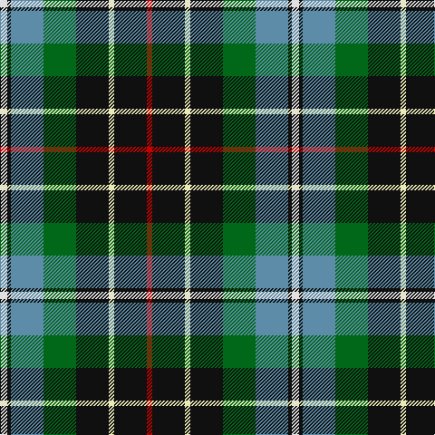

In pattern [RKWKGBKW](/patterns/rkwkgbkw/).

This was sourced from tartans-authority.  It is a [8 stripes tartan](/stripes/stripes8/).

Original link http://www.tartansauthority.com/tartan-ferret/display/2137/

## Thread count
LN/8 K4 B36 G36 K36 W6 K36 R/6

## Palette
Each colour and its ΔE from the base-6 reference it is a variant of.

| Colour | Shade | Base | ΔE (OKLab) |
|---|---|---|---|
| B | <code style="background-color:#5C8CA8;">#5C8CA8</code> `#5C8CA8` | B <code style="background-color:#2A418A;">#2A418A</code> | 0.23 |
| G | <code style="background-color:#006818;">#006818</code> `#006818` | G <code style="background-color:#006100;">#006100</code> | 0.02 |
| K | <code style="background-color:#101010;">#101010</code> `#101010` | K <code style="background-color:#000000;">#000000</code> | 0.17 |
| LN | <code style="background-color:#E0E0E0;">#E0E0E0</code> `#E0E0E0` | W <code style="background-color:#F7F7F7;">#F7F7F7</code> | 0.07 |
| R | <code style="background-color:#C80000;">#C80000</code> `#C80000` | R <code style="background-color:#CC0000;">#CC0000</code> | 0.01 |
| W | <code style="background-color:#E8E8B8;">#E8E8B8</code> `#E8E8B8` | W <code style="background-color:#F7F7F7;">#F7F7F7</code> | 0.08 |

# Sample pattern

## Nearest tartans

The nearest existing variants by ΔTartan distance.

1. [Wilson's, No 225](/setts/s9/g16ga2b13ba2k6y2g16ba2k12x2~b800080-ba5480b0-g008000-ga30a010-k000000-yf0c000/) — ΔT 0.69
1. [Hislop Family Tartan Tartan Number: 2135. Earliest known date: 1992 Based on the Brodie tartan which Mr Hislop, who commissioned the design, remembered being worn by his grandfather. Other elements in the sett come from the tartans of the families in the district around Hawick which is associated with the Hislop name. The Hyslop spelling is known further west in Galloway and SW Scotland. See products available Copyright © Blair Urquhart, Comrie, 2015](/setts/s8/r2k8y1k8g8b8k2w2x2~b202060-g006818-k101010-rc80000-we0e0e0-ye8c000/) — ΔT 0.95
1. [Quinn](/setts/s9/r1b8k4g1g4g1k4b8y1x6~b606080-g407050-k000000-r800000-yf0c000/) — ΔT 0.97
1. [Bisset](/setts/s9/r9g18k6g6k3y3g6b8w3x2~b000048-g408060-k000000-rc80000-we0e0e0-yfcb000/) — ΔT 0.97
1. [Unnamed 4](/setts/s10/k6g14b2r3b2k16y2ba16g16r3x2~b5480b0-ba8080d0-g008000-k000000-rc00000-yf0c000/) — ΔT 1.02
1. [Ayrshire (District)](/setts/s8/b2r1b10w1g4ga8y1ga2x4~b1c0070-g785000-ga30ac38-r880000-we0e0e0-ybc8c00/) — ΔT 1.02
1. [Unidentified #37](/setts/s10/k6g14b2r3b2k16y2ba16g16r3x2~b3c82af-ba0596fa-g005020-k101010-rdc0000-ye8c000/) — ΔT 1.04
1. [Loch Lomond Millenium Comemmorative Tartan Tartan Number: 2520. Earliest known date: 2002 Designed by Claire Donaldson of the House of Edgar. The application states that it is restricted to H of E by copyright. However, the fabric is produced by Lochcarron. See products available Copyright © Blair Urquhart, Comrie, 2015](/setts/s11/k3g2k12b4ga19r3ga19b4k12g2y3x2~b1c0070-g0098a0-ga408060-k101010-r880000-ye8c000/) — ΔT 1.05
1. [Carleton College Rugby](/setts/s6/r5b30w3g15y8ra4x2~b003c64-g004c00-rb07430-rac80000-wf8f8f8-yfccc00/) — ΔT 1.05
1. [Hislop Hunting (Name)](/setts/s11/r2b8g9k2w3k1y1k7y2k8r2x2~b202060-g006818-k101010-rc80000-wfcfcfc-ye8c000/) — ΔT 1.07

## Neighbour map

Every grey dot is one of 15726 variants placed by the first two principal components of the ΔTartan feature space (44% of its variance). Red is this tartan; blue dots are its nearest — click one to open its page.

<svg viewBox="0 0 640 380" role="img" style="max-width:100%;height:auto;border:1px solid #e0e0e0;border-radius:4px;display:block" xmlns="http://www.w3.org/2000/svg"><image href="/nn/cloud.v1.png" width="640" height="380"/><a href="/setts/s9/g16ga2b13ba2k6y2g16ba2k12x2~b800080-ba5480b0-g008000-ga30a010-k000000-yf0c000/"><circle cx="131.6" cy="169.0" r="4" fill="#3465a4"><title>Wilson's, No 225</title></circle></a><a href="/setts/s8/r2k8y1k8g8b8k2w2x2~b202060-g006818-k101010-rc80000-we0e0e0-ye8c000/"><circle cx="153.2" cy="195.0" r="4" fill="#3465a4"><title>Hislop Family Tartan Tartan Number: 2135. Earliest known date: 1992 Based on the Brodie tartan which Mr Hislop, who commissioned the design, remembered being worn by his grandfather. Other elements in the sett come from the tartans of the families in the district around Hawick which is associated with the Hislop name. The Hyslop spelling is known further west in Galloway and SW Scotland. See products available Copyright © Blair Urquhart, Comrie, 2015</title></circle></a><a href="/setts/s9/r1b8k4g1g4g1k4b8y1x6~b606080-g407050-k000000-r800000-yf0c000/"><circle cx="177.5" cy="173.1" r="4" fill="#3465a4"><title>Quinn</title></circle></a><a href="/setts/s9/r9g18k6g6k3y3g6b8w3x2~b000048-g408060-k000000-rc80000-we0e0e0-yfcb000/"><circle cx="120.9" cy="183.9" r="4" fill="#3465a4"><title>Bisset</title></circle></a><a href="/setts/s10/k6g14b2r3b2k16y2ba16g16r3x2~b5480b0-ba8080d0-g008000-k000000-rc00000-yf0c000/"><circle cx="88.4" cy="156.8" r="4" fill="#3465a4"><title>Unnamed 4</title></circle></a><a href="/setts/s8/b2r1b10w1g4ga8y1ga2x4~b1c0070-g785000-ga30ac38-r880000-we0e0e0-ybc8c00/"><circle cx="149.3" cy="152.6" r="4" fill="#3465a4"><title>Ayrshire (District)</title></circle></a><a href="/setts/s10/k6g14b2r3b2k16y2ba16g16r3x2~b3c82af-ba0596fa-g005020-k101010-rdc0000-ye8c000/"><circle cx="109.7" cy="166.2" r="4" fill="#3465a4"><title>Unidentified #37</title></circle></a><a href="/setts/s11/k3g2k12b4ga19r3ga19b4k12g2y3x2~b1c0070-g0098a0-ga408060-k101010-r880000-ye8c000/"><circle cx="177.5" cy="156.1" r="4" fill="#3465a4"><title>Loch Lomond Millenium Comemmorative Tartan Tartan Number: 2520. Earliest known date: 2002 Designed by Claire Donaldson of the House of Edgar. The application states that it is restricted to H of E by copyright. However, the fabric is produced by Lochcarron. See products available Copyright © Blair Urquhart, Comrie, 2015</title></circle></a><a href="/setts/s6/r5b30w3g15y8ra4x2~b003c64-g004c00-rb07430-rac80000-wf8f8f8-yfccc00/"><circle cx="169.0" cy="167.5" r="4" fill="#3465a4"><title>Carleton College Rugby</title></circle></a><a href="/setts/s11/r2b8g9k2w3k1y1k7y2k8r2x2~b202060-g006818-k101010-rc80000-wfcfcfc-ye8c000/"><circle cx="102.1" cy="153.9" r="4" fill="#3465a4"><title>Hislop Hunting (Name)</title></circle></a><circle cx="142.5" cy="174.8" r="5" fill="#c00000"/></svg>

ID: /setts/s8/w4k2b18g18k18wa3k18r3x2~b5c8ca8-g006818-k101010-rc80000-we0e0e0-wae8e8b8/
