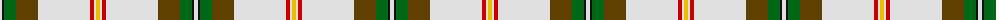
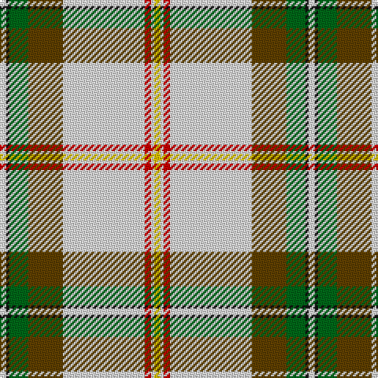

In pattern [WKGGWRWY](/patterns/wkggwrwy/).

This was sourced from tartans-authority.  It is a [8 stripes tartan](/stripes/stripes8/).

Original link http://www.tartansauthority.com/tartan-ferret/display/7696/

## Attestations

This cloth appears in 2 source records; the oldest owns this page.

- 1977 — Saskatchewan Dress (Dance) (tartans-authority, [record](http://www.tartansauthority.com/tartan-ferret/display/7696/))
- undated — Saskatchewan Dress (register-of-tartans, [record](https://www.tartanregister.gov.uk/tartanDetails.aspx?ref=5693))

## Thread count
LN/4 K2 G12 T22 LN52 R4 LN2 Y/4

## Palette
Each colour and its ΔE from the base-6 reference it is a variant of.

| Colour | Shade | Base | ΔE (OKLab) |
|---|---|---|---|
| G | <code style="background-color:#006818;">#006818</code> `#006818` | G <code style="background-color:#006100;">#006100</code> | 0.02 |
| K | <code style="background-color:#101010;">#101010</code> `#101010` | K <code style="background-color:#000000;">#000000</code> | 0.17 |
| LN | <code style="background-color:#E0E0E0;">#E0E0E0</code> `#E0E0E0` | W <code style="background-color:#F7F7F7;">#F7F7F7</code> | 0.07 |
| R | <code style="background-color:#C80000;">#C80000</code> `#C80000` | R <code style="background-color:#CC0000;">#CC0000</code> | 0.01 |
| T | <code style="background-color:#604000;">#604000</code> `#604000` | G <code style="background-color:#006100;">#006100</code> | 0.14 |
| Y | <code style="background-color:#E8C000;">#E8C000</code> `#E8C000` | Y <code style="background-color:#F2BF00;">#F2BF00</code> | 0.02 |

# Sample pattern

## Nearest tartans

The nearest existing variants by ΔTartan distance.

1. [McAleavy (2014)](/setts/s11/g112y12w12ya4wa4ya4wa32y20wa4g12r6-g5c6428-ra00000-wf8f4d0-waffffff-ya0a0a0-yaf8e38c/) — ΔT 1.14
1. [Nimah, Carissa & Bassem (Personal)](/setts/s7/w100g30b20r4b20ga16y6-b202060-g048888-ga146400-rdc0000-wf8f4d0-yffff00/) — ΔT 1.15
1. [Australian, dress](/setts/s9/w100r8y4k4y4r8y20r30b4-b5480b0-k000000-r806050-we0e0e0-yd08010/) — ΔT 1.28
1. [McAleavy (2014)](/setts/s11/g112w12y12ya4wa4ya4wa32w20wa4g12r6-g606000-rc80000-wc0c0c0-wafcfcfc-yc4bc68-yafccc00/) — ΔT 1.28
1. [Strathyre Dress (Dance)](/setts/s10/w110g24r4g6w4ga20b18g4b12w4-b780078-g285800-ga006818-rc80000-wf8f8f8/) — ΔT 1.29
1. [Highland Burn (Fashion)](/setts/s8/y20g2k4b4k36b2w90b2-b1474b4-g005430-k101010-we0e0e0-ya08858/) — ΔT 1.30
1. [Unidentified #54](/setts/s12/w96r8w12g4y4g4w4g24ra24b4ra8w4-b3474fc-g502814-r8c0000-ra8c6428-wc8c8c8-yc89800/) — ΔT 1.30
1. [Scotland the Brave Dress (Dance)](/setts/s10/w12k4w80b4ba24g24r12g4r4g8-b780078-ba2c2c80-g006818-k101010-rb468ac-wf8f8f8/) — ΔT 1.34
1. [Rothesay, Duke of](/setts/s11/r4w56b8w4k12w4g14r8k2r4w2-b304080-g008000-k000000-rc00000-we0e0e0/) — ΔT 1.37
1. [Glenmore Green](/setts/s11/w76k20b4k6w4k6g16r6k4r6w4-b441800-g5c6428-k101010-ra07c58-wf0f0d8/) — ΔT 1.41

## Neighbour map

Every grey dot is one of 15726 variants placed by the first two principal components of the ΔTartan feature space (44% of its variance). Red is this tartan; blue dots are its nearest — click one to open its page.

<svg viewBox="0 0 640 380" role="img" style="max-width:100%;height:auto;border:1px solid #e0e0e0;border-radius:4px;display:block" xmlns="http://www.w3.org/2000/svg"><image href="/nn/cloud.v1.png" width="640" height="380"/><a href="/setts/s11/g112y12w12ya4wa4ya4wa32y20wa4g12r6-g5c6428-ra00000-wf8f4d0-waffffff-ya0a0a0-yaf8e38c/"><circle cx="289.1" cy="60.1" r="4" fill="#3465a4"><title>McAleavy (2014)</title></circle></a><a href="/setts/s7/w100g30b20r4b20ga16y6-b202060-g048888-ga146400-rdc0000-wf8f4d0-yffff00/"><circle cx="215.8" cy="91.7" r="4" fill="#3465a4"><title>Nimah, Carissa &amp; Bassem (Personal)</title></circle></a><a href="/setts/s9/w100r8y4k4y4r8y20r30b4-b5480b0-k000000-r806050-we0e0e0-yd08010/"><circle cx="316.4" cy="84.6" r="4" fill="#3465a4"><title>Australian, dress</title></circle></a><a href="/setts/s11/g112w12y12ya4wa4ya4wa32w20wa4g12r6-g606000-rc80000-wc0c0c0-wafcfcfc-yc4bc68-yafccc00/"><circle cx="290.3" cy="59.6" r="4" fill="#3465a4"><title>McAleavy (2014)</title></circle></a><a href="/setts/s10/w110g24r4g6w4ga20b18g4b12w4-b780078-g285800-ga006818-rc80000-wf8f8f8/"><circle cx="292.6" cy="64.9" r="4" fill="#3465a4"><title>Strathyre Dress (Dance)</title></circle></a><a href="/setts/s8/y20g2k4b4k36b2w90b2-b1474b4-g005430-k101010-we0e0e0-ya08858/"><circle cx="295.6" cy="48.2" r="4" fill="#3465a4"><title>Highland Burn (Fashion)</title></circle></a><a href="/setts/s12/w96r8w12g4y4g4w4g24ra24b4ra8w4-b3474fc-g502814-r8c0000-ra8c6428-wc8c8c8-yc89800/"><circle cx="315.0" cy="58.6" r="4" fill="#3465a4"><title>Unidentified #54</title></circle></a><a href="/setts/s10/w12k4w80b4ba24g24r12g4r4g8-b780078-ba2c2c80-g006818-k101010-rb468ac-wf8f8f8/"><circle cx="218.4" cy="73.4" r="4" fill="#3465a4"><title>Scotland the Brave Dress (Dance)</title></circle></a><a href="/setts/s11/r4w56b8w4k12w4g14r8k2r4w2-b304080-g008000-k000000-rc00000-we0e0e0/"><circle cx="272.7" cy="66.0" r="4" fill="#3465a4"><title>Rothesay, Duke of</title></circle></a><a href="/setts/s11/w76k20b4k6w4k6g16r6k4r6w4-b441800-g5c6428-k101010-ra07c58-wf0f0d8/"><circle cx="263.8" cy="76.2" r="4" fill="#3465a4"><title>Glenmore Green</title></circle></a><circle cx="279.0" cy="78.0" r="5" fill="#c00000"/></svg>

ID: /setts/s8/w4k2g12ga22w52r4w2y4-g006818-ga604000-k101010-rc80000-we0e0e0-ye8c000/
