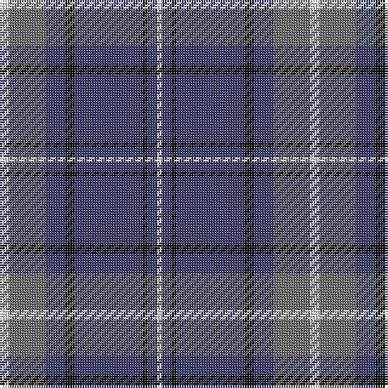

**Bands:** [WGBKBKBW](/stripes/wgbkbkbw/) · **Stripes:** [W Y DB K DB K DB W](/stripes/stripes8/) W Y DB K DB K DB W

This was sourced from tartans-authority.  It is a [8 band tartan](/bands/bands8/).

Original link http://www.tartansauthority.com/tartan-ferret/display/7936/

## Thread count
LN/4 N15 B8 K4 B28 K2 B4 LN/2

## Palette
Each colour and its ΔE from the base-6 reference it is a variant of.

| Colour | Shade | Base | ΔE (OKLab) |
|---|---|---|---|
| B | <code style="background-color:#3C3C68;">#3C3C68</code> `#3C3C68` | B <code style="background-color:#2A418A;">#2A418A</code> | 0.06 |
| K | <code style="background-color:#101010;">#101010</code> `#101010` | K <code style="background-color:#000000;">#000000</code> | 0.17 |
| LN | <code style="background-color:#E0E0E0;">#E0E0E0</code> `#E0E0E0` | W <code style="background-color:#F7F7F7;">#F7F7F7</code> | 0.07 |
| N | <code style="background-color:#6C6C6C;">#6C6C6C</code> `#6C6C6C` | G <code style="background-color:#006100;">#006100</code> | 0.18 |

# Sample pattern

## Nearest tartans

The nearest existing variants by ΔTartan distance.

1. [Unnamed C20th - USA](/setts/s7/db2ly1db18g7r7db1g1~x2/) — ΔT 0.77
1. [Katsushika (Corporate)](/setts/s8/db22ly2db1ly2db10y2g11y6~x2/) — ΔT 0.94
1. [MacHardy](/setts/s8/db3r3g18db16w2db26r3g3~x2/) — ΔT 0.98
1. [Connecticut State Police PB (Cor.)](/setts/s6/n42db2n2db17lo8db4~x2/) — ΔT 1.00
1. [Fujisankei Serene (Corporate)](/setts/s9/o1lb6db4lb1db16n1db4n6lb1~x4/) — ΔT 1.04
1. [Perkins (2015)](/setts/s7/k3t10lo5t29k10r6k2~x2/) — ΔT 1.04
1. [Connaught Green](/setts/s6/r1db12y5db2y4lb1~x2/) — ΔT 1.04
1. [Katsushika Scottish Country Dancers](/setts/s8/db22ly2db1ly2db10r2g11r6~x2/) — ΔT 1.06
1. [Bedford Academy](/setts/s9/y8ly4y35db2lt8db2y4db21y4~x2/) — ΔT 1.06
1. [Bedford Academy (Corporate)](/setts/s9/o8ly4o35db2t8db2o4db21o4~x2/) — ΔT 1.06

## Neighbour map

Every grey dot is one of 14299 variants placed by the first two principal components of the ΔTartan feature space (44% of its variance). Red is this tartan; blue dots are its nearest — click one to open its page.

<svg viewBox="0 0 640 380" role="img" style="max-width:100%;height:auto;border:1px solid #e0e0e0;border-radius:4px;display:block" xmlns="http://www.w3.org/2000/svg"><image href="/nn/cloud.v1.png" width="640" height="380"/><a href="/setts/s7/db2ly1db18g7r7db1g1~x2/"><circle cx="350.5" cy="172.9" r="4" fill="#3465a4"><title>Unnamed C20th - USA</title></circle></a><a href="/setts/s8/db22ly2db1ly2db10y2g11y6~x2/"><circle cx="349.4" cy="173.1" r="4" fill="#3465a4"><title>Katsushika (Corporate)</title></circle></a><a href="/setts/s8/db3r3g18db16w2db26r3g3~x2/"><circle cx="360.5" cy="198.1" r="4" fill="#3465a4"><title>MacHardy</title></circle></a><a href="/setts/s6/n42db2n2db17lo8db4~x2/"><circle cx="381.3" cy="179.2" r="4" fill="#3465a4"><title>Connecticut State Police PB (Cor.)</title></circle></a><a href="/setts/s9/o1lb6db4lb1db16n1db4n6lb1~x4/"><circle cx="344.8" cy="168.2" r="4" fill="#3465a4"><title>Fujisankei Serene (Corporate)</title></circle></a><a href="/setts/s7/k3t10lo5t29k10r6k2~x2/"><circle cx="333.7" cy="182.5" r="4" fill="#3465a4"><title>Perkins (2015)</title></circle></a><a href="/setts/s6/r1db12y5db2y4lb1~x2/"><circle cx="353.7" cy="219.6" r="4" fill="#3465a4"><title>Connaught Green</title></circle></a><a href="/setts/s8/db22ly2db1ly2db10r2g11r6~x2/"><circle cx="346.9" cy="166.2" r="4" fill="#3465a4"><title>Katsushika Scottish Country Dancers</title></circle></a><a href="/setts/s9/y8ly4y35db2lt8db2y4db21y4~x2/"><circle cx="337.2" cy="159.2" r="4" fill="#3465a4"><title>Bedford Academy</title></circle></a><a href="/setts/s9/o8ly4o35db2t8db2o4db21o4~x2/"><circle cx="357.7" cy="165.6" r="4" fill="#3465a4"><title>Bedford Academy (Corporate)</title></circle></a><circle cx="352.1" cy="186.6" r="5" fill="#c00000"/></svg>

ID: /setts/s8/w4y15db8k4db28k2db4w2/
