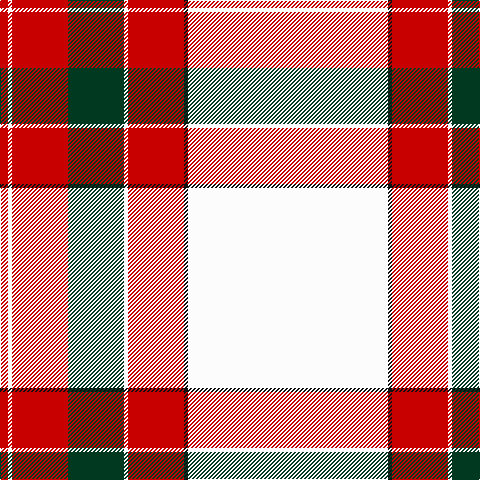

In pattern [RWRGWRKW](/stripes/rwrgwrkw/).

This was sourced from register-of-tartans.  It is a [8 stripe tartan](/stripes/stripes8/).

Original link https://www.tartanregister.gov.uk/tartanDetails.aspx?ref=5152

## Register references

External register numbers recorded for this tartan.

- Scottish Register of Tartans: [5152](https://www.tartanregister.gov.uk/tartanDetails.aspx?ref=5152)
- Scottish Tartans Authority (ITI): 3704

## Thread count
W/200 K4 R56 W4 DG56 R56 W4 R/8

## Palette
Each colour and the base-6 reference it is a variant of.

| Colour | Shade | Base |
|---|---|---|
| DG | <code style="background-color:#003820;">#003820</code> `oklch(30.0% 0.070 158.3)` <small>#003820</small> | G <code style="background-color:#006100;">#006100</code> |
| G | <code style="background-color:#006818;">#006818</code> `oklch(45.0% 0.142 145.0)` <small>#006818</small> | G <code style="background-color:#006100;">#006100</code> |
| K | <code style="background-color:#101010;">#101010</code> `oklch(17.3% 0.000 89.9)` <small>#101010</small> | K <code style="background-color:#000000;">#000000</code> |
| LN | <code style="background-color:#E0E0E0;">#E0E0E0</code> `oklch(90.7% 0.000 89.9)` <small>#E0E0E0</small> | W <code style="background-color:#F7F7F7;">#F7F7F7</code> |
| N | <code style="background-color:#C0C0C0;">#C0C0C0</code> `oklch(80.8% 0.000 89.9)` <small>#C0C0C0</small> | W <code style="background-color:#F7F7F7;">#F7F7F7</code> |
| R | <code style="background-color:#C80000;">#C80000</code> `oklch(52.3% 0.215 29.2)` <small>#C80000</small> | R <code style="background-color:#CC0000;">#CC0000</code> |
| W | <code style="background-color:#FCFCFC;">#FCFCFC</code> `oklch(99.1% 0.000 89.9)` <small>#FCFCFC</small> | W <code style="background-color:#F7F7F7;">#F7F7F7</code> |

# Sample pattern

## Nearest tartans

The nearest existing variants by ΔTartan distance.

1. [Wilsons' Blanket Pattern (Artefact)](/setts/s8/w80k2r19w2dg19r22w2r4~x2/) — ΔT 0.52
1. [Unidentified Blanket](/setts/s8/w50k1r12w1dg12r13w1r2~x2/) — ΔT 0.61
1. [Unidentified, Blanket](/setts/s8/w50k1r12w1g12r13w1r2~x2/) — ΔT 0.72
1. [Unidentified, Ross-shire](/setts/s8/w75o1r18g9o1r27w2r5~x2/) — ΔT 0.88
1. [Unidentified Ross-shire](/setts/s8/w75dy1r18dg9dy1r27w2r5~x2/) — ΔT 0.96
1. [MMK 1777](/setts/s7/w30k1r7dg7r8w1r2~x4/) — ΔT 1.02
1. [MacGregor Dress Burgundy Fancy Tartan Tartan Number: 6533. Earliest known date: 1975 A dancers tartan based on MacGregor See products available Copyright © Blair Urquhart, Comrie, 2015](/setts/s10/w52r22w6r8k1r3~x2/) — ΔT 1.15
1. [McBrayer Dress](/setts/s8/w57k1r12w1g12r14w1r2~x2/) — ΔT 1.16
1. [MacGregor Dress Red Fancy Tartan Tartan Number: 6541. Earliest known date: 1975 A Dancers tartan now woven by D C Dalgliesh of Selkirk. See products available Copyright © Blair Urquhart, Comrie, 2015](/setts/s10/w52r22w6r8k1db3~x2/) — ΔT 1.23
1. [Border Sett](/setts/s10/w75dy1r20w16r20w20g9w16g1r38~x2/) — ΔT 1.41

## Neighbour map

Every grey dot is one of 14299 variants placed by the first two principal components of the ΔTartan feature space (44% of its variance). Red is this tartan; blue dots are its nearest — click one to open its page.

<svg viewBox="0 0 640 380" role="img" style="max-width:100%;height:auto;border:1px solid #e0e0e0;border-radius:4px;display:block" xmlns="http://www.w3.org/2000/svg"><image href="/nn/cloud.v1.png" width="640" height="380"/><a href="/setts/s8/w80k2r19w2dg19r22w2r4~x2/"><circle cx="339.4" cy="76.9" r="4" fill="#3465a4"><title>Wilsons' Blanket Pattern (Artefact)</title></circle></a><a href="/setts/s8/w50k1r12w1dg12r13w1r2~x2/"><circle cx="364.5" cy="74.8" r="4" fill="#3465a4"><title>Unidentified Blanket</title></circle></a><a href="/setts/s8/w50k1r12w1g12r13w1r2~x2/"><circle cx="364.0" cy="76.7" r="4" fill="#3465a4"><title>Unidentified, Blanket</title></circle></a><a href="/setts/s8/w75o1r18g9o1r27w2r5~x2/"><circle cx="379.3" cy="75.9" r="4" fill="#3465a4"><title>Unidentified, Ross-shire</title></circle></a><a href="/setts/s8/w75dy1r18dg9dy1r27w2r5~x2/"><circle cx="380.7" cy="74.3" r="4" fill="#3465a4"><title>Unidentified Ross-shire</title></circle></a><a href="/setts/s7/w30k1r7dg7r8w1r2~x4/"><circle cx="332.2" cy="107.5" r="4" fill="#3465a4"><title>MMK 1777</title></circle></a><a href="/setts/s10/w52r22w6r8k1r3~x2/"><circle cx="331.2" cy="70.6" r="4" fill="#3465a4"><title>MacGregor Dress Burgundy Fancy Tartan Tartan Number: 6533. Earliest known date: 1975 A dancers tartan based on MacGregor See products available Copyright © Blair Urquhart, Comrie, 2015</title></circle></a><a href="/setts/s8/w57k1r12w1g12r14w1r2~x2/"><circle cx="391.9" cy="74.0" r="4" fill="#3465a4"><title>McBrayer Dress</title></circle></a><a href="/setts/s10/w52r22w6r8k1db3~x2/"><circle cx="341.0" cy="68.2" r="4" fill="#3465a4"><title>MacGregor Dress Red Fancy Tartan Tartan Number: 6541. Earliest known date: 1975 A Dancers tartan now woven by D C Dalgliesh of Selkirk. See products available Copyright © Blair Urquhart, Comrie, 2015</title></circle></a><a href="/setts/s10/w75dy1r20w16r20w20g9w16g1r38~x2/"><circle cx="357.9" cy="82.9" r="4" fill="#3465a4"><title>Border Sett</title></circle></a><circle cx="329.7" cy="69.9" r="5" fill="#c00000"/></svg>

ID: /setts/s8/w50k1r14w1dg14r14w1r2~x4/
