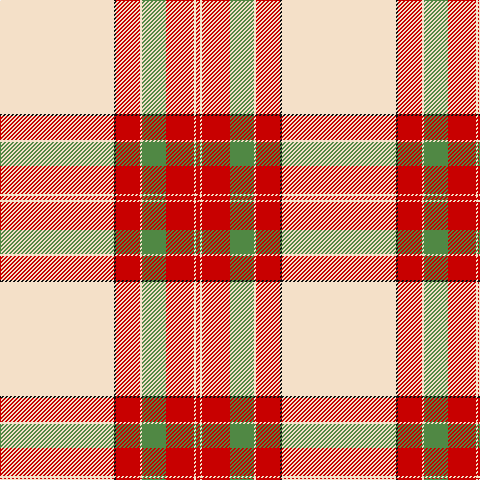

This page is one **sett** — a single exact thread-count. It belongs to the [tartan](/tartans/w57k1r12w1lg12r14w1r2/)
(the same proportion at any scale), whose colour order is pattern [RWRGWRKW](/stripes/rwrgwrkw/).

Sourced from register-of-tartans.  It is a [8 stripe tartan](/stripes/stripes8/).

Original link https://www.tartanregister.gov.uk/tartanDetails.aspx?ref=2301

2 attestations — the source records this cloth was collapsed from (oldest owns this page)

<ul>
<li>01/01/1982 — McBrayer Dress (register-of-tartans, <a href="https://www.tartanregister.gov.uk/tartanDetails.aspx?ref=2301">record</a>)</li>
<li>1982? — McBrayer Dress (Personal) (tartans-authority, <a href="http://www.tartansauthority.com/tartan-ferret/display/7205/">record</a>)</li>
</ul>

## Register references

External register numbers recorded for this tartan.

- Scottish Register of Tartans: [2301](https://www.tartanregister.gov.uk/tartanDetails.aspx?ref=2301)
- Scottish Tartans Authority (ITI): 7205

## Thread count
W/114 K2 R24 W2 LG24 R28 W2 R/4

## Palette
Each colour and the base-6 reference it is a variant of.

| Colour | Shade | Base |
|---|---|---|
| K | <code style="background-color:#101010;">#101010</code> `oklch(17.3% 0.000 89.9)` <small>#101010</small> | K <code style="background-color:#000000;">#000000</code> |
| LG | <code style="background-color:#508844;">#508844</code> `oklch(57.1% 0.116 140.1)` <small>#508844</small> | G <code style="background-color:#006100;">#006100</code> |
| R | <code style="background-color:#C80000;">#C80000</code> `oklch(52.3% 0.215 29.2)` <small>#C80000</small> | R <code style="background-color:#CC0000;">#CC0000</code> |
| W | <code style="background-color:#F4E0C8;">#F4E0C8</code> `oklch(91.7% 0.039 72.3)` <small>#F4E0C8</small> | W <code style="background-color:#F7F7F7;">#F7F7F7</code> |

# Sample pattern

## Nearest tartans

The nearest existing variants by ΔTartan distance, with this tartan at the top so the swatches line up against it.

ΔTartan

Tartan

Sett

—

<a href="/ttd/edit/#slug=w57k1r12w1g12r14w1r2~x2">McBrayer Dress</a> <a class="nn-out" href="/setts/s8/w57k1r12w1g12r14w1r2~x2/" title="open its dictionary page">↗</a>

0.53

<a href="/ttd/edit/#slug=w75o1r18g9o1r27w2r5~x2">Unidentified, Ross-shire</a> <a class="nn-out" href="/setts/s8/w75o1r18g9o1r27w2r5~x2/" title="open its dictionary page">↗</a>

0.61

<a href="/ttd/edit/#slug=w75dy1r18dg9dy1r27w2r5~x2">Unidentified Ross-shire</a> <a class="nn-out" href="/setts/s8/w75dy1r18dg9dy1r27w2r5~x2/" title="open its dictionary page">↗</a>

0.66

<a href="/ttd/edit/#slug=w50k1r12w1dg12r13w1r2~x2">Unidentified Blanket</a> <a class="nn-out" href="/setts/s8/w50k1r12w1dg12r13w1r2~x2/" title="open its dictionary page">↗</a>

0.66

<a href="/ttd/edit/#slug=w50k1r12w1g12r13w1r2~x2">Unidentified, Blanket</a> <a class="nn-out" href="/setts/s8/w50k1r12w1g12r13w1r2~x2/" title="open its dictionary page">↗</a>

0.94

<a href="/ttd/edit/#slug=w80k2r19w2dg19r22w2r4~x2">Wilsons' Blanket Pattern (Artefact)</a> <a class="nn-out" href="/setts/s8/w80k2r19w2dg19r22w2r4~x2/" title="open its dictionary page">↗</a>

1.16

<a href="/ttd/edit/#slug=w50k1r14w1dg14r14w1r2~x4">Wilson's Blanket Pattern</a> <a class="nn-out" href="/setts/s8/w50k1r14w1dg14r14w1r2~x4/" title="open its dictionary page">↗</a>

1.21

<a href="/ttd/edit/#slug=w30k1r7dg7r8w1r2~x4">MMK 1777</a> <a class="nn-out" href="/setts/s7/w30k1r7dg7r8w1r2~x4/" title="open its dictionary page">↗</a>

1.22

<a href="/ttd/edit/#slug=w80t1r14t9r24w2r4~x2">Unidentified Fisherwife's Plaid</a> <a class="nn-out" href="/setts/s7/w80t1r14t9r24w2r4~x2/" title="open its dictionary page">↗</a>

1.42

<a href="/ttd/edit/#slug=w52r22w6r8k1db3~x2">MacGregor Dress Red (Dance)</a> <a class="nn-out" href="/setts/s6/w52r22w6r8k1db3~x2/" title="open its dictionary page">↗</a>

1.47

<a href="/ttd/edit/#slug=lo98db32k3w6db4w4db6lo4">Irn Bru</a> <a class="nn-out" href="/setts/s8/lo98db32k3w6db4w4db6lo4/" title="open its dictionary page">↗</a>

## Neighbour map

Every grey dot is one of 14299 variants placed by the first two principal components of the ΔTartan feature space (44% of its variance). Red is this tartan; blue dots are its nearest — click one to open its page.

<svg viewBox="0 0 640 380" role="img" style="max-width:100%;height:auto;border:1px solid #e0e0e0;border-radius:4px;display:block" xmlns="http://www.w3.org/2000/svg"><image href="/nn/cloud.v1.png" width="640" height="380"/><a href="/setts/s8/w75o1r18g9o1r27w2r5~x2/"><circle cx="379.3" cy="75.9" r="4" fill="#3465a4"><title>Unidentified, Ross-shire</title></circle></a><a href="/setts/s8/w75dy1r18dg9dy1r27w2r5~x2/"><circle cx="380.7" cy="74.3" r="4" fill="#3465a4"><title>Unidentified Ross-shire</title></circle></a><a href="/setts/s8/w50k1r12w1dg12r13w1r2~x2/"><circle cx="364.5" cy="74.8" r="4" fill="#3465a4"><title>Unidentified Blanket</title></circle></a><a href="/setts/s8/w50k1r12w1g12r13w1r2~x2/"><circle cx="364.0" cy="76.7" r="4" fill="#3465a4"><title>Unidentified, Blanket</title></circle></a><a href="/setts/s8/w80k2r19w2dg19r22w2r4~x2/"><circle cx="339.4" cy="76.9" r="4" fill="#3465a4"><title>Wilsons' Blanket Pattern (Artefact)</title></circle></a><a href="/setts/s8/w50k1r14w1dg14r14w1r2~x4/"><circle cx="329.7" cy="69.9" r="4" fill="#3465a4"><title>Wilson's Blanket Pattern</title></circle></a><a href="/setts/s7/w30k1r7dg7r8w1r2~x4/"><circle cx="332.2" cy="107.5" r="4" fill="#3465a4"><title>MMK 1777</title></circle></a><a href="/setts/s7/w80t1r14t9r24w2r4~x2/"><circle cx="436.8" cy="100.9" r="4" fill="#3465a4"><title>Unidentified Fisherwife's Plaid</title></circle></a><a href="/setts/s6/w52r22w6r8k1db3~x2/"><circle cx="404.9" cy="91.2" r="4" fill="#3465a4"><title>MacGregor Dress Red (Dance)</title></circle></a><a href="/setts/s8/lo98db32k3w6db4w4db6lo4/"><circle cx="428.3" cy="86.1" r="4" fill="#3465a4"><title>Irn Bru</title></circle></a><circle cx="391.9" cy="74.0" r="5" fill="#c00000"/></svg>

ID: /setts/s8/w57k1r12w1g12r14w1r2~x2/
