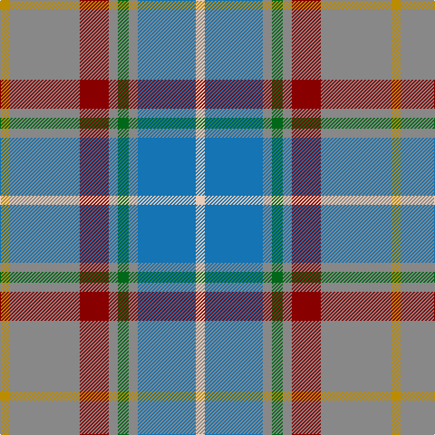

In pattern [WBRGRRRY](/patterns/wbrgrrry/).

This was sourced from tartans-authority.  It is a [8 stripes tartan](/stripes/stripes8/).

Original link http://www.tartansauthority.com/tartan-ferret/display/8662/

## Thread count
DY/10 N78 DR32 N10 G12 N10 B64 LR/10

## Palette
Each colour and its ΔE from the base-6 reference it is a variant of.

| Colour | Shade | Base | ΔE (OKLab) |
|---|---|---|---|
| B | <code style="background-color:#1474B4;">#1474B4</code> `#1474B4` | B <code style="background-color:#2A418A;">#2A418A</code> | 0.15 |
| DR | <code style="background-color:#880000;">#880000</code> `#880000` | R <code style="background-color:#CC0000;">#CC0000</code> | 0.15 |
| DY | <code style="background-color:#BC8C00;">#BC8C00</code> `#BC8C00` | Y <code style="background-color:#F2BF00;">#F2BF00</code> | 0.16 |
| G | <code style="background-color:#006818;">#006818</code> `#006818` | G <code style="background-color:#006100;">#006100</code> | 0.02 |
| LR | <code style="background-color:#E8CCB8;">#E8CCB8</code> `#E8CCB8` | W <code style="background-color:#F7F7F7;">#F7F7F7</code> | 0.12 |
| N | <code style="background-color:#888888;">#888888</code> `#888888` | R <code style="background-color:#CC0000;">#CC0000</code> | 0.24 |

# Sample pattern

## Nearest tartans

The nearest existing variants by ΔTartan distance.

1. [Hawaii (District)](/setts/s8/b4r1y1b12ba4g10y1r3~b5c8ca8-ba4c3428-g406054-rc80000-ye8c000~x4/) — ΔT 1.14
1. [State Seal of Iowa (Fashion)](/setts/s8/b5ba43b18w4ba6r5g25y5~b003c64-ba1474b4-g604000-r880000-we8ccb8-ybc8c00~x2/) — ΔT 1.28
1. [Balfour](/setts/s6/b30y3r11y3g33ra6~b304080-g808080-r806050-rac00000-yf0c000~x2/) — ΔT 1.35
1. [Asman Hunting](/setts/s11/b4y3b17r7w2ra7w2b7g17ra3g4~b304080-g407050-rc00000-ra806050-we0e0e0-yf0c000~x2/) — ΔT 1.37
1. [MacLeroy & Troine](/setts/s10/k2y3w2y3b4y19r6b23ra3ya2~b5c5c5c-k101010-r888888-rac80000-we0e0e0-y48a4c0-yafccc00~x2/) — ΔT 1.38
1. [Atikokan (District)](/setts/s7/y6b16w3g3r3ga3wa2~b2888c4-g886414-ga289c18-rc47c2c-wc0c0c0-wafcfcfc-yc48008~x4/) — ΔT 1.40
1. [Lyon, Jeffrey M (Hunting) (Personal)](/setts/s10/b27ba2b2ba16g5r5y2ba2ga14ba2~b6b8a96-ba14465c-g649848-ga604000-r880000-yd87c00~x2/) — ΔT 1.40
1. [Brodie Silver Clan Tartan Tartan Number: 1630. Earliest known date: c.1940-50 Probably a trade design based on Hunting Brodie, that has appeared in the last forty years. It is sometimes referred to as muted Brodie. (P.E. MacDonald, STS 1984) See products available Copyright © Blair Urquhart, Comrie, 2015](/setts/s7/r3b20y2b20ra20w20r3~b5c5c5c-rc80000-ra888888-wc0c0c0-ye8c000~x2/) — ΔT 1.41
1. [Australian Heavy Horse](/setts/s10/b4ba2b18k2bb5bc16w2bb2y2b4~b817d8c-ba2b6072-bb676278-bc4f2817-k101010-wffffff-yb98a76~x2/) — ΔT 1.43
1. [Allman-Jones (Personal)](/setts/s7/r3w2g7b25k8g15ga2~b505050-g808080-ga003820-k101010-r960028-wf8f4d0~x2/) — ΔT 1.43

## Neighbour map

Every grey dot is one of 15726 variants placed by the first two principal components of the ΔTartan feature space (44% of its variance). Red is this tartan; blue dots are its nearest — click one to open its page.

<svg viewBox="0 0 640 380" role="img" style="max-width:100%;height:auto;border:1px solid #e0e0e0;border-radius:4px;display:block" xmlns="http://www.w3.org/2000/svg"><image href="/nn/cloud.v1.png" width="640" height="380"/><a href="/setts/s8/b4r1y1b12ba4g10y1r3~b5c8ca8-ba4c3428-g406054-rc80000-ye8c000~x4/"><circle cx="248.0" cy="183.9" r="4" fill="#3465a4"><title>Hawaii (District)</title></circle></a><a href="/setts/s8/b5ba43b18w4ba6r5g25y5~b003c64-ba1474b4-g604000-r880000-we8ccb8-ybc8c00~x2/"><circle cx="216.9" cy="168.6" r="4" fill="#3465a4"><title>State Seal of Iowa (Fashion)</title></circle></a><a href="/setts/s6/b30y3r11y3g33ra6~b304080-g808080-r806050-rac00000-yf0c000~x2/"><circle cx="227.4" cy="197.7" r="4" fill="#3465a4"><title>Balfour</title></circle></a><a href="/setts/s11/b4y3b17r7w2ra7w2b7g17ra3g4~b304080-g407050-rc00000-ra806050-we0e0e0-yf0c000~x2/"><circle cx="152.4" cy="167.0" r="4" fill="#3465a4"><title>Asman Hunting</title></circle></a><a href="/setts/s10/k2y3w2y3b4y19r6b23ra3ya2~b5c5c5c-k101010-r888888-rac80000-we0e0e0-y48a4c0-yafccc00~x2/"><circle cx="202.1" cy="126.2" r="4" fill="#3465a4"><title>MacLeroy &amp; Troine</title></circle></a><a href="/setts/s7/y6b16w3g3r3ga3wa2~b2888c4-g886414-ga289c18-rc47c2c-wc0c0c0-wafcfcfc-yc48008~x4/"><circle cx="165.9" cy="160.5" r="4" fill="#3465a4"><title>Atikokan (District)</title></circle></a><a href="/setts/s10/b27ba2b2ba16g5r5y2ba2ga14ba2~b6b8a96-ba14465c-g649848-ga604000-r880000-yd87c00~x2/"><circle cx="217.1" cy="147.3" r="4" fill="#3465a4"><title>Lyon, Jeffrey M (Hunting) (Personal)</title></circle></a><a href="/setts/s7/r3b20y2b20ra20w20r3~b5c5c5c-rc80000-ra888888-wc0c0c0-ye8c000~x2/"><circle cx="235.4" cy="209.1" r="4" fill="#3465a4"><title>Brodie Silver Clan Tartan Tartan Number: 1630. Earliest known date: c.1940-50 Probably a trade design based on Hunting Brodie, that has appeared in the last forty years. It is sometimes referred to as muted Brodie. (P.E. MacDonald, STS 1984) See products available Copyright © Blair Urquhart, Comrie, 2015</title></circle></a><a href="/setts/s10/b4ba2b18k2bb5bc16w2bb2y2b4~b817d8c-ba2b6072-bb676278-bc4f2817-k101010-wffffff-yb98a76~x2/"><circle cx="203.1" cy="137.0" r="4" fill="#3465a4"><title>Australian Heavy Horse</title></circle></a><a href="/setts/s7/r3w2g7b25k8g15ga2~b505050-g808080-ga003820-k101010-r960028-wf8f4d0~x2/"><circle cx="212.1" cy="168.4" r="4" fill="#3465a4"><title>Allman-Jones (Personal)</title></circle></a><circle cx="214.2" cy="179.6" r="5" fill="#c00000"/></svg>

ID: /setts/s8/w5b32r5g6r5ra16r39y5~b1474b4-g006818-r888888-ra880000-we8ccb8-ybc8c00~x2/
