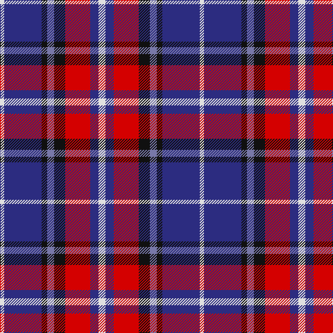

In pattern [WBKBKRBW](/patterns/wbkbkrbw/).

This was sourced from register-of-tartans.  It is a [8 stripes tartan](/stripes/stripes8/).

Original link https://www.tartanregister.gov.uk/tartanDetails.aspx?ref=688

## Attestations

This cloth appears in 2 source records; the oldest owns this page.

- 01/01/2006 — Clinton (Personal) (register-of-tartans, [record](https://www.tartanregister.gov.uk/tartanDetails.aspx?ref=688))
- 2006 — Clinton (Personal) (tartans-authority, [record](http://www.tartansauthority.com/tartan-ferret/display/7076/))

## Thread count
LN/6 DB54 K8 B10 K16 R36 DB12 LN/10

## Palette
Each colour and its ΔE from the base-6 reference it is a variant of.

| Colour | Shade | Base | ΔE (OKLab) |
|---|---|---|---|
| B | <code style="background-color:#7878A8;">#7878A8</code> `#7878A8` | B <code style="background-color:#2A418A;">#2A418A</code> | 0.20 |
| DB | <code style="background-color:#2C2C80;">#2C2C80</code> `#2C2C80` | B <code style="background-color:#2A418A;">#2A418A</code> | 0.06 |
| K | <code style="background-color:#101010;">#101010</code> `#101010` | K <code style="background-color:#000000;">#000000</code> | 0.17 |
| LN | <code style="background-color:#E0E0E0;">#E0E0E0</code> `#E0E0E0` | W <code style="background-color:#F7F7F7;">#F7F7F7</code> | 0.07 |
| R | <code style="background-color:#D40000;">#D40000</code> `#D40000` | R <code style="background-color:#CC0000;">#CC0000</code> | 0.02 |

# Sample pattern

## Nearest tartans

The nearest existing variants by ΔTartan distance.

1. [Dauphinee (Personal)](/setts/s11/r9k4w6k4b21y3b13k2w4k2r6~b2c2c80-k101010-rc80000-wfcfcfc-ybc8c00~x2/) — ΔT 0.85
1. [Fife (McGill)](/setts/s6/b31ba4b6k19r20y4~b2c2c80-ba5c8ca8-k101010-rc80000-ye8c000~x2/) — ΔT 1.04
1. [Lovell (2014)](/setts/s8/y2k2b14ba4k5r2y5r1~b2c2c80-ba202060-k101010-rc80000-ye8c000~x4/) — ΔT 1.12
1. [Fife](/setts/s6/b31ba4b6k19r20y4~b304080-ba5480b0-k000000-rc00000-yf0c000~x2/) — ΔT 1.15
1. [Le Mirage (Corporate?)](/setts/s10/b36ba15r25w5k6b35ba15r7w5k6~b1c1c50-ba2c2c80-k101010-rc80000-we0e0e0/) — ΔT 1.16
1. [Brigadoon](/setts/s8/w4b19r4ba2r4ba23y4ba2~b1c1c50-ba780078-rc80000-we0e0e0-ye8c000~x2/) — ΔT 1.18
1. [The Open Championship](/setts/s6/w2b15g2ba20r9w2~b304080-ba000050-g808080-rc00000-we0e0e0~x2/) — ΔT 1.20
1. [Unidentified](/setts/s10/k4w3k3r13b24r8b26ba12k3w2~b2c2c80-ba5c8ca8-k101010-rc80000-we0e0e0~x2/) — ΔT 1.22
1. [Afternoon Tea / Assam](/setts/s6/r15ra98b72ba25b8w15~b202060-ba5c8ca8-rc80000-ra880000-wfcfcfc/) — ΔT 1.24
1. [Wilson's, No 111](/setts/s5/b19w2g12ba3k4~b800080-ba5480b0-g008000-k000000-we0e0e0~x2/) — ΔT 1.25

## Neighbour map

Every grey dot is one of 15726 variants placed by the first two principal components of the ΔTartan feature space (44% of its variance). Red is this tartan; blue dots are its nearest — click one to open its page.

<svg viewBox="0 0 640 380" role="img" style="max-width:100%;height:auto;border:1px solid #e0e0e0;border-radius:4px;display:block" xmlns="http://www.w3.org/2000/svg"><image href="/nn/cloud.v1.png" width="640" height="380"/><a href="/setts/s11/r9k4w6k4b21y3b13k2w4k2r6~b2c2c80-k101010-rc80000-wfcfcfc-ybc8c00~x2/"><circle cx="168.3" cy="150.5" r="4" fill="#3465a4"><title>Dauphinee (Personal)</title></circle></a><a href="/setts/s6/b31ba4b6k19r20y4~b2c2c80-ba5c8ca8-k101010-rc80000-ye8c000~x2/"><circle cx="186.3" cy="208.9" r="4" fill="#3465a4"><title>Fife (McGill)</title></circle></a><a href="/setts/s8/y2k2b14ba4k5r2y5r1~b2c2c80-ba202060-k101010-rc80000-ye8c000~x4/"><circle cx="163.2" cy="152.9" r="4" fill="#3465a4"><title>Lovell (2014)</title></circle></a><a href="/setts/s6/b31ba4b6k19r20y4~b304080-ba5480b0-k000000-rc00000-yf0c000~x2/"><circle cx="168.7" cy="203.7" r="4" fill="#3465a4"><title>Fife</title></circle></a><a href="/setts/s10/b36ba15r25w5k6b35ba15r7w5k6~b1c1c50-ba2c2c80-k101010-rc80000-we0e0e0/"><circle cx="182.8" cy="190.2" r="4" fill="#3465a4"><title>Le Mirage (Corporate?)</title></circle></a><a href="/setts/s8/w4b19r4ba2r4ba23y4ba2~b1c1c50-ba780078-rc80000-we0e0e0-ye8c000~x2/"><circle cx="217.6" cy="151.9" r="4" fill="#3465a4"><title>Brigadoon</title></circle></a><a href="/setts/s6/w2b15g2ba20r9w2~b304080-ba000050-g808080-rc00000-we0e0e0~x2/"><circle cx="173.9" cy="187.6" r="4" fill="#3465a4"><title>The Open Championship</title></circle></a><a href="/setts/s10/k4w3k3r13b24r8b26ba12k3w2~b2c2c80-ba5c8ca8-k101010-rc80000-we0e0e0~x2/"><circle cx="237.4" cy="157.0" r="4" fill="#3465a4"><title>Unidentified</title></circle></a><a href="/setts/s6/r15ra98b72ba25b8w15~b202060-ba5c8ca8-rc80000-ra880000-wfcfcfc/"><circle cx="215.3" cy="174.8" r="4" fill="#3465a4"><title>Afternoon Tea / Assam</title></circle></a><a href="/setts/s5/b19w2g12ba3k4~b800080-ba5480b0-g008000-k000000-we0e0e0~x2/"><circle cx="206.5" cy="193.6" r="4" fill="#3465a4"><title>Wilson's, No 111</title></circle></a><circle cx="170.3" cy="171.0" r="5" fill="#c00000"/></svg>

ID: /setts/s8/w5b6r18k8ba5k4b27w3~b2c2c80-ba7878a8-k101010-rd40000-we0e0e0~x2/
