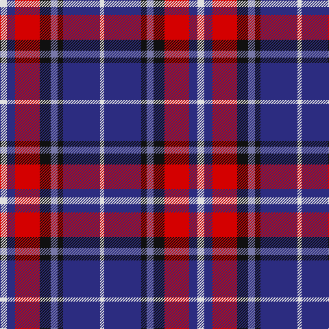

**Bands:** [WBKBKRBW](/stripes/wbkbkrbw/) · **Stripes:** [W DB K B K R DB W](/stripes/stripes8/) W DB K B K R DB W

This was sourced from register-of-tartans.  It is a [8 band tartan](/bands/bands8/).

Original link https://www.tartanregister.gov.uk/tartanDetails.aspx?ref=688

## Attestations

This cloth appears in 2 source records; the oldest owns this page.

- 01/01/2006 — Clinton (Personal) (register-of-tartans, [record](https://www.tartanregister.gov.uk/tartanDetails.aspx?ref=688))
- 2006 — Clinton (Personal) (tartans-authority, [record](http://www.tartansauthority.com/tartan-ferret/display/7076/))

## Register references

External register numbers recorded for this tartan.

- Scottish Register of Tartans: [688](https://www.tartanregister.gov.uk/tartanDetails.aspx?ref=688)
- Scottish Tartans Authority (ITI): 7076

## Thread count
LN/10 DB12 R36 K16 B10 K8 DB54 LN/6

## Palette
Each colour and its ΔE from the base-6 reference it is a variant of.

| Colour | Shade | Base | ΔE (OKLab) |
|---|---|---|---|
| B | <code style="background-color:#7878A8;">#7878A8</code> `#7878A8` | B <code style="background-color:#2A418A;">#2A418A</code> | 0.20 |
| DB | <code style="background-color:#2C2C80;">#2C2C80</code> `#2C2C80` | B <code style="background-color:#2A418A;">#2A418A</code> | 0.06 |
| K | <code style="background-color:#101010;">#101010</code> `#101010` | K <code style="background-color:#000000;">#000000</code> | 0.17 |
| LN | <code style="background-color:#E0E0E0;">#E0E0E0</code> `#E0E0E0` | W <code style="background-color:#F7F7F7;">#F7F7F7</code> | 0.07 |
| R | <code style="background-color:#D40000;">#D40000</code> `#D40000` | R <code style="background-color:#CC0000;">#CC0000</code> | 0.02 |

# Sample pattern

## Nearest tartans

The nearest existing variants by ΔTartan distance.

1. [Dauphinee (Personal)](/setts/s11/r9k4w6k4db21lo3db13k2w4k2r6~x2/) — ΔT 0.85
1. [Fife (McGill)](/setts/s6/db31t4db6k19r20ly4~x2/) — ΔT 1.04
1. [Lovell (2014)](/setts/s8/ly2k2db14db4k5r2ly5r1~x4/) — ΔT 1.12
1. [Le Mirage (Corporate?)](/setts/s10/db36db15r25w5k6db35db15r7w5k6/) — ΔT 1.16
1. [Brigadoon](/setts/s8/w4db19r4dp2r4dp23ly4dp2~x2/) — ΔT 1.19
1. [The Open Championship](/setts/s6/w2db15y2db20r9w2~x2/) — ΔT 1.20
1. [Unidentified](/setts/s10/k4w3k3r13db24r8db26t12k3w2~x2/) — ΔT 1.22
1. [Afternoon Tea / Assam](/setts/s6/r15r98db72t25db8w15/) — ΔT 1.24
1. [Wilson's, No 111](/setts/s5/p19w2g12t3k4~x2/) — ΔT 1.24
1. [Naysmith, William A (Personal)](/setts/s10/lb4r2db14k4lb4k3lb3k2r2lb2~x2/) — ΔT 1.26

## Neighbour map

Every grey dot is one of 14299 variants placed by the first two principal components of the ΔTartan feature space (44% of its variance). Red is this tartan; blue dots are its nearest — click one to open its page.

<svg viewBox="0 0 640 380" role="img" style="max-width:100%;height:auto;border:1px solid #e0e0e0;border-radius:4px;display:block" xmlns="http://www.w3.org/2000/svg"><image href="/nn/cloud.v1.png" width="640" height="380"/><a href="/setts/s11/r9k4w6k4db21lo3db13k2w4k2r6~x2/"><circle cx="170.9" cy="148.6" r="4" fill="#3465a4"><title>Dauphinee (Personal)</title></circle></a><a href="/setts/s6/db31t4db6k19r20ly4~x2/"><circle cx="188.6" cy="209.0" r="4" fill="#3465a4"><title>Fife (McGill)</title></circle></a><a href="/setts/s8/ly2k2db14db4k5r2ly5r1~x4/"><circle cx="166.1" cy="152.9" r="4" fill="#3465a4"><title>Lovell (2014)</title></circle></a><a href="/setts/s10/db36db15r25w5k6db35db15r7w5k6/"><circle cx="185.2" cy="192.1" r="4" fill="#3465a4"><title>Le Mirage (Corporate?)</title></circle></a><a href="/setts/s8/w4db19r4dp2r4dp23ly4dp2~x2/"><circle cx="219.3" cy="151.1" r="4" fill="#3465a4"><title>Brigadoon</title></circle></a><a href="/setts/s6/w2db15y2db20r9w2~x2/"><circle cx="177.1" cy="188.2" r="4" fill="#3465a4"><title>The Open Championship</title></circle></a><a href="/setts/s10/k4w3k3r13db24r8db26t12k3w2~x2/"><circle cx="239.7" cy="157.5" r="4" fill="#3465a4"><title>Unidentified</title></circle></a><a href="/setts/s6/r15r98db72t25db8w15/"><circle cx="216.9" cy="174.2" r="4" fill="#3465a4"><title>Afternoon Tea / Assam</title></circle></a><a href="/setts/s5/p19w2g12t3k4~x2/"><circle cx="208.9" cy="191.2" r="4" fill="#3465a4"><title>Wilson's, No 111</title></circle></a><a href="/setts/s10/lb4r2db14k4lb4k3lb3k2r2lb2~x2/"><circle cx="109.0" cy="166.4" r="4" fill="#3465a4"><title>Naysmith, William A (Personal)</title></circle></a><circle cx="172.7" cy="170.0" r="5" fill="#c00000"/></svg>

ID: /setts/s8/w5db6r18k8b5k4db27w3~x2/
