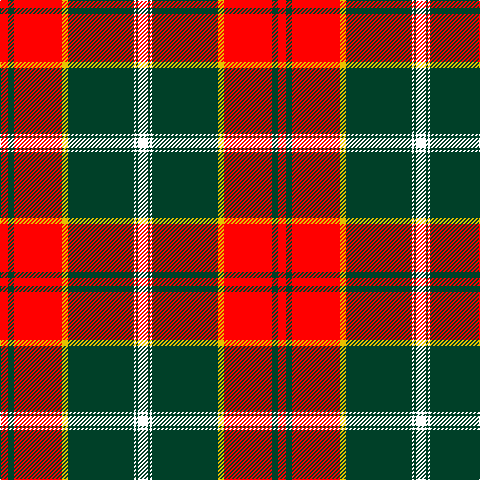

In pattern [RGRYGWGW](/stripes/rgrygwgw/).

This was sourced from register-of-tartans.  It is a [8 stripe tartan](/stripes/stripes8/).

Original link https://www.tartanregister.gov.uk/tartanDetails.aspx?ref=11621

## Register references

External register numbers recorded for this tartan.

- Scottish Register of Tartans: [11621](https://www.tartanregister.gov.uk/tartanDetails.aspx?ref=11621)

## Thread count
W/10 DG2 W2 DG66 Y6 R48 DG6 R/8

## Palette
Each colour and the base-6 reference it is a variant of.

| Colour | Shade | Base |
|---|---|---|
| DG | <code style="background-color:#004028;">#004028</code> `oklch(32.8% 0.073 160.8)` <small>#004028</small> | G <code style="background-color:#006100;">#006100</code> |
| R | <code style="background-color:#FF0000;">#FF0000</code> `oklch(62.8% 0.258 29.2)` <small>#FF0000</small> | R <code style="background-color:#CC0000;">#CC0000</code> |
| W | <code style="background-color:#FFFFFF;">#FFFFFF</code> `oklch(100.0% 0.000 89.9)` <small>#FFFFFF</small> | W <code style="background-color:#F7F7F7;">#F7F7F7</code> |
| Y | <code style="background-color:#E8C000;">#E8C000</code> `oklch(81.9% 0.168 93.7)` <small>#E8C000</small> | Y <code style="background-color:#F2BF00;">#F2BF00</code> |

# Sample pattern

## Nearest tartans

The nearest existing variants by ΔTartan distance.

1. [Citylink Gold (Corporate)](/setts/s8/r25n2r3lo2r3n11w13lo1~x2/) — ΔT 1.11
1. [Sutherland de Albergaria (Personal)](/setts/s8/w10k2w2k66ly6r48k5r8/) — ΔT 1.17
1. [Spens](/setts/s8/r56w2db6w2g32r11db6w5/) — ΔT 1.20
1. [Scott](/setts/s12/g4r3k1r28g14r4g4w3g4r4g4w3~x2/) — ΔT 1.24
1. [Connaught Irish District Tartan Tartan Number: 2064. Earliest known date: Not known A tartan from the West of Ireland. See products available Copyright © Blair Urquhart, Comrie, 2015](/setts/s10/ly32g2m1g2m1g2m32do1m1do4~x2/) — ΔT 1.26
1. [FIRES Center of Excelence](/setts/s8/r50ly8k2w2k2ly8k22r3~x2/) — ΔT 1.32
1. [Marjoribanks (Clan)](/setts/s8/w3k3w3k37r40w1r2lo3~x2/) — ΔT 1.32
1. [Livingstone, MacLay MacLeay](/setts/s7/r28g4k4g4k4t6ly1~x2/) — ΔT 1.34
1. [Pittsburgh St Andrew's Society](/setts/s8/t1r1lo1k15lo15r1t1lo1~x4/) — ΔT 1.37
1. [MacPhail](/setts/s6/r25k7r3g13t1k2~x4/) — ΔT 1.38

## Neighbour map

Every grey dot is one of 14299 variants placed by the first two principal components of the ΔTartan feature space (44% of its variance). Red is this tartan; blue dots are its nearest — click one to open its page.

<svg viewBox="0 0 640 380" role="img" style="max-width:100%;height:auto;border:1px solid #e0e0e0;border-radius:4px;display:block" xmlns="http://www.w3.org/2000/svg"><image href="/nn/cloud.v1.png" width="640" height="380"/><a href="/setts/s8/r25n2r3lo2r3n11w13lo1~x2/"><circle cx="304.6" cy="128.0" r="4" fill="#3465a4"><title>Citylink Gold (Corporate)</title></circle></a><a href="/setts/s8/w10k2w2k66ly6r48k5r8/"><circle cx="321.3" cy="107.1" r="4" fill="#3465a4"><title>Sutherland de Albergaria (Personal)</title></circle></a><a href="/setts/s8/r56w2db6w2g32r11db6w5/"><circle cx="360.3" cy="123.9" r="4" fill="#3465a4"><title>Spens</title></circle></a><a href="/setts/s12/g4r3k1r28g14r4g4w3g4r4g4w3~x2/"><circle cx="334.7" cy="109.0" r="4" fill="#3465a4"><title>Scott</title></circle></a><a href="/setts/s10/ly32g2m1g2m1g2m32do1m1do4~x2/"><circle cx="312.5" cy="76.2" r="4" fill="#3465a4"><title>Connaught Irish District Tartan Tartan Number: 2064. Earliest known date: Not known A tartan from the West of Ireland. See products available Copyright © Blair Urquhart, Comrie, 2015</title></circle></a><a href="/setts/s8/r50ly8k2w2k2ly8k22r3~x2/"><circle cx="337.4" cy="107.2" r="4" fill="#3465a4"><title>FIRES Center of Excelence</title></circle></a><a href="/setts/s8/w3k3w3k37r40w1r2lo3~x2/"><circle cx="328.5" cy="93.4" r="4" fill="#3465a4"><title>Marjoribanks (Clan)</title></circle></a><a href="/setts/s7/r28g4k4g4k4t6ly1~x2/"><circle cx="310.0" cy="107.1" r="4" fill="#3465a4"><title>Livingstone, MacLay MacLeay</title></circle></a><a href="/setts/s8/t1r1lo1k15lo15r1t1lo1~x4/"><circle cx="284.0" cy="129.0" r="4" fill="#3465a4"><title>Pittsburgh St Andrew's Society</title></circle></a><a href="/setts/s6/r25k7r3g13t1k2~x4/"><circle cx="325.8" cy="147.8" r="4" fill="#3465a4"><title>MacPhail</title></circle></a><circle cx="320.0" cy="104.5" r="5" fill="#c00000"/></svg>

ID: /setts/s8/w5dg1w1dg33ly3r24dg3r4~x2/
