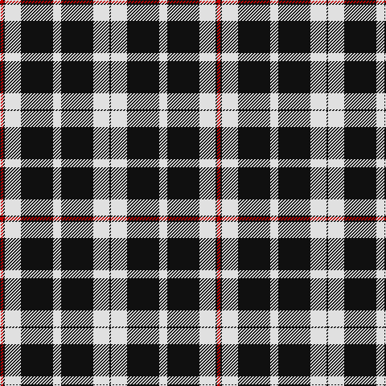

This page is one **sett** — a single exact thread-count. It belongs to the [tartan](/tartans/w5k20w10k1r2/)
(the same proportion at any scale), whose colour order is pattern [KWKWKWKR](/stripes/kwkwkwkr/).

Sourced from register-of-tartans.  It is a [8 stripe tartan](/stripes/stripes8/).

Original link https://www.tartanregister.gov.uk/tartanDetails.aspx?ref=3903

## Also known as

This cloth is also recorded under:

- St Piran Cornish Flag
- St Piran, Cornish Flag
- St. Piran Cornish Flag

## Register references

External register numbers recorded for this tartan.

- Scottish Register of Tartans: [3903](https://www.tartanregister.gov.uk/tartanDetails.aspx?ref=3903)
- Scottish Tartans Authority (ITI): 1618
- Scottish Tartans World Register: 1618

## Thread count
R/4 K2 LN20 K40 LN10 K40 LN20 K/2

## Palette

Palette: <strong>Tartan Register</strong>
<table><thead><tr><th>Colour</th><th>Threads</th><th>Shade</th><th>Base</th><th>OKLCh</th></tr></thead><tbody><tr><td>R/</td><td style="text-align:right;font-variant-numeric:tabular-nums">4</td><td><code style="background-color:#C80000;">#C80000</code> <small style="color:#888">#C80000</small></td><td>R <code style="background-color:#CC0000;">#CC0000</code></td><td><small style="color:#888">oklch(52.3% 0.215 29.2)</small></td></tr><tr><td>K</td><td style="text-align:right;font-variant-numeric:tabular-nums">2</td><td><code style="background-color:#101010;">#101010</code> <small style="color:#888">#101010</small></td><td>K <code style="background-color:#000000;">#000000</code></td><td><small style="color:#888">oklch(17.3% 0.000 89.9)</small></td></tr><tr><td>LN</td><td style="text-align:right;font-variant-numeric:tabular-nums">20</td><td><code style="background-color:#E0E0E0;">#E0E0E0</code> <small style="color:#888">#E0E0E0</small></td><td>W <code style="background-color:#F7F7F7;">#F7F7F7</code></td><td><small style="color:#888">oklch(90.7% 0.000 89.9)</small></td></tr><tr><td>K</td><td style="text-align:right;font-variant-numeric:tabular-nums">40</td><td><code style="background-color:#101010;">#101010</code> <small style="color:#888">#101010</small></td><td>K <code style="background-color:#000000;">#000000</code></td><td><small style="color:#888">oklch(17.3% 0.000 89.9)</small></td></tr><tr><td>LN</td><td style="text-align:right;font-variant-numeric:tabular-nums">10</td><td><code style="background-color:#E0E0E0;">#E0E0E0</code> <small style="color:#888">#E0E0E0</small></td><td>W <code style="background-color:#F7F7F7;">#F7F7F7</code></td><td><small style="color:#888">oklch(90.7% 0.000 89.9)</small></td></tr><tr><td>K</td><td style="text-align:right;font-variant-numeric:tabular-nums">40</td><td><code style="background-color:#101010;">#101010</code> <small style="color:#888">#101010</small></td><td>K <code style="background-color:#000000;">#000000</code></td><td><small style="color:#888">oklch(17.3% 0.000 89.9)</small></td></tr><tr><td>LN</td><td style="text-align:right;font-variant-numeric:tabular-nums">20</td><td><code style="background-color:#E0E0E0;">#E0E0E0</code> <small style="color:#888">#E0E0E0</small></td><td>W <code style="background-color:#F7F7F7;">#F7F7F7</code></td><td><small style="color:#888">oklch(90.7% 0.000 89.9)</small></td></tr><tr><td>K/</td><td style="text-align:right;font-variant-numeric:tabular-nums">2</td><td><code style="background-color:#101010;">#101010</code> <small style="color:#888">#101010</small></td><td>K <code style="background-color:#000000;">#000000</code></td><td><small style="color:#888">oklch(17.3% 0.000 89.9)</small></td></tr></tbody></table>

# Sample pattern

## Nearest tartans

The nearest existing variants by ΔTartan distance, with this tartan at the top so the swatches line up against it.

ΔTartan

Tartan

Sett

—

<a href="/ttd/edit/#slug=w5k20w10k1r2~x2">St. Piran Cornish Flag</a> <a class="nn-out" href="/setts/s8/w5k20w10k1r2~x2/" title="open its dictionary page">↗</a>

0.74

<a href="/ttd/edit/#slug=w6k1w2k4w4k2w4k15r1~x2">Menzies Dress Tartan Tartan Number: 12444. Earliest known date: See products available Copyright © Blair Urquhart, Comrie, 2015</a> <a class="nn-out" href="/setts/s9/w6k1w2k4w4k2w4k15r1~x2/" title="open its dictionary page">↗</a>

1.05

<a href="/ttd/edit/#slug=k12lr1k2lr6k4lr3k4lr21r4~x2">MacKnight (Name)</a> <a class="nn-out" href="/setts/s9/k12lr1k2lr6k4lr3k4lr21r4~x2/" title="open its dictionary page">↗</a>

1.16

<a href="/ttd/edit/#slug=w5k20w10k1r2~x2">Cornish Flag (District)</a> <a class="nn-out" href="/setts/s5/w5k20w10k1r2~x2/" title="open its dictionary page">↗</a>

1.17

<a href="/ttd/edit/#slug=w36k8w36k95w4k4r6">Gretna Football Club (Corporate)</a> <a class="nn-out" href="/setts/s7/w36k8w36k95w4k4r6/" title="open its dictionary page">↗</a>

1.18

<a href="/ttd/edit/#slug=w24k16w1k16w3k8w2~x2">Saks Fifth Avenue (Corp)</a> <a class="nn-out" href="/setts/s7/w24k16w1k16w3k8w2~x2/" title="open its dictionary page">↗</a>

1.20

<a href="/ttd/edit/#slug=lr3k24lr6k8w4k8lr35k2~x2">Nowell/Noel 1951 (Name)</a> <a class="nn-out" href="/setts/s8/lr3k24lr6k8w4k8lr35k2~x2/" title="open its dictionary page">↗</a>

1.23

<a href="/ttd/edit/#slug=k17ly2k2ly2k9w11k2w11k20ly2~x2">Coppa Romana (Switzerland)</a> <a class="nn-out" href="/setts/s10/k17ly2k2ly2k9w11k2w11k20ly2~x2/" title="open its dictionary page">↗</a>

1.26

<a href="/ttd/edit/#slug=k17ly2k2ly2k9lb11k2lb11k20ly2~x2">Coppa Romana (Corporate)</a> <a class="nn-out" href="/setts/s10/k17ly2k2ly2k9lb11k2lb11k20ly2~x2/" title="open its dictionary page">↗</a>

1.30

<a href="/ttd/edit/#slug=k16w30lb36k10lb10k83lb6">Glasgow Warriors</a> <a class="nn-out" href="/setts/s7/k16w30lb36k10lb10k83lb6/" title="open its dictionary page">↗</a>

1.31

<a href="/ttd/edit/#slug=k5w3k3lb10w3k3w2k6w1k15w3k3w2k5~x2">Drummond, Grey (Clans Originaux)</a> <a class="nn-out" href="/setts/s14/k5w3k3lb10w3k3w2k6w1k15w3k3w2k5~x2/" title="open its dictionary page">↗</a>

## Neighbour map

Every grey dot is one of 14359 variants placed by the first two principal components of the ΔTartan feature space (44% of its variance). Red is this tartan; blue dots are its nearest — click one to open its page.

<svg viewBox="0 0 640 380" role="img" style="max-width:100%;height:auto;border:1px solid #e0e0e0;border-radius:4px;display:block" xmlns="http://www.w3.org/2000/svg"><image href="/nn/cloud.v1.png" width="640" height="380"/><a href="/setts/s9/w6k1w2k4w4k2w4k15r1~x2/"><circle cx="315.1" cy="167.2" r="4" fill="#3465a4"><title>Menzies Dress Tartan Tartan Number: 12444. Earliest known date: See products available Copyright © Blair Urquhart, Comrie, 2015</title></circle></a><a href="/setts/s9/k12lr1k2lr6k4lr3k4lr21r4~x2/"><circle cx="325.1" cy="160.1" r="4" fill="#3465a4"><title>MacKnight (Name)</title></circle></a><a href="/setts/s5/w5k20w10k1r2~x2/"><circle cx="324.2" cy="182.4" r="4" fill="#3465a4"><title>Cornish Flag (District)</title></circle></a><a href="/setts/s7/w36k8w36k95w4k4r6/"><circle cx="345.3" cy="144.7" r="4" fill="#3465a4"><title>Gretna Football Club (Corporate)</title></circle></a><a href="/setts/s7/w24k16w1k16w3k8w2~x2/"><circle cx="349.7" cy="184.1" r="4" fill="#3465a4"><title>Saks Fifth Avenue (Corp)</title></circle></a><a href="/setts/s8/lr3k24lr6k8w4k8lr35k2~x2/"><circle cx="304.3" cy="170.1" r="4" fill="#3465a4"><title>Nowell/Noel 1951 (Name)</title></circle></a><a href="/setts/s10/k17ly2k2ly2k9w11k2w11k20ly2~x2/"><circle cx="322.2" cy="190.3" r="4" fill="#3465a4"><title>Coppa Romana (Switzerland)</title></circle></a><a href="/setts/s10/k17ly2k2ly2k9lb11k2lb11k20ly2~x2/"><circle cx="326.0" cy="193.5" r="4" fill="#3465a4"><title>Coppa Romana (Corporate)</title></circle></a><a href="/setts/s7/k16w30lb36k10lb10k83lb6/"><circle cx="290.5" cy="187.1" r="4" fill="#3465a4"><title>Glasgow Warriors</title></circle></a><a href="/setts/s14/k5w3k3lb10w3k3w2k6w1k15w3k3w2k5~x2/"><circle cx="304.2" cy="162.9" r="4" fill="#3465a4"><title>Drummond, Grey (Clans Originaux)</title></circle></a><circle cx="343.7" cy="171.8" r="5" fill="#c00000"/></svg>

ID: /setts/s8/w5k20w10k1r2~x2/
