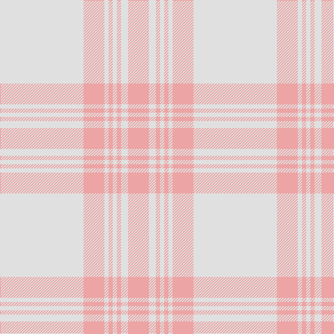

In pattern [WYWYWYWY](/stripes/wywywywy/).

This was sourced from register-of-tartans.  It is a [8 stripe tartan](/stripes/stripes8/).

Original link https://www.tartanregister.gov.uk/tartanDetails.aspx?ref=2013

## Attestations

This cloth appears in 2 source records; the oldest owns this page.

- 01/01/2007 — Walk the Walk (register-of-tartans, [record](https://www.tartanregister.gov.uk/tartanDetails.aspx?ref=2013))
- pre 2007 — Walk the Walk (Corporate) (tartans-authority, [record](http://www.tartansauthority.com/tartan-ferret/display/7306/))

## Register references

External register numbers recorded for this tartan.

- Scottish Register of Tartans: [2013](https://www.tartanregister.gov.uk/tartanDetails.aspx?ref=2013)
- Scottish Tartans Authority (ITI): 7306

## Thread count
LN/120 LR30 LN6 LR6 LN6 LR6 LN10 LR/30

## Palette
Each colour and its ΔE from the base-6 reference it is a variant of.

| Colour | Shade | Base | ΔE (OKLab) |
|---|---|---|---|
| LN | <code style="background-color:#E0E0E0;">#E0E0E0</code> `#E0E0E0` | W <code style="background-color:#F7F7F7;">#F7F7F7</code> | 0.07 |
| LR | <code style="background-color:#ECA4A4;">#ECA4A4</code> `#ECA4A4` | Y <code style="background-color:#F2BF00;">#F2BF00</code> | 0.17 |
| LRa | <code style="background-color:#E08070;">#E08070</code> `#E08070` | Y <code style="background-color:#F2BF00;">#F2BF00</code> | 0.19 |
| N | <code style="background-color:#5C5C5C;">#5C5C5C</code> `#5C5C5C` | B <code style="background-color:#2A418A;">#2A418A</code> | 0.15 |
| Na | <code style="background-color:#A0A0A0;">#A0A0A0</code> `#A0A0A0` | Y <code style="background-color:#F2BF00;">#F2BF00</code> | 0.21 |
| O | <code style="background-color:#FC5454;">#FC5454</code> `#FC5454` | R <code style="background-color:#CC0000;">#CC0000</code> | 0.15 |
| R | <code style="background-color:#D8345C;">#D8345C</code> `#D8345C` | R <code style="background-color:#CC0000;">#CC0000</code> | 0.09 |

# Sample pattern

## Nearest tartans

The nearest existing variants by ΔTartan distance.

1. [Amazon](/setts/s8/w8w30w60w15lo2w2lo2w5~x2/) — ΔT 2.37
1. [Amazon](/setts/s8/w8lb30w60lb15lo2lb2lo2lb5~x2/) — ΔT 3.19
1. [Takla Makan #2](/setts/s6/t4lo15t4lo15t4w2~x2/) — ΔT 3.45
1. [Masai Shuka 13 (Artefact)](/setts/s6/lb25w5r1w1r1w20~x4/) — ΔT 3.49
1. [Hebridean Cairn (Fashion)](/setts/s8/n2o3n3o3n10o2n18o1~x4/) — ΔT 3.53
1. [Young in Australia (Name)](/setts/s4/lo81g6lo8g8~x2/) — ΔT 3.53
1. [Orkney Slate (Fashion)](/setts/s8/n8o74lb8n42o11dp2o16n4/) — ΔT 3.78
1. [Hebridean Cairn](/setts/s14/n18o2n10o3n3o3n2o3n3o3n10o2n18o1~x4/) — ΔT 3.78
1. [McKerrell of Hillhouse Dress (Clan)](/setts/s4/w4o28t48ly3~x2/) — ΔT 3.84
1. [Cairns, David (Personal)](/setts/s5/n11o1n4o8r1~x8/) — ΔT 3.90

## Neighbour map

Every grey dot is one of 14299 variants placed by the first two principal components of the ΔTartan feature space (44% of its variance). Red is this tartan; blue dots are its nearest — click one to open its page.

<svg viewBox="0 0 640 380" role="img" style="max-width:100%;height:auto;border:1px solid #e0e0e0;border-radius:4px;display:block" xmlns="http://www.w3.org/2000/svg"><image href="/nn/cloud.v1.png" width="640" height="380"/><a href="/setts/s8/w8w30w60w15lo2w2lo2w5~x2/"><circle cx="566.7" cy="227.6" r="4" fill="#3465a4"><title>Amazon</title></circle></a><a href="/setts/s8/w8lb30w60lb15lo2lb2lo2lb5~x2/"><circle cx="482.9" cy="178.0" r="4" fill="#3465a4"><title>Amazon</title></circle></a><a href="/setts/s6/t4lo15t4lo15t4w2~x2/"><circle cx="521.4" cy="315.0" r="4" fill="#3465a4"><title>Takla Makan #2</title></circle></a><a href="/setts/s6/lb25w5r1w1r1w20~x4/"><circle cx="448.8" cy="205.7" r="4" fill="#3465a4"><title>Masai Shuka 13 (Artefact)</title></circle></a><a href="/setts/s8/n2o3n3o3n10o2n18o1~x4/"><circle cx="626.0" cy="297.9" r="4" fill="#3465a4"><title>Hebridean Cairn (Fashion)</title></circle></a><a href="/setts/s4/lo81g6lo8g8~x2/"><circle cx="626.0" cy="314.0" r="4" fill="#3465a4"><title>Young in Australia (Name)</title></circle></a><a href="/setts/s8/n8o74lb8n42o11dp2o16n4/"><circle cx="524.6" cy="194.5" r="4" fill="#3465a4"><title>Orkney Slate (Fashion)</title></circle></a><a href="/setts/s14/n18o2n10o3n3o3n2o3n3o3n10o2n18o1~x4/"><circle cx="626.0" cy="279.9" r="4" fill="#3465a4"><title>Hebridean Cairn</title></circle></a><a href="/setts/s4/w4o28t48ly3~x2/"><circle cx="501.6" cy="294.2" r="4" fill="#3465a4"><title>McKerrell of Hillhouse Dress (Clan)</title></circle></a><a href="/setts/s5/n11o1n4o8r1~x8/"><circle cx="504.7" cy="311.4" r="4" fill="#3465a4"><title>Cairns, David (Personal)</title></circle></a><circle cx="626.0" cy="242.0" r="5" fill="#c00000"/></svg>

ID: /setts/s8/w60lr15w3lr3w3lr3w5lr15~x2/
