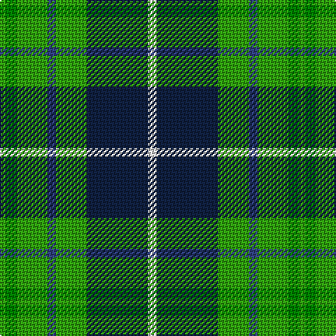

In pattern [GGGBGBBW](/patterns/gggbgbbw/).

This was sourced from weddslist.  It is a [8 stripes tartan](/stripes/stripes8/).

Original link http://www.weddslist.com/cgi-bin/tartans/pg.pl?source=sts

## Thread count
G/4 Ga8 G22 B6 G22 DB24 DB20 LN/6

## Palette
Each colour and its ΔE from the base-6 reference it is a variant of.

| Colour | Shade | Base | ΔE (OKLab) |
|---|---|---|---|
| B | <code style="background-color:#304080;">#304080</code> `#304080` | B <code style="background-color:#2A418A;">#2A418A</code> | 0.02 |
| DB | <code style="background-color:#102040;">#102040</code> `#102040` | B <code style="background-color:#2A418A;">#2A418A</code> | 0.16 |
| G | <code style="background-color:#30A010;">#30A010</code> `#30A010` | G <code style="background-color:#006100;">#006100</code> | 0.20 |
| Ga | <code style="background-color:#008000;">#008000</code> `#008000` | G <code style="background-color:#006100;">#006100</code> | 0.10 |
| LN | <code style="background-color:#E0E0E0;">#E0E0E0</code> `#E0E0E0` | W <code style="background-color:#F7F7F7;">#F7F7F7</code> | 0.07 |

# Sample pattern

## Nearest tartans

The nearest existing variants by ΔTartan distance.

1. [Disciples of Christ MM (Switzerland)](/setts/s7/k44g42k10g24b24r6w8-b2888c4-g006818-k101010-r888888-wfcfcfc/) — ΔT 0.92
1. [Disciples of Christ Motorcycle Ministry (Switzerland)](/setts/s7/k44g42k10g24b24r6w8-b2888c4-g006818-k101010-r888888-we0e0e0/) — ΔT 0.97
1. [Wilson's, No 149](/setts/s11/g16b12k4b12g22ba4k4ba4g22w4k16-b304080-ba5480b0-g008000-k000000-we0e0e0/) — ΔT 1.09
1. [Loch Katrine](/setts/s7/b16k22w6k22g24g20r4-b8080d0-g30a010-k000030-r802040-we0e0e0/) — ΔT 1.34
1. [Arrol](/setts/s9/r10b30k30g30w4g30k30g30w4-b304080-g008000-k000000-rc00000-we0e0e0/) — ΔT 1.34
1. [Trafalger](/setts/s6/g6b2g16b14k6y2-b304080-g008000-k000000-yf0c000/) — ΔT 1.41
1. [Arrol Corporate Tartan Tartan Number: 1365. Earliest known date: c.1910 From James Johnston & Co. (Glasgow) pattern book covering 1863 to 1963. Designed early 20th century for Sir William Arrol, head of the engineering firm which built Forth Bridge, and of the Arrol-Johnston motor car company, but it is not clear whether it was intended as a corporate tartan or for his personal use. See products available Copyright © Blair Urquhart, Comrie, 2015](/setts/s9/r10b30k30g30w4g30k30g30w4-b2c2c80-g006818-k101010-rc80000-we0e0e0/) — ΔT 1.41
1. [MacRae, Ancient hunting](/setts/s8/g48k8g12r8g12k38b44w10-b304080-g008000-k000000-rc00000-we0e0e0/) — ΔT 1.42
1. [CSCA (Corporate)](/setts/s8/g10r8g38k20g16w8b36r8-b2c2c80-g006818-k101010-rc80000-wfcfcfc/) — ΔT 1.43
1. [Aztec, New Mexico](/setts/s8/r6k16g34y4g34k16b16k4-b3850c8-g146400-k101010-rff0000-yffe600/) — ΔT 1.43

## Neighbour map

Every grey dot is one of 15726 variants placed by the first two principal components of the ΔTartan feature space (44% of its variance). Red is this tartan; blue dots are its nearest — click one to open its page.

<svg viewBox="0 0 640 380" role="img" style="max-width:100%;height:auto;border:1px solid #e0e0e0;border-radius:4px;display:block" xmlns="http://www.w3.org/2000/svg"><image href="/nn/cloud.v1.png" width="640" height="380"/><a href="/setts/s7/k44g42k10g24b24r6w8-b2888c4-g006818-k101010-r888888-wfcfcfc/"><circle cx="148.0" cy="217.0" r="4" fill="#3465a4"><title>Disciples of Christ MM (Switzerland)</title></circle></a><a href="/setts/s7/k44g42k10g24b24r6w8-b2888c4-g006818-k101010-r888888-we0e0e0/"><circle cx="152.7" cy="219.2" r="4" fill="#3465a4"><title>Disciples of Christ Motorcycle Ministry (Switzerland)</title></circle></a><a href="/setts/s11/g16b12k4b12g22ba4k4ba4g22w4k16-b304080-ba5480b0-g008000-k000000-we0e0e0/"><circle cx="148.9" cy="206.2" r="4" fill="#3465a4"><title>Wilson's, No 149</title></circle></a><a href="/setts/s7/b16k22w6k22g24g20r4-b8080d0-g30a010-k000030-r802040-we0e0e0/"><circle cx="89.6" cy="235.4" r="4" fill="#3465a4"><title>Loch Katrine</title></circle></a><a href="/setts/s9/r10b30k30g30w4g30k30g30w4-b304080-g008000-k000000-rc00000-we0e0e0/"><circle cx="129.4" cy="214.3" r="4" fill="#3465a4"><title>Arrol</title></circle></a><a href="/setts/s6/g6b2g16b14k6y2-b304080-g008000-k000000-yf0c000/"><circle cx="214.6" cy="230.7" r="4" fill="#3465a4"><title>Trafalger</title></circle></a><a href="/setts/s9/r10b30k30g30w4g30k30g30w4-b2c2c80-g006818-k101010-rc80000-we0e0e0/"><circle cx="162.6" cy="226.6" r="4" fill="#3465a4"><title>Arrol Corporate Tartan Tartan Number: 1365. Earliest known date: c.1910 From James Johnston &amp; Co. (Glasgow) pattern book covering 1863 to 1963. Designed early 20th century for Sir William Arrol, head of the engineering firm which built Forth Bridge, and of the Arrol-Johnston motor car company, but it is not clear whether it was intended as a corporate tartan or for his personal use. See products available Copyright © Blair Urquhart, Comrie, 2015</title></circle></a><a href="/setts/s8/g48k8g12r8g12k38b44w10-b304080-g008000-k000000-rc00000-we0e0e0/"><circle cx="115.1" cy="202.5" r="4" fill="#3465a4"><title>MacRae, Ancient hunting</title></circle></a><a href="/setts/s8/g10r8g38k20g16w8b36r8-b2c2c80-g006818-k101010-rc80000-wfcfcfc/"><circle cx="138.1" cy="223.4" r="4" fill="#3465a4"><title>CSCA (Corporate)</title></circle></a><a href="/setts/s8/r6k16g34y4g34k16b16k4-b3850c8-g146400-k101010-rff0000-yffe600/"><circle cx="220.1" cy="205.7" r="4" fill="#3465a4"><title>Aztec, New Mexico</title></circle></a><circle cx="138.9" cy="223.9" r="5" fill="#c00000"/></svg>

ID: /setts/s8/w6b20b24g22ba6g22ga8g4-b102040-ba304080-g30a010-ga008000-we0e0e0/
