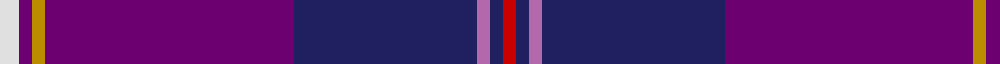

In pattern [RBRBBYBW](/patterns/rbrbbybw/).

This was sourced from tartans-authority.  It is a [8 stripes tartan](/stripes/stripes8/).

Original link http://www.tartansauthority.com/tartan-ferret/display/6032/

## Thread count
LN/6 Pa4 DY4 Pa76 DB56 P4 DB4 R/4

## Palette
Each colour and its ΔE from the base-6 reference it is a variant of.

| Colour | Shade | Base | ΔE (OKLab) |
|---|---|---|---|
| DB | <code style="background-color:#202060;">#202060</code> `#202060` | B <code style="background-color:#2C4084;">#2C4084</code> | 0.11 |
| DY | <code style="background-color:#BC8C00;">#BC8C00</code> `#BC8C00` | Y <code style="background-color:#E8C000;">#E8C000</code> | 0.16 |
| LN | <code style="background-color:#E0E0E0;">#E0E0E0</code> `#E0E0E0` | W <code style="background-color:#F4F4F0;">#F4F4F0</code> | 0.06 |
| P | <code style="background-color:#B468AC;">#B468AC</code> `#B468AC` | R <code style="background-color:#C80000;">#C80000</code> | 0.21 |
| Pa | <code style="background-color:#6C0070;">#6C0070</code> `#6C0070` | B <code style="background-color:#2C4084;">#2C4084</code> | 0.15 |
| R | <code style="background-color:#C80000;">#C80000</code> `#C80000` | R <code style="background-color:#C80000;">#C80000</code> | 0.00 |

# Sample pattern

## Nearest tartans

The nearest existing variants by ΔTartan distance.

1. [Diamond Jubilee (Lochcarron) (Comm.)](/setts/s10/b92ba24y6ba6w6b22bb10ba4bb14wa4-b780078-ba202060-bb1c0070-wc0c0c0-wae0e0e0-ybc8c00/) — ΔT 1.04
1. [Pride of Glencoe](/setts/s6/k6g4r6b60ba64w6-b2c2c80-ba6c0070-g006818-k101010-rc04094-we0e0e0/) — ΔT 1.24
1. [Custer (Personal)](/setts/s10/b40w2ba16bb2r4k6r4bb2ba40b16-b2c2c80-ba780078-bb2888c4-k101010-rc80000-wf8f8f8/) — ΔT 1.30
1. [Gretna Gold](/setts/s14/b4r4b56ba76y4ba4w6ba4y4ba76b56r4b4ra4-b202060-ba6c0070-rb468ac-rac80000-we0e0e0-ybc8c00/) — ΔT 1.40
1. [Gretna Gold Fashion Tartan Tartan Number: 6032. Earliest known date: 01/01/2003 Presumably a fashion tartan. Lochcarron swatch. See products available Copyright © Blair Urquhart, Comrie, 2015](/setts/s14/b4r4b56ba76k4ba4w6ba4k4ba76b56r4b4ra4-b202060-ba6c0070-k000000-rb468ac-rac80000-we0e0e0/) — ΔT 1.45
1. [Pride of Fife](/setts/s10/b4w4ba32y4ba4r10b74ba12y4b4-b202060-ba440044-r800028-wfcfcfc-y48a4c0/) — ΔT 1.51
1. [Gill, Anil (Personal)](/setts/s10/g2b60ba64b2r10b2ra8b2r4w2-b000084-ba780078-g649848-rdc0000-rae87878-wffffff/) — ΔT 1.70
1. [Cheadle (Personal)](/setts/s6/b20y6b16ba84g10r10-b780078-ba2c2c80-g006818-r888888-ye8c000/) — ΔT 1.74
1. [St. Leonards (Corporate)](/setts/s8/r32b4ra12r6k8ba4b80ba12-b2c2c80-ba2888c4-k101010-rc80000-ra888888/) — ΔT 1.75
1. [Royal Scottish Corporation](/setts/s9/w4r6b24ba6b6ba56r6ba6y4-b1c1c50-ba2c2c80-rc80000-we0e0e0-ye8c000/) — ΔT 1.77

## Neighbour map

Every grey dot is one of 15726 variants placed by the first two principal components of the ΔTartan feature space (44% of its variance). Red is this tartan; blue dots are its nearest — click one to open its page.

<svg viewBox="0 0 640 380" role="img" style="max-width:100%;height:auto;border:1px solid #e0e0e0;border-radius:4px;display:block" xmlns="http://www.w3.org/2000/svg"><image href="/nn/cloud.v1.png" width="640" height="380"/><a href="/setts/s10/b92ba24y6ba6w6b22bb10ba4bb14wa4-b780078-ba202060-bb1c0070-wc0c0c0-wae0e0e0-ybc8c00/"><circle cx="379.2" cy="107.2" r="4" fill="#3465a4"><title>Diamond Jubilee (Lochcarron) (Comm.)</title></circle></a><a href="/setts/s6/k6g4r6b60ba64w6-b2c2c80-ba6c0070-g006818-k101010-rc04094-we0e0e0/"><circle cx="297.6" cy="163.7" r="4" fill="#3465a4"><title>Pride of Glencoe</title></circle></a><a href="/setts/s10/b40w2ba16bb2r4k6r4bb2ba40b16-b2c2c80-ba780078-bb2888c4-k101010-rc80000-wf8f8f8/"><circle cx="299.1" cy="137.3" r="4" fill="#3465a4"><title>Custer (Personal)</title></circle></a><a href="/setts/s14/b4r4b56ba76y4ba4w6ba4y4ba76b56r4b4ra4-b202060-ba6c0070-rb468ac-rac80000-we0e0e0-ybc8c00/"><circle cx="362.9" cy="116.8" r="4" fill="#3465a4"><title>Gretna Gold</title></circle></a><a href="/setts/s14/b4r4b56ba76k4ba4w6ba4k4ba76b56r4b4ra4-b202060-ba6c0070-k000000-rb468ac-rac80000-we0e0e0/"><circle cx="364.5" cy="118.5" r="4" fill="#3465a4"><title>Gretna Gold Fashion Tartan Tartan Number: 6032. Earliest known date: 01/01/2003 Presumably a fashion tartan. Lochcarron swatch. See products available Copyright © Blair Urquhart, Comrie, 2015</title></circle></a><a href="/setts/s10/b4w4ba32y4ba4r10b74ba12y4b4-b202060-ba440044-r800028-wfcfcfc-y48a4c0/"><circle cx="368.1" cy="143.1" r="4" fill="#3465a4"><title>Pride of Fife</title></circle></a><a href="/setts/s10/g2b60ba64b2r10b2ra8b2r4w2-b000084-ba780078-g649848-rdc0000-rae87878-wffffff/"><circle cx="285.4" cy="76.2" r="4" fill="#3465a4"><title>Gill, Anil (Personal)</title></circle></a><a href="/setts/s6/b20y6b16ba84g10r10-b780078-ba2c2c80-g006818-r888888-ye8c000/"><circle cx="353.1" cy="180.8" r="4" fill="#3465a4"><title>Cheadle (Personal)</title></circle></a><a href="/setts/s8/r32b4ra12r6k8ba4b80ba12-b2c2c80-ba2888c4-k101010-rc80000-ra888888/"><circle cx="314.9" cy="133.5" r="4" fill="#3465a4"><title>St. Leonards (Corporate)</title></circle></a><a href="/setts/s9/w4r6b24ba6b6ba56r6ba6y4-b1c1c50-ba2c2c80-rc80000-we0e0e0-ye8c000/"><circle cx="337.3" cy="151.7" r="4" fill="#3465a4"><title>Royal Scottish Corporation</title></circle></a><circle cx="341.9" cy="125.0" r="5" fill="#c00000"/></svg>

ID: /setts/s8/w6b4y4b76ba56r4ba4ra4-b6c0070-ba202060-rb468ac-rac80000-we0e0e0-ybc8c00/
