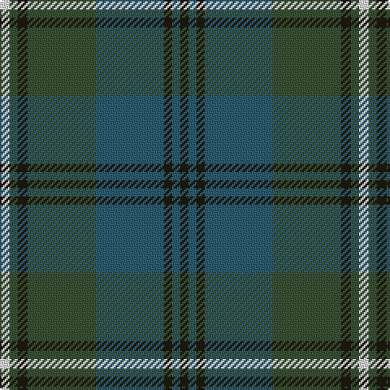

In pattern [KBKBGKGW](/stripes/kbkbgkgw/).

This was sourced from house-of-tartan.  It is a [8 stripe tartan](/stripes/stripes8/).

Original link http://www.house-of-tartan.scotland.net/house/TartanViewjs.asp?colr=Def&tnam=6500

## Thread count
LN/6 N5 K6 N42 B42 K5 B5 K/5

## Palette
Each colour and the base-6 reference it is a variant of.

| Colour | Shade | Base |
|---|---|---|
| B | <code style="background-color:#2D5C71;">#2D5C71</code> `oklch(45.1% 0.062 229.4)` <small>#2D5C71</small> | B <code style="background-color:#2A418A;">#2A418A</code> |
| K | <code style="background-color:#1E1A10;">#1E1A10</code> `oklch(21.9% 0.019 88.7)` <small>#1E1A10</small> | K <code style="background-color:#000000;">#000000</code> |
| LN | <code style="background-color:#E0E0E0;">#E0E0E0</code> `oklch(90.7% 0.000 89.9)` <small>#E0E0E0</small> | W <code style="background-color:#F7F7F7;">#F7F7F7</code> |
| N | <code style="background-color:#3A5134;">#3A5134</code> `oklch(40.7% 0.055 139.3)` <small>#3A5134</small> | G <code style="background-color:#006100;">#006100</code> |

# Sample pattern

## Nearest tartans

The nearest existing variants by ΔTartan distance.

1. [Grampian (District)](/setts/s8/y24r2y3db14dt24r2dt3db3~x2/) — ΔT 1.21
1. [Eastern Western Motor Group, Dalbraith](/setts/s8/dy28g2dy4db18g23db2g3lo4~x2/) — ΔT 1.34
1. [Wcwm 1530](/setts/s8/dg36db3dg3db3dg6n34r4n4~x2/) — ΔT 1.40
1. [St. Andrews New Golf Club](/setts/s9/dp4dt18r2dt2r2dt9g20dt3g4~x2/) — ΔT 1.41
1. [Stuart/Stewart of Appin #2](/setts/s10/dg11r4dg4r7dg41db11t4db41r4db8/) — ΔT 1.42
1. [Gammell (Brown) (Personal)](/setts/s8/db20dy2db2dy2db2dy6g15dy2~x2/) — ΔT 1.43
1. [Stuart/Stewart of Appin](/setts/s10/dg8r3dg3r5dg26db7t3db28r3db6~x2/) — ΔT 1.47
1. [Clyde (WCWM Fashion)](/setts/s9/lo2n28k2w2k2g26n3g5lo2~x2/) — ΔT 1.47
1. [Scotch Mist](/setts/s8/n4o4n4k4n18k3do38w3~x2/) — ΔT 1.48
1. [Gammell Family Tartan Tartan Number: 597. Earliest known date: 1965 Designed (probably by David Thomas and Arthur Mackie of Strathmore Woollen Co) for the Hill family of Angus as a personal tartan. Tommy Gemmell (6.3.05) said "The tartan was designed using the largest Government sett by Mrs Hill's mother - a Mrs Gammell - who was a handweaver." See products available Copyright © Blair Urquhart, Comrie, 2015](/setts/s8/db32do3db3do3db3do10g24r3~x2/) — ΔT 1.48

## Neighbour map

Every grey dot is one of 14299 variants placed by the first two principal components of the ΔTartan feature space (44% of its variance). Red is this tartan; blue dots are its nearest — click one to open its page.

<svg viewBox="0 0 640 380" role="img" style="max-width:100%;height:auto;border:1px solid #e0e0e0;border-radius:4px;display:block" xmlns="http://www.w3.org/2000/svg"><image href="/nn/cloud.v1.png" width="640" height="380"/><a href="/setts/s8/y24r2y3db14dt24r2dt3db3~x2/"><circle cx="277.8" cy="220.4" r="4" fill="#3465a4"><title>Grampian (District)</title></circle></a><a href="/setts/s8/dy28g2dy4db18g23db2g3lo4~x2/"><circle cx="289.4" cy="218.9" r="4" fill="#3465a4"><title>Eastern Western Motor Group, Dalbraith</title></circle></a><a href="/setts/s8/dg36db3dg3db3dg6n34r4n4~x2/"><circle cx="361.3" cy="218.1" r="4" fill="#3465a4"><title>Wcwm 1530</title></circle></a><a href="/setts/s9/dp4dt18r2dt2r2dt9g20dt3g4~x2/"><circle cx="341.2" cy="233.2" r="4" fill="#3465a4"><title>St. Andrews New Golf Club</title></circle></a><a href="/setts/s10/dg11r4dg4r7dg41db11t4db41r4db8/"><circle cx="305.6" cy="206.3" r="4" fill="#3465a4"><title>Stuart/Stewart of Appin #2</title></circle></a><a href="/setts/s8/db20dy2db2dy2db2dy6g15dy2~x2/"><circle cx="340.6" cy="238.9" r="4" fill="#3465a4"><title>Gammell (Brown) (Personal)</title></circle></a><a href="/setts/s10/dg8r3dg3r5dg26db7t3db28r3db6~x2/"><circle cx="294.0" cy="210.9" r="4" fill="#3465a4"><title>Stuart/Stewart of Appin</title></circle></a><a href="/setts/s9/lo2n28k2w2k2g26n3g5lo2~x2/"><circle cx="326.6" cy="179.3" r="4" fill="#3465a4"><title>Clyde (WCWM Fashion)</title></circle></a><a href="/setts/s8/n4o4n4k4n18k3do38w3~x2/"><circle cx="329.9" cy="186.1" r="4" fill="#3465a4"><title>Scotch Mist</title></circle></a><a href="/setts/s8/db32do3db3do3db3do10g24r3~x2/"><circle cx="315.5" cy="216.8" r="4" fill="#3465a4"><title>Gammell Family Tartan Tartan Number: 597. Earliest known date: 1965 Designed (probably by David Thomas and Arthur Mackie of Strathmore Woollen Co) for the Hill family of Angus as a personal tartan. Tommy Gemmell (6.3.05) said &quot;The tartan was designed using the largest Government sett by Mrs Hill's mother - a Mrs Gammell - who was a handweaver.&quot; See products available Copyright © Blair Urquhart, Comrie, 2015</title></circle></a><circle cx="294.4" cy="229.0" r="5" fill="#c00000"/></svg>

ID: /setts/s8/w6dg5k6dg42n42k5n5k5/
