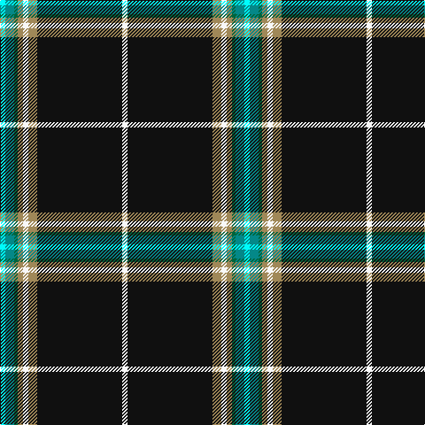

In pattern [WGGYWYKW](/patterns/wggywykw/).

This was sourced from register-of-tartans.  It is a [8 stripes tartan](/stripes/stripes8/).

Original link https://www.tartanregister.gov.uk/tartanDetails.aspx?ref=11144

## Thread count
LB/6 B10 G4 LT6 W6 LT10 K96 W/6

## Palette
Each colour and its ΔE from the base-6 reference it is a variant of.

| Colour | Shade | Base | ΔE (OKLab) |
|---|---|---|---|
| B | <code style="background-color:#048888;">#048888</code> `#048888` | G <code style="background-color:#006400;">#006400</code> | 0.18 |
| G | <code style="background-color:#00643C;">#00643C</code> `#00643C` | G <code style="background-color:#006400;">#006400</code> | 0.06 |
| K | <code style="background-color:#101010;">#101010</code> `#101010` | K <code style="background-color:#000000;">#000000</code> | 0.17 |
| LB | <code style="background-color:#00FCFC;">#00FCFC</code> `#00FCFC` | W <code style="background-color:#F4F4F0;">#F4F4F0</code> | 0.17 |
| LT | <code style="background-color:#A08858;">#A08858</code> `#A08858` | Y <code style="background-color:#E8C000;">#E8C000</code> | 0.21 |
| W | <code style="background-color:#F8F8F8;">#F8F8F8</code> `#F8F8F8` | W <code style="background-color:#F4F4F0;">#F4F4F0</code> | 0.01 |

# Sample pattern

## Nearest tartans

The nearest existing variants by ΔTartan distance.

1. [Victory](/setts/s9/k4r6k72b4k10b14y6w10ya4-b666666-k101010-re3170d-w82cffd-yffe600-ya86c67c/) — ΔT 0.74
1. [Pavelka Ltd](/setts/s8/g6k96g10w6g6ga4gb10wa6-g604000-ga006818-gb048888-k101010-wfcfcfc-wa98c8e8/) — ΔT 0.81
1. [Hawes (2014)](/setts/s10/w4b6g10k100g8b6w4ba6k4y4-b441800-ba5c8ca8-g007800-k101010-wffffff-yffd700/) — ΔT 0.94
1. [Clan An Caigeann (Corporate)](/setts/s12/k88y6k8y6k8b8w4b8r4w4g8y4-b2c2c80-g003820-k101010-r880000-we0e0e0-ye8c000/) — ΔT 1.05
1. [Hawks (2014)](/setts/s10/w4b6g10k100g8b6w4ba6k4y4-b441800-ba2c2c80-g006818-k101010-wfcfcfc-yfccc00/) — ΔT 1.13
1. [Stewart Black Clan Tartan Tartan Number: 1061. Earliest known date: c.1930 Count from a silk sample in the STS collection labelled Stewart See products available Copyright © Blair Urquhart, Comrie, 2015](/setts/s12/k96b8k16y4k6w6k6g24r12k6r6w6-b2c2c80-g006818-k101010-rc80000-we0e0e0-ye8c000/) — ΔT 1.19
1. [Thin Blue Line UK](/setts/s10/b10k70ba6k4r6k4g6k4w6k4-b003c64-ba0596fa-g008b00-k101010-rdc0000-wffffff/) — ΔT 1.23
1. [Avalon](/setts/s7/r10g6y12w6y10k110w10-g006818-k101010-rc80000-wf8f8f8-ye8c000/) — ΔT 1.24
1. [Friends of Nordegg](/setts/s6/k100g12b12r12ba12w6-b0000cd-ba666666-g008b00-k101010-rff0000-wffffff/) — ΔT 1.26
1. [Braddock Family (Northumberland) (Personal)](/setts/s11/w10k8b4k10y4r4y4k60g6w14k8-b2c2c80-g649848-k101010-rca2625-we0e0e0-ye8c000/) — ΔT 1.26

## Neighbour map

Every grey dot is one of 15726 variants placed by the first two principal components of the ΔTartan feature space (44% of its variance). Red is this tartan; blue dots are its nearest — click one to open its page.

<svg viewBox="0 0 640 380" role="img" style="max-width:100%;height:auto;border:1px solid #e0e0e0;border-radius:4px;display:block" xmlns="http://www.w3.org/2000/svg"><image href="/nn/cloud.v1.png" width="640" height="380"/><a href="/setts/s9/k4r6k72b4k10b14y6w10ya4-b666666-k101010-re3170d-w82cffd-yffe600-ya86c67c/"><circle cx="342.2" cy="101.4" r="4" fill="#3465a4"><title>Victory</title></circle></a><a href="/setts/s8/g6k96g10w6g6ga4gb10wa6-g604000-ga006818-gb048888-k101010-wfcfcfc-wa98c8e8/"><circle cx="383.3" cy="96.1" r="4" fill="#3465a4"><title>Pavelka Ltd</title></circle></a><a href="/setts/s10/w4b6g10k100g8b6w4ba6k4y4-b441800-ba5c8ca8-g007800-k101010-wffffff-yffd700/"><circle cx="392.9" cy="75.4" r="4" fill="#3465a4"><title>Hawes (2014)</title></circle></a><a href="/setts/s12/k88y6k8y6k8b8w4b8r4w4g8y4-b2c2c80-g003820-k101010-r880000-we0e0e0-ye8c000/"><circle cx="364.6" cy="72.8" r="4" fill="#3465a4"><title>Clan An Caigeann (Corporate)</title></circle></a><a href="/setts/s10/w4b6g10k100g8b6w4ba6k4y4-b441800-ba2c2c80-g006818-k101010-wfcfcfc-yfccc00/"><circle cx="401.5" cy="79.5" r="4" fill="#3465a4"><title>Hawks (2014)</title></circle></a><a href="/setts/s12/k96b8k16y4k6w6k6g24r12k6r6w6-b2c2c80-g006818-k101010-rc80000-we0e0e0-ye8c000/"><circle cx="363.7" cy="81.3" r="4" fill="#3465a4"><title>Stewart Black Clan Tartan Tartan Number: 1061. Earliest known date: c.1930 Count from a silk sample in the STS collection labelled Stewart See products available Copyright © Blair Urquhart, Comrie, 2015</title></circle></a><a href="/setts/s10/b10k70ba6k4r6k4g6k4w6k4-b003c64-ba0596fa-g008b00-k101010-rdc0000-wffffff/"><circle cx="397.9" cy="99.0" r="4" fill="#3465a4"><title>Thin Blue Line UK</title></circle></a><a href="/setts/s7/r10g6y12w6y10k110w10-g006818-k101010-rc80000-wf8f8f8-ye8c000/"><circle cx="368.0" cy="116.3" r="4" fill="#3465a4"><title>Avalon</title></circle></a><a href="/setts/s6/k100g12b12r12ba12w6-b0000cd-ba666666-g008b00-k101010-rff0000-wffffff/"><circle cx="336.8" cy="130.7" r="4" fill="#3465a4"><title>Friends of Nordegg</title></circle></a><a href="/setts/s11/w10k8b4k10y4r4y4k60g6w14k8-b2c2c80-g649848-k101010-rca2625-we0e0e0-ye8c000/"><circle cx="308.6" cy="99.4" r="4" fill="#3465a4"><title>Braddock Family (Northumberland) (Personal)</title></circle></a><circle cx="358.6" cy="85.4" r="5" fill="#c00000"/></svg>

ID: /setts/s8/w6g10ga4y6wa6y10k96wa6-g048888-ga00643c-k101010-w00fcfc-waf8f8f8-ya08858/
