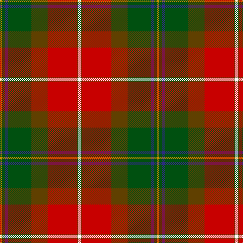

In pattern [WGRGGBGY](/patterns/wgrggbgy/).

This was sourced from register-of-tartans.  It is a [8 stripes tartan](/stripes/stripes8/).

Original link https://www.tartanregister.gov.uk/tartanDetails.aspx?ref=4062

## Attestations

This cloth appears in 2 source records; the oldest owns this page.

- 01/01/2002 — Tache, Sir Etienne Paschal #2 (register-of-tartans, [record](https://www.tartanregister.gov.uk/tartanDetails.aspx?ref=4062))
- pre 2002 — Tache, Sir Etienne Paschal (Commem) (tartans-authority, [record](http://www.tartansauthority.com/tartan-ferret/display/1877/))

## Thread count
DY/4 G6 DB6 G46 T32 R58 T2 W/6

## Palette
Each colour and its ΔE from the base-6 reference it is a variant of.

| Colour | Shade | Base | ΔE (OKLab) |
|---|---|---|---|
| DB | <code style="background-color:#2C2C80;">#2C2C80</code> `#2C2C80` | B <code style="background-color:#2C4084;">#2C4084</code> | 0.05 |
| DY | <code style="background-color:#BC8C00;">#BC8C00</code> `#BC8C00` | Y <code style="background-color:#E8C000;">#E8C000</code> | 0.16 |
| G | <code style="background-color:#005010;">#005010</code> `#005010` | G <code style="background-color:#006400;">#006400</code> | 0.07 |
| R | <code style="background-color:#C80000;">#C80000</code> `#C80000` | R <code style="background-color:#C80000;">#C80000</code> | 0.00 |
| T | <code style="background-color:#604000;">#604000</code> `#604000` | G <code style="background-color:#006400;">#006400</code> | 0.14 |
| W | <code style="background-color:#FCFCFC;">#FCFCFC</code> `#FCFCFC` | W <code style="background-color:#F4F4F0;">#F4F4F0</code> | 0.03 |
| Y | <code style="background-color:#E8C000;">#E8C000</code> `#E8C000` | Y <code style="background-color:#E8C000;">#E8C000</code> | 0.00 |

# Sample pattern

## Nearest tartans

The nearest existing variants by ΔTartan distance.

1. [Etienne Paschal Tache Sir... Canadian Tartan Tartan Number: 1877. Earliest known date: 1983 Nothing See products available Copyright © Blair Urquhart, Comrie, 2015](/setts/s8/w6g2r58g32ga46b6ga6y4-b2c2c80-g604000-ga006818-rc80000-we0e0e0-ye8c000/) — ΔT 0.30
1. [Etienne, Paschal Tache Sir...](/setts/s8/w6r2ra58r32g46b6g6y4-b304080-g008000-r806050-rac00000-we0e0e0-yf0c000/) — ΔT 0.72
1. [Hamish Bicknell (Personal)](/setts/s11/w6k2r50k4g4ga50g4y4g20k2r4-g604000-ga006818-k101010-rc80000-we0e0e0-ye8c000/) — ΔT 1.02
1. [Henry W.A. Canadian Tartan Tartan Number: 1667. Earliest known date: 1983 See products available Copyright © Blair Urquhart, Comrie, 2015](/setts/s9/g48r48w6ga42y4r2y4g12r4-g604000-ga006818-rc80000-we0e0e0-ye8c000/) — ΔT 1.05
1. [Westwood (Fashion?)](/setts/s10/r30y60k2w12k2y4g32b8r12w2-b5c8ca8-g003820-k101010-rc80000-we0e0e0-ya08858/) — ΔT 1.15
1. [Bicknell, The Hamish (Personal)](/setts/s11/w6k2r50k4g4ga50g4y4g20k2r4-g603311-ga008000-k101010-raf1e2d-wffffff-yffe600/) — ΔT 1.22
1. [Telfer (Name)](/setts/s9/g18y4g12r70b12w2ra40b10w4-b1c1c50-g006818-rc80000-ra880000-wa8ace8-ye8c000/) — ΔT 1.22
1. [Carolina, States of (District)](/setts/s13/r64g28k32y6k8ya8k8r2ga56r26k8r8ya4-g789484-ga5c6428-k101010-ra00000-yc4bc68-yab8b8b8/) — ΔT 1.23
1. [Forrester (Clan)](/setts/s9/w12b16w4b60r96g60y4g16y12-b283854-g285800-rc80000-we0e0e0-ye8c000/) — ΔT 1.24
1. [Moray of Abercairny](/setts/s11/w2b6ba4r36ra4g32ra4r4ra4b6w2-b5c8ca8-ba1c1c50-g006818-r880000-rad05054-wf8f8f8/) — ΔT 1.25

## Neighbour map

Every grey dot is one of 15726 variants placed by the first two principal components of the ΔTartan feature space (44% of its variance). Red is this tartan; blue dots are its nearest — click one to open its page.

<svg viewBox="0 0 640 380" role="img" style="max-width:100%;height:auto;border:1px solid #e0e0e0;border-radius:4px;display:block" xmlns="http://www.w3.org/2000/svg"><image href="/nn/cloud.v1.png" width="640" height="380"/><a href="/setts/s8/w6g2r58g32ga46b6ga6y4-b2c2c80-g604000-ga006818-rc80000-we0e0e0-ye8c000/"><circle cx="224.1" cy="112.2" r="4" fill="#3465a4"><title>Etienne Paschal Tache Sir... Canadian Tartan Tartan Number: 1877. Earliest known date: 1983 Nothing See products available Copyright © Blair Urquhart, Comrie, 2015</title></circle></a><a href="/setts/s8/w6r2ra58r32g46b6g6y4-b304080-g008000-r806050-rac00000-we0e0e0-yf0c000/"><circle cx="226.1" cy="112.6" r="4" fill="#3465a4"><title>Etienne, Paschal Tache Sir...</title></circle></a><a href="/setts/s11/w6k2r50k4g4ga50g4y4g20k2r4-g604000-ga006818-k101010-rc80000-we0e0e0-ye8c000/"><circle cx="216.8" cy="84.6" r="4" fill="#3465a4"><title>Hamish Bicknell (Personal)</title></circle></a><a href="/setts/s9/g48r48w6ga42y4r2y4g12r4-g604000-ga006818-rc80000-we0e0e0-ye8c000/"><circle cx="237.1" cy="132.4" r="4" fill="#3465a4"><title>Henry W.A. Canadian Tartan Tartan Number: 1667. Earliest known date: 1983 See products available Copyright © Blair Urquhart, Comrie, 2015</title></circle></a><a href="/setts/s10/r30y60k2w12k2y4g32b8r12w2-b5c8ca8-g003820-k101010-rc80000-we0e0e0-ya08858/"><circle cx="204.8" cy="85.6" r="4" fill="#3465a4"><title>Westwood (Fashion?)</title></circle></a><a href="/setts/s11/w6k2r50k4g4ga50g4y4g20k2r4-g603311-ga008000-k101010-raf1e2d-wffffff-yffe600/"><circle cx="203.5" cy="80.4" r="4" fill="#3465a4"><title>Bicknell, The Hamish (Personal)</title></circle></a><a href="/setts/s9/g18y4g12r70b12w2ra40b10w4-b1c1c50-g006818-rc80000-ra880000-wa8ace8-ye8c000/"><circle cx="247.4" cy="91.2" r="4" fill="#3465a4"><title>Telfer (Name)</title></circle></a><a href="/setts/s13/r64g28k32y6k8ya8k8r2ga56r26k8r8ya4-g789484-ga5c6428-k101010-ra00000-yc4bc68-yab8b8b8/"><circle cx="201.4" cy="86.6" r="4" fill="#3465a4"><title>Carolina, States of (District)</title></circle></a><a href="/setts/s9/w12b16w4b60r96g60y4g16y12-b283854-g285800-rc80000-we0e0e0-ye8c000/"><circle cx="196.5" cy="123.2" r="4" fill="#3465a4"><title>Forrester (Clan)</title></circle></a><a href="/setts/s11/w2b6ba4r36ra4g32ra4r4ra4b6w2-b5c8ca8-ba1c1c50-g006818-r880000-rad05054-wf8f8f8/"><circle cx="204.3" cy="100.3" r="4" fill="#3465a4"><title>Moray of Abercairny</title></circle></a><circle cx="222.8" cy="111.9" r="5" fill="#c00000"/></svg>

ID: /setts/s8/w6g2r58g32ga46b6ga6y4-b2c2c80-g604000-ga005010-rc80000-wfcfcfc-ybc8c00/
