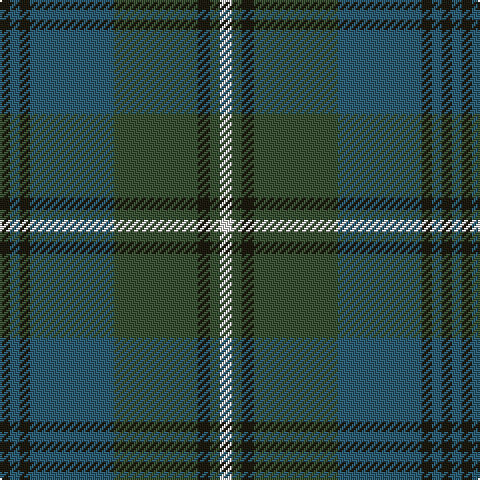

In pattern [KBKBGKGW](/patterns/kbkbgkgw/).

This was sourced from house-of-tartan.  It is a [8 stripes tartan](/stripes/stripes8/).

Original link http://www.house-of-tartan.scotland.net/house/TartanViewjs.asp?colr=Def&tnam=6500

## Thread count
K/5 B5 K5 B42 N42 K6 N5 LN/6

## Palette
Each colour and its ΔE from the base-6 reference it is a variant of.

| Colour | Shade | Base | ΔE (OKLab) |
|---|---|---|---|
| B | <code style="background-color:#2D5C71;">#2D5C71</code> `#2D5C71` | B <code style="background-color:#2A418A;">#2A418A</code> | 0.10 |
| K | <code style="background-color:#1E1A10;">#1E1A10</code> `#1E1A10` | K <code style="background-color:#000000;">#000000</code> | 0.22 |
| LN | <code style="background-color:#E0E0E0;">#E0E0E0</code> `#E0E0E0` | W <code style="background-color:#F7F7F7;">#F7F7F7</code> | 0.07 |
| N | <code style="background-color:#3A5134;">#3A5134</code> `#3A5134` | G <code style="background-color:#006100;">#006100</code> | 0.09 |

# Sample pattern

## Nearest tartans

The nearest existing variants by ΔTartan distance.

1. [Grampian (District)](/setts/s8/g24r2g3b14ba24r2ba3b3~b303070-ba14283c-g5c6428-rc80000~x2/) — ΔT 1.21
1. [Eastern Western Motor Group, Dalbraith](/setts/s8/g28ga2g4b18ga23b2ga3y4~b202060-g604000-ga006818-ya08858~x2/) — ΔT 1.34
1. [Wcwm 1530](/setts/s8/g36b3g3b3g6ba34r4ba4~b0000e0-ba306084-g004c00-r8c0000~x2/) — ΔT 1.40
1. [St. Andrews New Golf Club](/setts/s9/b4ba18r2ba2r2ba9g20ba3g4~b780078-ba003c64-g006818-r880000~x2/) — ΔT 1.42
1. [Stuart/Stewart of Appin #2](/setts/s10/g11r4g4r7g41b11ba4b41r4b8~b2c4084-ba3c82af-g005020-rdc0000/) — ΔT 1.42
1. [Gammell (Brown) (Personal)](/setts/s8/b20g2b2g2b2g6ga15g2~b2c2c80-g604000-ga006818~x2/) — ΔT 1.43
1. [Clyde (WCWM Fashion)](/setts/s9/y2b28k2w2k2g26b3g5y2~b5c5c5c-g147880-k101010-wf8f8f8-yd87c00~x2/) — ΔT 1.47
1. [Stuart/Stewart of Appin](/setts/s10/g8r3g3r5g26b7ba3b28r3b6~b2c4084-ba3c82af-g005020-rdc0000~x2/) — ΔT 1.47
1. [Scotch Mist](/setts/s8/b4r4b4k4b18k3ba38w3~b646464-ba444444-k101010-r8c8c8c-we0e0e0~x2/) — ΔT 1.48
1. [Gammell Family Tartan Tartan Number: 597. Earliest known date: 1965 Designed (probably by David Thomas and Arthur Mackie of Strathmore Woollen Co) for the Hill family of Angus as a personal tartan. Tommy Gemmell (6.3.05) said "The tartan was designed using the largest Government sett by Mrs Hill's mother - a Mrs Gammell - who was a handweaver." See products available Copyright © Blair Urquhart, Comrie, 2015](/setts/s8/b32ba3b3ba3b3ba10g24r3~b202060-ba441800-g006818-r901c38~x2/) — ΔT 1.49

## Neighbour map

Every grey dot is one of 15726 variants placed by the first two principal components of the ΔTartan feature space (44% of its variance). Red is this tartan; blue dots are its nearest — click one to open its page.

<svg viewBox="0 0 640 380" role="img" style="max-width:100%;height:auto;border:1px solid #e0e0e0;border-radius:4px;display:block" xmlns="http://www.w3.org/2000/svg"><image href="/nn/cloud.v1.png" width="640" height="380"/><a href="/setts/s8/g24r2g3b14ba24r2ba3b3~b303070-ba14283c-g5c6428-rc80000~x2/"><circle cx="275.5" cy="210.5" r="4" fill="#3465a4"><title>Grampian (District)</title></circle></a><a href="/setts/s8/g28ga2g4b18ga23b2ga3y4~b202060-g604000-ga006818-ya08858~x2/"><circle cx="287.4" cy="208.7" r="4" fill="#3465a4"><title>Eastern Western Motor Group, Dalbraith</title></circle></a><a href="/setts/s8/g36b3g3b3g6ba34r4ba4~b0000e0-ba306084-g004c00-r8c0000~x2/"><circle cx="358.7" cy="208.4" r="4" fill="#3465a4"><title>Wcwm 1530</title></circle></a><a href="/setts/s9/b4ba18r2ba2r2ba9g20ba3g4~b780078-ba003c64-g006818-r880000~x2/"><circle cx="338.8" cy="223.7" r="4" fill="#3465a4"><title>St. Andrews New Golf Club</title></circle></a><a href="/setts/s10/g11r4g4r7g41b11ba4b41r4b8~b2c4084-ba3c82af-g005020-rdc0000/"><circle cx="303.1" cy="199.0" r="4" fill="#3465a4"><title>Stuart/Stewart of Appin #2</title></circle></a><a href="/setts/s8/b20g2b2g2b2g6ga15g2~b2c2c80-g604000-ga006818~x2/"><circle cx="338.2" cy="230.9" r="4" fill="#3465a4"><title>Gammell (Brown) (Personal)</title></circle></a><a href="/setts/s9/y2b28k2w2k2g26b3g5y2~b5c5c5c-g147880-k101010-wf8f8f8-yd87c00~x2/"><circle cx="324.7" cy="168.3" r="4" fill="#3465a4"><title>Clyde (WCWM Fashion)</title></circle></a><a href="/setts/s10/g8r3g3r5g26b7ba3b28r3b6~b2c4084-ba3c82af-g005020-rdc0000~x2/"><circle cx="291.6" cy="204.0" r="4" fill="#3465a4"><title>Stuart/Stewart of Appin</title></circle></a><a href="/setts/s8/b4r4b4k4b18k3ba38w3~b646464-ba444444-k101010-r8c8c8c-we0e0e0~x2/"><circle cx="328.3" cy="177.1" r="4" fill="#3465a4"><title>Scotch Mist</title></circle></a><a href="/setts/s8/b32ba3b3ba3b3ba10g24r3~b202060-ba441800-g006818-r901c38~x2/"><circle cx="313.0" cy="209.1" r="4" fill="#3465a4"><title>Gammell Family Tartan Tartan Number: 597. Earliest known date: 1965 Designed (probably by David Thomas and Arthur Mackie of Strathmore Woollen Co) for the Hill family of Angus as a personal tartan. Tommy Gemmell (6.3.05) said &quot;The tartan was designed using the largest Government sett by Mrs Hill's mother - a Mrs Gammell - who was a handweaver.&quot; See products available Copyright © Blair Urquhart, Comrie, 2015</title></circle></a><circle cx="292.0" cy="218.7" r="5" fill="#c00000"/></svg>

ID: /setts/s8/w6g5k6g42b42k5b5k5~b2d5c71-g3a5134-k1e1a10-we0e0e0/
