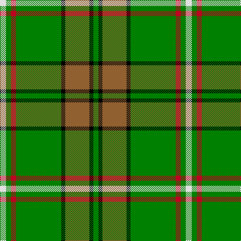

This page is one **sett** — a single exact thread-count. It belongs to the [tartan](/tartans/w6g5r5g45k4o24k4g5/)
(the same proportion at any scale), whose colour order is pattern [GKRKGRGW](/stripes/gkrkgrgw/).

Sourced from weddslist.  It is a [8 stripe tartan](/stripes/stripes8/).

Original link http://www.weddslist.com/cgi-bin/tartans/pg.pl?source=sts

## Thread count
LN/12 G10 R10 G90 K8 LT48 K8 G/10

## Palette

Palette: <strong>Tartan Register</strong> <small style="color:#888">(2 of 5 colours)</small>
<table><thead><tr><th>Colour</th><th>Threads</th><th>Shade</th><th>Base</th><th>OKLCh</th></tr></thead><tbody><tr><td>LN/</td><td style="text-align:right;font-variant-numeric:tabular-nums">12</td><td><code style="background-color:#E0E0E0;">#E0E0E0</code> <small style="color:#888">#E0E0E0</small></td><td>W <code style="background-color:#F7F7F7;">#F7F7F7</code></td><td><small style="color:#888">oklch(90.7% 0.000 89.9)</small></td></tr><tr><td>G</td><td style="text-align:right;font-variant-numeric:tabular-nums">10</td><td><code style="background-color:#008000;">#008000</code> <small style="color:#888">#008000</small></td><td>G <code style="background-color:#006100;">#006100</code></td><td><small style="color:#888">oklch(52.0% 0.177 142.5)</small></td></tr><tr><td>R</td><td style="text-align:right;font-variant-numeric:tabular-nums">10</td><td><code style="background-color:#C00020;">#C00020</code> <small style="color:#888">#C00020</small></td><td>R <code style="background-color:#CC0000;">#CC0000</code></td><td><small style="color:#888">oklch(50.9% 0.206 24.5)</small></td></tr><tr><td>G</td><td style="text-align:right;font-variant-numeric:tabular-nums">90</td><td><code style="background-color:#008000;">#008000</code> <small style="color:#888">#008000</small></td><td>G <code style="background-color:#006100;">#006100</code></td><td><small style="color:#888">oklch(52.0% 0.177 142.5)</small></td></tr><tr><td>K</td><td style="text-align:right;font-variant-numeric:tabular-nums">8</td><td><code style="background-color:#000000;">#000000</code> <small style="color:#888">#000000</small></td><td>K <code style="background-color:#000000;">#000000</code></td><td><small style="color:#888">oklch(0.0% 0.000 0.0)</small></td></tr><tr><td>LT</td><td style="text-align:right;font-variant-numeric:tabular-nums">48</td><td><code style="background-color:#906030;">#906030</code> <small style="color:#888">#906030</small></td><td>R <code style="background-color:#CC0000;">#CC0000</code></td><td><small style="color:#888">oklch(53.1% 0.089 63.7)</small></td></tr><tr><td>K</td><td style="text-align:right;font-variant-numeric:tabular-nums">8</td><td><code style="background-color:#000000;">#000000</code> <small style="color:#888">#000000</small></td><td>K <code style="background-color:#000000;">#000000</code></td><td><small style="color:#888">oklch(0.0% 0.000 0.0)</small></td></tr><tr><td>G/</td><td style="text-align:right;font-variant-numeric:tabular-nums">10</td><td><code style="background-color:#008000;">#008000</code> <small style="color:#888">#008000</small></td><td>G <code style="background-color:#006100;">#006100</code></td><td><small style="color:#888">oklch(52.0% 0.177 142.5)</small></td></tr></tbody></table>

# Sample pattern

## Nearest tartans

The nearest existing variants by ΔTartan distance, with this tartan at the top so the swatches line up against it.

ΔTartan

Tartan

Sett

—

<a href="/ttd/edit/#slug=w6g5r5g45k4o24k4g5~x2">O'Neill</a> <a class="nn-out" href="/setts/s8/w6g5r5g45k4o24k4g5~x2/" title="open its dictionary page">↗</a>

0.55

<a href="/ttd/edit/#slug=g12k1r1k1t2k1ly4~x2">Alberta District Tartan Tartan Number: 2055. Earliest known date: 1961 Designed for the Edmonton Rehabilitation Society as a project for handloom weaving by disabled students. The Provincial Legislative of Alberta gave formal approval for the Alberta tartan in 1961. See products available Copyright © Blair Urquhart, Comrie, 2015</a> <a class="nn-out" href="/setts/s7/g12k1r1k1t2k1ly4~x2/" title="open its dictionary page">↗</a>

0.67

<a href="/ttd/edit/#slug=w6g5r5g45k4lo24k4g5~x2">O'Neill (Name)</a> <a class="nn-out" href="/setts/s8/w6g5r5g45k4lo24k4g5~x2/" title="open its dictionary page">↗</a>

0.74

<a href="/ttd/edit/#slug=g13k1r1k1b2k1ly4~x8">Alberta (Province)</a> <a class="nn-out" href="/setts/s7/g13k1r1k1b2k1ly4~x8/" title="open its dictionary page">↗</a>

0.74

<a href="/ttd/edit/#slug=g12k1r1k1b2k1ly4~x8">Alberta (District)</a> <a class="nn-out" href="/setts/s7/g12k1r1k1b2k1ly4~x8/" title="open its dictionary page">↗</a>

0.91

<a href="/ttd/edit/#slug=t2g1t1g12dg2g1m6ly2~x4">Manitoba</a> <a class="nn-out" href="/setts/s8/t2g1t1g12dg2g1m6ly2~x4/" title="open its dictionary page">↗</a>

0.92

<a href="/ttd/edit/#slug=g18r1lb2k1lb2r1o6k2~x4">Humphries (Name)</a> <a class="nn-out" href="/setts/s8/g18r1lb2k1lb2r1o6k2~x4/" title="open its dictionary page">↗</a>

1.09

<a href="/ttd/edit/#slug=t2g1t1g12r2g1r6ly2~x2">Manitoba</a> <a class="nn-out" href="/setts/s8/t2g1t1g12r2g1r6ly2~x2/" title="open its dictionary page">↗</a>

1.09

<a href="/ttd/edit/#slug=db3g16ly1r1w1r6g3r1g3w1~x2">Canadian Caledonian</a> <a class="nn-out" href="/setts/s10/db3g16ly1r1w1r6g3r1g3w1~x2/" title="open its dictionary page">↗</a>

1.17

<a href="/ttd/edit/#slug=g4lo1dt1lo1dt2g9r1dt6w1~x4">Casey of West Virginia (Personal)</a> <a class="nn-out" href="/setts/s9/g4lo1dt1lo1dt2g9r1dt6w1~x4/" title="open its dictionary page">↗</a>

1.18

<a href="/ttd/edit/#slug=ly5g3ly3g53r7db5r13w4~x2">Hall (P.I.E.) (Personal)</a> <a class="nn-out" href="/setts/s8/ly5g3ly3g53r7db5r13w4~x2/" title="open its dictionary page">↗</a>

## Neighbour map

Every grey dot is one of 14299 variants placed by the first two principal components of the ΔTartan feature space (44% of its variance). Red is this tartan; blue dots are its nearest — click one to open its page.

<svg viewBox="0 0 640 380" role="img" style="max-width:100%;height:auto;border:1px solid #e0e0e0;border-radius:4px;display:block" xmlns="http://www.w3.org/2000/svg"><image href="/nn/cloud.v1.png" width="640" height="380"/><a href="/setts/s7/g12k1r1k1t2k1ly4~x2/"><circle cx="270.5" cy="155.3" r="4" fill="#3465a4"><title>Alberta District Tartan Tartan Number: 2055. Earliest known date: 1961 Designed for the Edmonton Rehabilitation Society as a project for handloom weaving by disabled students. The Provincial Legislative of Alberta gave formal approval for the Alberta tartan in 1961. See products available Copyright © Blair Urquhart, Comrie, 2015</title></circle></a><a href="/setts/s8/w6g5r5g45k4lo24k4g5~x2/"><circle cx="299.6" cy="167.3" r="4" fill="#3465a4"><title>O'Neill (Name)</title></circle></a><a href="/setts/s7/g13k1r1k1b2k1ly4~x8/"><circle cx="290.9" cy="152.6" r="4" fill="#3465a4"><title>Alberta (Province)</title></circle></a><a href="/setts/s7/g12k1r1k1b2k1ly4~x8/"><circle cx="270.8" cy="156.5" r="4" fill="#3465a4"><title>Alberta (District)</title></circle></a><a href="/setts/s8/t2g1t1g12dg2g1m6ly2~x4/"><circle cx="267.4" cy="167.1" r="4" fill="#3465a4"><title>Manitoba</title></circle></a><a href="/setts/s8/g18r1lb2k1lb2r1o6k2~x4/"><circle cx="289.8" cy="129.2" r="4" fill="#3465a4"><title>Humphries (Name)</title></circle></a><a href="/setts/s8/t2g1t1g12r2g1r6ly2~x2/"><circle cx="268.9" cy="161.7" r="4" fill="#3465a4"><title>Manitoba</title></circle></a><a href="/setts/s10/db3g16ly1r1w1r6g3r1g3w1~x2/"><circle cx="340.2" cy="133.8" r="4" fill="#3465a4"><title>Canadian Caledonian</title></circle></a><a href="/setts/s9/g4lo1dt1lo1dt2g9r1dt6w1~x4/"><circle cx="240.5" cy="180.4" r="4" fill="#3465a4"><title>Casey of West Virginia (Personal)</title></circle></a><a href="/setts/s8/ly5g3ly3g53r7db5r13w4~x2/"><circle cx="345.3" cy="131.6" r="4" fill="#3465a4"><title>Hall (P.I.E.) (Personal)</title></circle></a><circle cx="283.5" cy="159.2" r="5" fill="#c00000"/></svg>

ID: /setts/s8/w6g5r5g45k4o24k4g5~x2/
