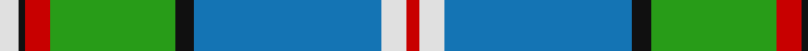

In pattern [RWBKGRKW](/patterns/rwbkgrkw/).

This was sourced from tartans-authority.  It is a [8 stripes tartan](/stripes/stripes8/).

Original link http://www.tartansauthority.com/tartan-ferret/display/6595/

## Thread count
LN/6 K2 R8 G40 K6 B60 LN8 R/4

## Palette
Each colour and its ΔE from the base-6 reference it is a variant of.

| Colour | Shade | Base | ΔE (OKLab) |
|---|---|---|---|
| B | <code style="background-color:#1474B4;">#1474B4</code> `#1474B4` | B <code style="background-color:#2C4084;">#2C4084</code> | 0.15 |
| G | <code style="background-color:#289C18;">#289C18</code> `#289C18` | G <code style="background-color:#006400;">#006400</code> | 0.18 |
| K | <code style="background-color:#101010;">#101010</code> `#101010` | K <code style="background-color:#000000;">#000000</code> | 0.17 |
| LN | <code style="background-color:#E0E0E0;">#E0E0E0</code> `#E0E0E0` | W <code style="background-color:#F4F4F0;">#F4F4F0</code> | 0.06 |
| R | <code style="background-color:#C80000;">#C80000</code> `#C80000` | R <code style="background-color:#C80000;">#C80000</code> | 0.00 |

# Sample pattern

## Nearest tartans

The nearest existing variants by ΔTartan distance.

1. [Caskie](/setts/s7/w6k2b50r14g24k2y6-b2888c4-g006818-k101010-rc80000-we0e0e0-ye8c000/) — ΔT 1.11
1. [Scottish Prison Service](/setts/s14/w8b60k6g40r8k2w6k2r8g40k6b60w8r4-b1474b4-g289c18-k101010-rc80000-we0e0e0/) — ΔT 1.18
1. [Vancouver, Centennial](/setts/s6/g8y4g48w24b52r2-b304080-g008000-rc00000-we0e0e0-yf0c000/) — ΔT 1.24
1. [Nova Scotia (Province)](/setts/s9/w4b40g4ga4g4ga8g16y4r2-b38409c-g006818-ga289c18-rc80000-wffffff-ye8c000/) — ΔT 1.27
1. [Nova Scotia (District)](/setts/s9/w4b40g4ga4g4ga8g16y4r2-b38409c-g006818-ga289c18-rc80000-wfcfcfc-ye8c000/) — ΔT 1.27
1. [German MacLeod](/setts/s8/w4k2g26k12b54k4r4y4-b1474b4-g006818-k101010-rc80000-w98c8e8-ye8c000/) — ΔT 1.34
1. [Southwell (Australian) (Personal)](/setts/s8/g78r4w2r4b28w28g4ga20-b202060-g006818-ga289c18-rc80000-wfcfcfc/) — ΔT 1.37
1. [Chalk (Personal)](/setts/s11/b4w10b10g22w10ga24ba2ga4ba52ga4b4-b003c64-ba2888c4-g5c6428-ga003820-we0e0e0/) — ΔT 1.38
1. [Presley of Lonmay](/setts/s7/k4w50k4b16k4g56y4-b1474b4-g408060-k101010-wc0c0c0-ye8c000/) — ΔT 1.38
1. [Dinwiddie Clan Tartan Tartan Number: 3212. Earliest known date: 2001 The registered tartan of the Dinwiddie Clan. Dinwiddies are normally associated with the Maxwells, but Lord Lyon stated, in 1988, that Dinwiddies were a sept of no other clan. See products available Copyright © Blair Urquhart, Comrie, 2015](/setts/s10/y8r4k4r84k26g50r12k4ra8k4-g289c18-k101010-r888888-rac8002c-ye8c000/) — ΔT 1.38

## Neighbour map

Every grey dot is one of 15726 variants placed by the first two principal components of the ΔTartan feature space (44% of its variance). Red is this tartan; blue dots are its nearest — click one to open its page.

<svg viewBox="0 0 640 380" role="img" style="max-width:100%;height:auto;border:1px solid #e0e0e0;border-radius:4px;display:block" xmlns="http://www.w3.org/2000/svg"><image href="/nn/cloud.v1.png" width="640" height="380"/><a href="/setts/s7/w6k2b50r14g24k2y6-b2888c4-g006818-k101010-rc80000-we0e0e0-ye8c000/"><circle cx="237.2" cy="116.8" r="4" fill="#3465a4"><title>Caskie</title></circle></a><a href="/setts/s14/w8b60k6g40r8k2w6k2r8g40k6b60w8r4-b1474b4-g289c18-k101010-rc80000-we0e0e0/"><circle cx="246.3" cy="96.6" r="4" fill="#3465a4"><title>Scottish Prison Service</title></circle></a><a href="/setts/s6/g8y4g48w24b52r2-b304080-g008000-rc00000-we0e0e0-yf0c000/"><circle cx="216.9" cy="149.6" r="4" fill="#3465a4"><title>Vancouver, Centennial</title></circle></a><a href="/setts/s9/w4b40g4ga4g4ga8g16y4r2-b38409c-g006818-ga289c18-rc80000-wffffff-ye8c000/"><circle cx="225.2" cy="111.1" r="4" fill="#3465a4"><title>Nova Scotia (Province)</title></circle></a><a href="/setts/s9/w4b40g4ga4g4ga8g16y4r2-b38409c-g006818-ga289c18-rc80000-wfcfcfc-ye8c000/"><circle cx="225.7" cy="111.3" r="4" fill="#3465a4"><title>Nova Scotia (District)</title></circle></a><a href="/setts/s8/w4k2g26k12b54k4r4y4-b1474b4-g006818-k101010-rc80000-w98c8e8-ye8c000/"><circle cx="257.6" cy="108.6" r="4" fill="#3465a4"><title>German MacLeod</title></circle></a><a href="/setts/s8/g78r4w2r4b28w28g4ga20-b202060-g006818-ga289c18-rc80000-wfcfcfc/"><circle cx="248.9" cy="100.5" r="4" fill="#3465a4"><title>Southwell (Australian) (Personal)</title></circle></a><a href="/setts/s11/b4w10b10g22w10ga24ba2ga4ba52ga4b4-b003c64-ba2888c4-g5c6428-ga003820-we0e0e0/"><circle cx="179.3" cy="114.4" r="4" fill="#3465a4"><title>Chalk (Personal)</title></circle></a><a href="/setts/s7/k4w50k4b16k4g56y4-b1474b4-g408060-k101010-wc0c0c0-ye8c000/"><circle cx="213.8" cy="151.9" r="4" fill="#3465a4"><title>Presley of Lonmay</title></circle></a><a href="/setts/s10/y8r4k4r84k26g50r12k4ra8k4-g289c18-k101010-r888888-rac8002c-ye8c000/"><circle cx="263.0" cy="113.5" r="4" fill="#3465a4"><title>Dinwiddie Clan Tartan Tartan Number: 3212. Earliest known date: 2001 The registered tartan of the Dinwiddie Clan. Dinwiddies are normally associated with the Maxwells, but Lord Lyon stated, in 1988, that Dinwiddies were a sept of no other clan. See products available Copyright © Blair Urquhart, Comrie, 2015</title></circle></a><circle cx="247.3" cy="113.5" r="5" fill="#c00000"/></svg>

ID: /setts/s8/w6k2r8g40k6b60w8r4-b1474b4-g289c18-k101010-rc80000-we0e0e0/
