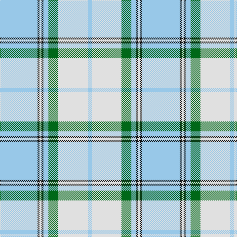

In pattern [WKWKWGWW](/patterns/wkwkwgww/).

This was sourced from register-of-tartans.  It is a [8 stripes tartan](/stripes/stripes8/).

Original link https://www.tartanregister.gov.uk/tartanDetails.aspx?ref=2212

## Attestations

This cloth appears in 2 source records; the oldest owns this page.

- 01/01/2002 — Longniddry Turquoise (Dance) (register-of-tartans, [record](https://www.tartanregister.gov.uk/tartanDetails.aspx?ref=2212))
- pre 2002 — Longniddry, Turquoise (Dance) (tartans-authority, [record](http://www.tartansauthority.com/tartan-ferret/display/369/))

## Thread count
LB/76 K4 LN4 K4 LB10 G20 LN60 LB/8

## Palette
Each colour and its ΔE from the base-6 reference it is a variant of.

| Colour | Shade | Base | ΔE (OKLab) |
|---|---|---|---|
| G | <code style="background-color:#006818;">#006818</code> `#006818` | G <code style="background-color:#006100;">#006100</code> | 0.02 |
| K | <code style="background-color:#101010;">#101010</code> `#101010` | K <code style="background-color:#000000;">#000000</code> | 0.17 |
| LB | <code style="background-color:#98C8E8;">#98C8E8</code> `#98C8E8` | W <code style="background-color:#F7F7F7;">#F7F7F7</code> | 0.18 |
| LN | <code style="background-color:#E0E0E0;">#E0E0E0</code> `#E0E0E0` | W <code style="background-color:#F7F7F7;">#F7F7F7</code> | 0.07 |

# Sample pattern

## Nearest tartans

The nearest existing variants by ΔTartan distance.

1. [St. John's (Corporate)](/setts/s7/w12b6w90ba72w6y18b6-b1c0070-ba2888c4-we0e0e0-ye8c000/) — ΔT 0.94
1. [St John's](/setts/s12/w12b6w90ba72w6y18b6y18w6ba72w90b6-b1c0070-ba2888c4-we0e0e0-ye8c000/) — ΔT 1.19
1. [Malmo Skyblue](/setts/s8/b28w36wa28w36wa85r3wa3r3-b003c64-rc80000-wf8f8f8-wad8e8e8/) — ΔT 1.26
1. [Longniddry, dress (Turquoise)](/setts/s8/b84k4w4k4b10ba24w64b8-b5480b0-ba606080-k000000-we0e0e0/) — ΔT 1.39
1. [Silver (Personal)](/setts/s9/w48b48y12w2ba8w40b20y6w8-b2474b4-ba202060-we0e0e0-y7c98bc/) — ΔT 1.45
1. [MacPherson Turquoise Dress Tartan Tartan Number: 8183. Earliest known date: Threadcount and colours aren't 100% original. Generated manually. See products available Copyright © Blair Urquhart, Comrie, 2015](/setts/s7/w8k4w52b46w6b16ba6-b2888c4-ba8c008c-k101010-we0e0e0/) — ΔT 1.49
1. [Lennox Turquoise Dress District Tartan Tartan Number: 8190. Earliest known date: pre 2003 Families with the surname 'Lennox' are usually considered related to Clans Stewart or MacFarlane. Some of this surname also choose to wear the distinctive and ancient 'Lennox' tartan. D W Stewart reproduced the sett from a 'lost' portrait of the Countess of Lennox dating from the 16th century./Threadcount and colours aren't 100% original. Generated manually./ See products available Copyright © Blair Urquhart, Comrie, 2015](/setts/s7/b16ba4b48ba10w52k4w16-b5c8ca8-ba2c2c80-k101010-we0e0e0/) — ΔT 1.51
1. [Galloway (Dance)](/setts/s6/g6r4b70w70b4r6-b1474b4-g007800-rc80000-wfcfcfc/) — ΔT 1.64
1. [Supporter.com](/setts/s7/b120g9r7y12g33y33b26-b0596fa-g289c18-rff0000-yfccc00/) — ΔT 1.64
1. [Galloway (Dance)](/setts/s10/g6r4b70w70b4r6b4w70b70r4-b1474b4-g007800-rc80000-wfcfcfc/) — ΔT 1.67

## Neighbour map

Every grey dot is one of 15726 variants placed by the first two principal components of the ΔTartan feature space (44% of its variance). Red is this tartan; blue dots are its nearest — click one to open its page.

<svg viewBox="0 0 640 380" role="img" style="max-width:100%;height:auto;border:1px solid #e0e0e0;border-radius:4px;display:block" xmlns="http://www.w3.org/2000/svg"><image href="/nn/cloud.v1.png" width="640" height="380"/><a href="/setts/s7/w12b6w90ba72w6y18b6-b1c0070-ba2888c4-we0e0e0-ye8c000/"><circle cx="284.9" cy="154.0" r="4" fill="#3465a4"><title>St. John's (Corporate)</title></circle></a><a href="/setts/s12/w12b6w90ba72w6y18b6y18w6ba72w90b6-b1c0070-ba2888c4-we0e0e0-ye8c000/"><circle cx="271.3" cy="137.9" r="4" fill="#3465a4"><title>St John's</title></circle></a><a href="/setts/s8/b28w36wa28w36wa85r3wa3r3-b003c64-rc80000-wf8f8f8-wad8e8e8/"><circle cx="301.0" cy="134.8" r="4" fill="#3465a4"><title>Malmo Skyblue</title></circle></a><a href="/setts/s8/b84k4w4k4b10ba24w64b8-b5480b0-ba606080-k000000-we0e0e0/"><circle cx="293.9" cy="137.0" r="4" fill="#3465a4"><title>Longniddry, dress (Turquoise)</title></circle></a><a href="/setts/s9/w48b48y12w2ba8w40b20y6w8-b2474b4-ba202060-we0e0e0-y7c98bc/"><circle cx="281.3" cy="149.5" r="4" fill="#3465a4"><title>Silver (Personal)</title></circle></a><a href="/setts/s7/w8k4w52b46w6b16ba6-b2888c4-ba8c008c-k101010-we0e0e0/"><circle cx="276.2" cy="172.3" r="4" fill="#3465a4"><title>MacPherson Turquoise Dress Tartan Tartan Number: 8183. Earliest known date: Threadcount and colours aren't 100% original. Generated manually. See products available Copyright © Blair Urquhart, Comrie, 2015</title></circle></a><a href="/setts/s7/b16ba4b48ba10w52k4w16-b5c8ca8-ba2c2c80-k101010-we0e0e0/"><circle cx="247.5" cy="177.1" r="4" fill="#3465a4"><title>Lennox Turquoise Dress District Tartan Tartan Number: 8190. Earliest known date: pre 2003 Families with the surname 'Lennox' are usually considered related to Clans Stewart or MacFarlane. Some of this surname also choose to wear the distinctive and ancient 'Lennox' tartan. D W Stewart reproduced the sett from a 'lost' portrait of the Countess of Lennox dating from the 16th century./Threadcount and colours aren't 100% original. Generated manually./ See products available Copyright © Blair Urquhart, Comrie, 2015</title></circle></a><a href="/setts/s6/g6r4b70w70b4r6-b1474b4-g007800-rc80000-wfcfcfc/"><circle cx="268.8" cy="145.4" r="4" fill="#3465a4"><title>Galloway (Dance)</title></circle></a><a href="/setts/s7/b120g9r7y12g33y33b26-b0596fa-g289c18-rff0000-yfccc00/"><circle cx="338.2" cy="164.3" r="4" fill="#3465a4"><title>Supporter.com</title></circle></a><a href="/setts/s10/g6r4b70w70b4r6b4w70b70r4-b1474b4-g007800-rc80000-wfcfcfc/"><circle cx="268.3" cy="132.3" r="4" fill="#3465a4"><title>Galloway (Dance)</title></circle></a><circle cx="301.8" cy="144.5" r="5" fill="#c00000"/></svg>

ID: /setts/s8/w76k4wa4k4w10g20wa60w8-g006818-k101010-w98c8e8-wae0e0e0/
