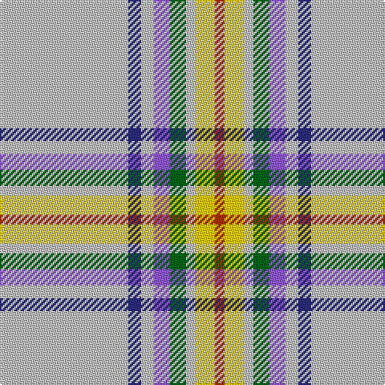

In pattern [RYWGBWBW](/patterns/rywgbwbw/).

This was sourced from tartans-authority.  It is a [8 stripes tartan](/stripes/stripes8/).

Original link http://www.tartansauthority.com/tartan-ferret/display/11252/

## Thread count
N/80 DB8 N8 P10 G10 N6 Y12 R/6

## Palette
Each colour and its ΔE from the base-6 reference it is a variant of.

| Colour | Shade | Base | ΔE (OKLab) |
|---|---|---|---|
| DB | <code style="background-color:#2C2C80;">#2C2C80</code> `#2C2C80` | B <code style="background-color:#2C4084;">#2C4084</code> | 0.05 |
| G | <code style="background-color:#006818;">#006818</code> `#006818` | G <code style="background-color:#006400;">#006400</code> | 0.02 |
| N | <code style="background-color:#C0C0C0;">#C0C0C0</code> `#C0C0C0` | W <code style="background-color:#F4F4F0;">#F4F4F0</code> | 0.16 |
| P | <code style="background-color:#9058D8;">#9058D8</code> `#9058D8` | B <code style="background-color:#2C4084;">#2C4084</code> | 0.22 |
| R | <code style="background-color:#B03000;">#B03000</code> `#B03000` | R <code style="background-color:#C80000;">#C80000</code> | 0.05 |
| Y | <code style="background-color:#FCCC00;">#FCCC00</code> `#FCCC00` | Y <code style="background-color:#E8C000;">#E8C000</code> | 0.04 |

# Sample pattern

## Nearest tartans

The nearest existing variants by ΔTartan distance.

1. [Ofsharick, Matthew (Personal)](/setts/s9/w110b16wa16b16g10w16y8wa8k8-b5f749c-g649848-k000000-wc8c8c8-waf8f8f8-yf8e38c/) — ΔT 1.04
1. [Gray, Thomas (Personal)](/setts/s10/b4y4ba4r24w64bb4w4r8w4bb4-b2888c4-ba2c2c80-bb5c5c5c-r888888-we0e0e0-ye8c000/) — ΔT 1.20
1. [Ofsharick, Matthew (Personal)](/setts/s9/r110b16w16b16g10r16y8w8k8-b1474b4-g006818-k101010-r888888-wfcfcfc-yfccc00/) — ΔT 1.28
1. [Nicolson of the Isles (Personal)](/setts/s7/w4r24y10wa70b8r8ya4-b6080d0-rc80000-we0e0e0-wa98c8e8-y80c86c-yae8c000/) — ΔT 1.52
1. [Haddrell (2013)](/setts/s7/r4b8w36ba4w4ba82wa4-b1474b4-ba5c5c5c-rc80000-wc0c0c0-wafcfcfc/) — ΔT 1.76
1. [Unidentified #54](/setts/s12/w96r8w12b4y4b4w4b24ra24ba4ra8w4-b502814-ba3474fc-r8c0000-ra8c6428-wc8c8c8-yc89800/) — ΔT 1.78
1. [Boucherville Dress (District)](/setts/s9/w40y4b10w8ba4b4ba4b4g2-b5c5c5c-ba1c0070-g003820-we0e0e0-yd09800/) — ΔT 1.79
1. [World Peace](/setts/s11/b16g16w6g16b16w6wa80r6k6wa80w6-b3d2e60-g052f14-k120a01-r89051b-wf7f1e8-wa96aed3/) — ΔT 1.82
1. [Glenclova](/setts/s12/w100g12b14y5b5wa5b5g28w16b5w18y6-b505050-g808080-wc0c0c0-wae0e0e0-yfadc00/) — ΔT 1.83
1. [Norris (1998)](/setts/s6/k4w2g10r2b36ra4-b5c8ca8-g006818-k101010-r880000-raff0000-wffffff/) — ΔT 1.85

## Neighbour map

Every grey dot is one of 15726 variants placed by the first two principal components of the ΔTartan feature space (44% of its variance). Red is this tartan; blue dots are its nearest — click one to open its page.

<svg viewBox="0 0 640 380" role="img" style="max-width:100%;height:auto;border:1px solid #e0e0e0;border-radius:4px;display:block" xmlns="http://www.w3.org/2000/svg"><image href="/nn/cloud.v1.png" width="640" height="380"/><a href="/setts/s9/w110b16wa16b16g10w16y8wa8k8-b5f749c-g649848-k000000-wc8c8c8-waf8f8f8-yf8e38c/"><circle cx="299.7" cy="103.1" r="4" fill="#3465a4"><title>Ofsharick, Matthew (Personal)</title></circle></a><a href="/setts/s10/b4y4ba4r24w64bb4w4r8w4bb4-b2888c4-ba2c2c80-bb5c5c5c-r888888-we0e0e0-ye8c000/"><circle cx="315.9" cy="91.4" r="4" fill="#3465a4"><title>Gray, Thomas (Personal)</title></circle></a><a href="/setts/s9/r110b16w16b16g10r16y8w8k8-b1474b4-g006818-k101010-r888888-wfcfcfc-yfccc00/"><circle cx="314.9" cy="116.1" r="4" fill="#3465a4"><title>Ofsharick, Matthew (Personal)</title></circle></a><a href="/setts/s7/w4r24y10wa70b8r8ya4-b6080d0-rc80000-we0e0e0-wa98c8e8-y80c86c-yae8c000/"><circle cx="287.8" cy="113.9" r="4" fill="#3465a4"><title>Nicolson of the Isles (Personal)</title></circle></a><a href="/setts/s7/r4b8w36ba4w4ba82wa4-b1474b4-ba5c5c5c-rc80000-wc0c0c0-wafcfcfc/"><circle cx="378.7" cy="131.7" r="4" fill="#3465a4"><title>Haddrell (2013)</title></circle></a><a href="/setts/s12/w96r8w12b4y4b4w4b24ra24ba4ra8w4-b502814-ba3474fc-r8c0000-ra8c6428-wc8c8c8-yc89800/"><circle cx="315.0" cy="58.6" r="4" fill="#3465a4"><title>Unidentified #54</title></circle></a><a href="/setts/s9/w40y4b10w8ba4b4ba4b4g2-b5c5c5c-ba1c0070-g003820-we0e0e0-yd09800/"><circle cx="306.6" cy="99.3" r="4" fill="#3465a4"><title>Boucherville Dress (District)</title></circle></a><a href="/setts/s11/b16g16w6g16b16w6wa80r6k6wa80w6-b3d2e60-g052f14-k120a01-r89051b-wf7f1e8-wa96aed3/"><circle cx="289.2" cy="105.8" r="4" fill="#3465a4"><title>World Peace</title></circle></a><a href="/setts/s12/w100g12b14y5b5wa5b5g28w16b5w18y6-b505050-g808080-wc0c0c0-wae0e0e0-yfadc00/"><circle cx="377.2" cy="108.2" r="4" fill="#3465a4"><title>Glenclova</title></circle></a><a href="/setts/s6/k4w2g10r2b36ra4-b5c8ca8-g006818-k101010-r880000-raff0000-wffffff/"><circle cx="337.2" cy="132.0" r="4" fill="#3465a4"><title>Norris (1998)</title></circle></a><circle cx="359.3" cy="113.9" r="5" fill="#c00000"/></svg>

ID: /setts/s8/w80b8w8ba10g10w6y12r6-b2c2c80-ba9058d8-g006818-rb03000-wc0c0c0-yfccc00/
