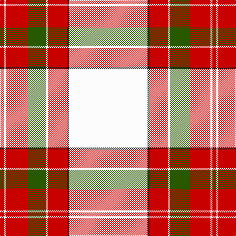

**Bands:** [RWRGWRKW](/stripes/rwrgwrkw/) · **Stripes:** [R W R DG W R K W](/stripes/stripes8/) R W R DG W R K W

This was sourced from tartans-authority.  It is a [8 band tartan](/bands/bands8/).

Original link http://www.tartansauthority.com/tartan-ferret/display/3704/

## Variants

Other setts woven to the same stripe pattern.

- [Unidentified Blanket](/setts/s8/w50k1r12w1dg12r13w1r2~x2/)
- [Wilson's Blanket Pattern](/setts/s8/w50k1r14w1dg14r14w1r2~x4/)

## Thread count
R/8 W4 R44 G38 W4 R38 K4 W/160

## Palette
Each colour and its ΔE from the base-6 reference it is a variant of.

| Colour | Shade | Base | ΔE (OKLab) |
|---|---|---|---|
| G | <code style="background-color:#285800;">#285800</code> `#285800` | G <code style="background-color:#006100;">#006100</code> | 0.03 |
| K | <code style="background-color:#101010;">#101010</code> `#101010` | K <code style="background-color:#000000;">#000000</code> | 0.17 |
| R | <code style="background-color:#C80000;">#C80000</code> `#C80000` | R <code style="background-color:#CC0000;">#CC0000</code> | 0.01 |
| W | <code style="background-color:#FCFCFC;">#FCFCFC</code> `#FCFCFC` | W <code style="background-color:#F7F7F7;">#F7F7F7</code> | 0.01 |

# Sample pattern

## Nearest tartans

The nearest existing variants by ΔTartan distance.

1. [Wilson's Blanket Pattern](/setts/s8/w50k1r14w1dg14r14w1r2~x4/) — ΔT 0.52
1. [Unidentified Blanket](/setts/s8/w50k1r12w1dg12r13w1r2~x2/) — ΔT 0.60
1. [Unidentified, Blanket](/setts/s8/w50k1r12w1g12r13w1r2~x2/) — ΔT 0.66
1. [MMK 1777](/setts/s7/w30k1r7dg7r8w1r2~x4/) — ΔT 0.81
1. [Unidentified, Ross-shire](/setts/s8/w75o1r18g9o1r27w2r5~x2/) — ΔT 0.81
1. [Unidentified Ross-shire](/setts/s8/w75dy1r18dg9dy1r27w2r5~x2/) — ΔT 0.89
1. [McBrayer Dress](/setts/s8/w57k1r12w1g12r14w1r2~x2/) — ΔT 0.94
1. [Border Sett](/setts/s10/w75dy1r20w16r20w20g9w16g1r38~x2/) — ΔT 1.32
1. [MacGregor Dress Red Fancy Tartan Tartan Number: 6541. Earliest known date: 1975 A Dancers tartan now woven by D C Dalgliesh of Selkirk. See products available Copyright © Blair Urquhart, Comrie, 2015](/setts/s10/w52r22w6r8k1db3k1r8w6r22~x2/) — ΔT 1.33
1. [MacGregor Dress Red (Dance)](/setts/s6/w52r22w6r8k1db3~x2/) — ΔT 1.35

## Neighbour map

Every grey dot is one of 14313 variants placed by the first two principal components of the ΔTartan feature space (44% of its variance). Red is this tartan; blue dots are its nearest — click one to open its page.

<svg viewBox="0 0 640 380" role="img" style="max-width:100%;height:auto;border:1px solid #e0e0e0;border-radius:4px;display:block" xmlns="http://www.w3.org/2000/svg"><image href="/nn/cloud.v1.png" width="640" height="380"/><a href="/setts/s8/w50k1r14w1dg14r14w1r2~x4/"><circle cx="330.3" cy="70.2" r="4" fill="#3465a4"><title>Wilson's Blanket Pattern</title></circle></a><a href="/setts/s8/w50k1r12w1dg12r13w1r2~x2/"><circle cx="365.2" cy="75.1" r="4" fill="#3465a4"><title>Unidentified Blanket</title></circle></a><a href="/setts/s8/w50k1r12w1g12r13w1r2~x2/"><circle cx="364.6" cy="76.9" r="4" fill="#3465a4"><title>Unidentified, Blanket</title></circle></a><a href="/setts/s7/w30k1r7dg7r8w1r2~x4/"><circle cx="332.7" cy="107.8" r="4" fill="#3465a4"><title>MMK 1777</title></circle></a><a href="/setts/s8/w75o1r18g9o1r27w2r5~x2/"><circle cx="380.0" cy="76.1" r="4" fill="#3465a4"><title>Unidentified, Ross-shire</title></circle></a><a href="/setts/s8/w75dy1r18dg9dy1r27w2r5~x2/"><circle cx="381.4" cy="74.5" r="4" fill="#3465a4"><title>Unidentified Ross-shire</title></circle></a><a href="/setts/s8/w57k1r12w1g12r14w1r2~x2/"><circle cx="392.7" cy="74.2" r="4" fill="#3465a4"><title>McBrayer Dress</title></circle></a><a href="/setts/s10/w75dy1r20w16r20w20g9w16g1r38~x2/"><circle cx="358.7" cy="83.2" r="4" fill="#3465a4"><title>Border Sett</title></circle></a><a href="/setts/s10/w52r22w6r8k1db3k1r8w6r22~x2/"><circle cx="341.7" cy="68.4" r="4" fill="#3465a4"><title>MacGregor Dress Red Fancy Tartan Tartan Number: 6541. Earliest known date: 1975 A Dancers tartan now woven by D C Dalgliesh of Selkirk. See products available Copyright © Blair Urquhart, Comrie, 2015</title></circle></a><a href="/setts/s6/w52r22w6r8k1db3~x2/"><circle cx="405.7" cy="91.6" r="4" fill="#3465a4"><title>MacGregor Dress Red (Dance)</title></circle></a><circle cx="340.0" cy="77.1" r="5" fill="#c00000"/></svg>

ID: /setts/s8/w80k2r19w2dg19r22w2r4~x2/
