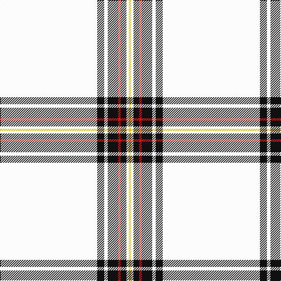

In pattern [WKWKRKWY](/patterns/wkwkrkwy/).

This was sourced from register-of-tartans.  It is a [8 stripes tartan](/stripes/stripes8/).

Original link https://www.tartanregister.gov.uk/tartanDetails.aspx?ref=792

## Thread count
W/166 K12 W6 K18 R4 K10 W4 Y/4

## Palette
Each colour and its ΔE from the base-6 reference it is a variant of.

| Colour | Shade | Base | ΔE (OKLab) |
|---|---|---|---|
| K | <code style="background-color:#101010;">#101010</code> `#101010` | K <code style="background-color:#000000;">#000000</code> | 0.17 |
| R | <code style="background-color:#FF0000;">#FF0000</code> `#FF0000` | R <code style="background-color:#CC0000;">#CC0000</code> | 0.11 |
| W | <code style="background-color:#FCFCFC;">#FCFCFC</code> `#FCFCFC` | W <code style="background-color:#F7F7F7;">#F7F7F7</code> | 0.01 |
| Y | <code style="background-color:#E8C000;">#E8C000</code> `#E8C000` | Y <code style="background-color:#F2BF00;">#F2BF00</code> | 0.02 |

# Sample pattern

## Nearest tartans

The nearest existing variants by ΔTartan distance.

1. [Crane of Cluny Dress (Personal)](/setts/s8/w83k6w3k9r2k5w2y2x2~k101010-rc80000-wfcfcfc-ye8c000/) — ΔT 0.02
1. [Young, Christina](/setts/s6/w162k10b10y9g6b3~b800070-g908000-k000000-we0e0e0-yff8500/) — ΔT 1.31
1. [Summer Spirit (Fashion)](/setts/s8/r2w2k2w28k8w9k1y2x2~k101010-rc80000-wfcfcec-ye8c000/) — ΔT 1.62
1. [Wilson's Blanket Sett - Border](/setts/s13/w100r14w13g13w13k1r14k1w13g13w13r12w100x2~g408060-k101010-rc80000-wfcfcfc/) — ΔT 1.83
1. [Old England House Check](/setts/s12/w46r9w4k8w9ra4w9g2w2g2w2g1x2~g604000-k101010-r888888-rac80000-we0e0e0/) — ΔT 1.85
1. [Old England House Check](/setts/s12/w46y4w9k8w9r4w9b2w2b2w2b2x2~b4c3428-k101010-rdc0000-wf8f4d0-ya0a0a0/) — ΔT 1.88
1. [Summer Spirit](/setts/s14/y2k1w9k8w28k2w2r2w2k2w28k8w9k1x2~k101010-rc80000-wfcfcec-ye8c000/) — ΔT 1.88
1. [Unnamed C18th - Blanket Pattern](/setts/s9/w120k2b4g3w2k2r8w2r3x2~b38409c-g289c18-k300500-rd05054-wfcfcfc/) — ΔT 1.97
1. [UPS No. 2 (Corporate)](/setts/s16/w8b2w2y2w2b2w15b2w60b4wa1b2wa2b2wa1b4x2~b381414-wfcf4b4-wafcf890-ydc982c/) — ΔT 2.06
1. [UPS No.2](/setts/s16/b2w8b4wa1b2wa2b2wa1b4w60b2w15b2w2y2w2x2~b391614-wfef6b4-wafcfa93-ydf982e/) — ΔT 2.09

## Neighbour map

Every grey dot is one of 15726 variants placed by the first two principal components of the ΔTartan feature space (44% of its variance). Red is this tartan; blue dots are its nearest — click one to open its page.

<svg viewBox="0 0 640 380" role="img" style="max-width:100%;height:auto;border:1px solid #e0e0e0;border-radius:4px;display:block" xmlns="http://www.w3.org/2000/svg"><image href="/nn/cloud.v1.png" width="640" height="380"/><a href="/setts/s8/w83k6w3k9r2k5w2y2x2~k101010-rc80000-wfcfcfc-ye8c000/"><circle cx="506.1" cy="70.0" r="4" fill="#3465a4"><title>Crane of Cluny Dress (Personal)</title></circle></a><a href="/setts/s6/w162k10b10y9g6b3~b800070-g908000-k000000-we0e0e0-yff8500/"><circle cx="531.4" cy="72.5" r="4" fill="#3465a4"><title>Young, Christina</title></circle></a><a href="/setts/s8/r2w2k2w28k8w9k1y2x2~k101010-rc80000-wfcfcec-ye8c000/"><circle cx="413.5" cy="106.7" r="4" fill="#3465a4"><title>Summer Spirit (Fashion)</title></circle></a><a href="/setts/s13/w100r14w13g13w13k1r14k1w13g13w13r12w100x2~g408060-k101010-rc80000-wfcfcfc/"><circle cx="506.9" cy="70.7" r="4" fill="#3465a4"><title>Wilson's Blanket Sett - Border</title></circle></a><a href="/setts/s12/w46r9w4k8w9ra4w9g2w2g2w2g1x2~g604000-k101010-r888888-rac80000-we0e0e0/"><circle cx="439.1" cy="55.0" r="4" fill="#3465a4"><title>Old England House Check</title></circle></a><a href="/setts/s12/w46y4w9k8w9r4w9b2w2b2w2b2x2~b4c3428-k101010-rdc0000-wf8f4d0-ya0a0a0/"><circle cx="439.3" cy="76.8" r="4" fill="#3465a4"><title>Old England House Check</title></circle></a><a href="/setts/s14/y2k1w9k8w28k2w2r2w2k2w28k8w9k1x2~k101010-rc80000-wfcfcec-ye8c000/"><circle cx="422.4" cy="88.5" r="4" fill="#3465a4"><title>Summer Spirit</title></circle></a><a href="/setts/s9/w120k2b4g3w2k2r8w2r3x2~b38409c-g289c18-k300500-rd05054-wfcfcfc/"><circle cx="587.5" cy="41.1" r="4" fill="#3465a4"><title>Unnamed C18th - Blanket Pattern</title></circle></a><a href="/setts/s16/w8b2w2y2w2b2w15b2w60b4wa1b2wa2b2wa1b4x2~b381414-wfcf4b4-wafcf890-ydc982c/"><circle cx="511.7" cy="30.3" r="4" fill="#3465a4"><title>UPS No. 2 (Corporate)</title></circle></a><a href="/setts/s16/b2w8b4wa1b2wa2b2wa1b4w60b2w15b2w2y2w2x2~b391614-wfef6b4-wafcfa93-ydf982e/"><circle cx="511.4" cy="30.0" r="4" fill="#3465a4"><title>UPS No.2</title></circle></a><circle cx="506.3" cy="69.9" r="5" fill="#c00000"/></svg>

ID: /setts/s8/w83k6w3k9r2k5w2y2x2~k101010-rff0000-wfcfcfc-ye8c000/
