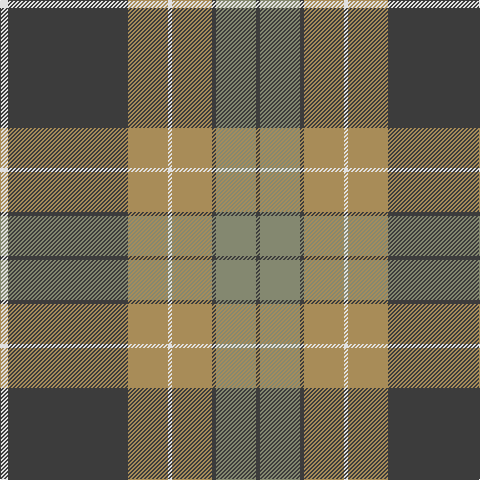

In pattern [BGBYWYBW](/patterns/bgbywybw/).

This was sourced from register-of-tartans.  It is a [8 stripes tartan](/stripes/stripes8/).

Original link https://www.tartanregister.gov.uk/tartanDetails.aspx?ref=1140

## Thread count
LN/8 N120 LT40 LN4 LT40 N4 Na40 N/4

## Palette
Each colour and its ΔE from the base-6 reference it is a variant of.

| Colour | Shade | Base | ΔE (OKLab) |
|---|---|---|---|
| LN | <code style="background-color:#E0E0E0;">#E0E0E0</code> `#E0E0E0` | W <code style="background-color:#F4F4F0;">#F4F4F0</code> | 0.06 |
| LT | <code style="background-color:#A88C58;">#A88C58</code> `#A88C58` | Y <code style="background-color:#E8C000;">#E8C000</code> | 0.19 |
| N | <code style="background-color:#3C3C3C;">#3C3C3C</code> `#3C3C3C` | B <code style="background-color:#2C4084;">#2C4084</code> | 0.12 |
| Na | <code style="background-color:#848870;">#848870</code> `#848870` | G <code style="background-color:#006400;">#006400</code> | 0.22 |

# Sample pattern

ID: /setts/s8/w8b120y40w4y40b4g40b4-b3c3c3c-g848870-we0e0e0-ya88c58/
