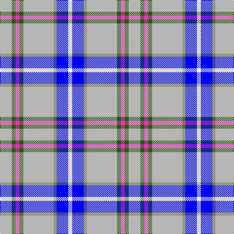

In pattern [WBGYGRGY](/patterns/wbgygrgy/).

This was sourced from register-of-tartans.  It is a [8 stripes tartan](/stripes/stripes8/).

Original link https://www.tartanregister.gov.uk/tartanDetails.aspx?ref=10769

## Thread count
N/24 G8 LR8 G8 N62 Ga6 B24 W/8

## Palette
Each colour and its ΔE from the base-6 reference it is a variant of.

| Colour | Shade | Base | ΔE (OKLab) |
|---|---|---|---|
| B | <code style="background-color:#0000FF;">#0000FF</code> `#0000FF` | B <code style="background-color:#2C4084;">#2C4084</code> | 0.21 |
| G | <code style="background-color:#285800;">#285800</code> `#285800` | G <code style="background-color:#006400;">#006400</code> | 0.04 |
| Ga | <code style="background-color:#767E52;">#767E52</code> `#767E52` | G <code style="background-color:#006400;">#006400</code> | 0.17 |
| LR | <code style="background-color:#EC34C4;">#EC34C4</code> `#EC34C4` | R <code style="background-color:#C80000;">#C80000</code> | 0.24 |
| N | <code style="background-color:#B6B6B6;">#B6B6B6</code> `#B6B6B6` | Y <code style="background-color:#E8C000;">#E8C000</code> | 0.17 |
| W | <code style="background-color:#FFFFFF;">#FFFFFF</code> `#FFFFFF` | W <code style="background-color:#F4F4F0;">#F4F4F0</code> | 0.03 |

# Sample pattern

ID: /setts/s8/w8b24g6y62ga8r8ga8y24-b0000ff-g767e52-ga285800-rec34c4-wffffff-yb6b6b6/
