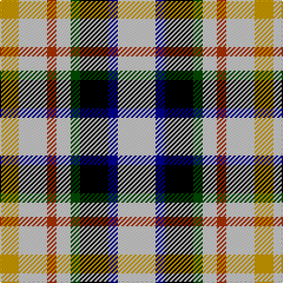

In pattern [WBKGWRWY](/patterns/wbkgwrwy/).

This was sourced from register-of-tartans.  It is a [8 stripes tartan](/stripes/stripes8/).

Original link https://www.tartanregister.gov.uk/tartanDetails.aspx?ref=2598

## Thread count
DY/16 N24 R8 N12 G8 K24 DB8 N/32

## Palette
Each colour and its ΔE from the base-6 reference it is a variant of.

| Colour | Shade | Base | ΔE (OKLab) |
|---|---|---|---|
| DB | <code style="background-color:#00008C;">#00008C</code> `#00008C` | B <code style="background-color:#2A418A;">#2A418A</code> | 0.13 |
| DY | <code style="background-color:#C89800;">#C89800</code> `#C89800` | Y <code style="background-color:#F2BF00;">#F2BF00</code> | 0.12 |
| G | <code style="background-color:#004C00;">#004C00</code> `#004C00` | G <code style="background-color:#006100;">#006100</code> | 0.07 |
| K | <code style="background-color:#000000;">#000000</code> `#000000` | K <code style="background-color:#000000;">#000000</code> | 0.00 |
| N | <code style="background-color:#C8C8C8;">#C8C8C8</code> `#C8C8C8` | W <code style="background-color:#F7F7F7;">#F7F7F7</code> | 0.14 |
| R | <code style="background-color:#A83000;">#A83000</code> `#A83000` | R <code style="background-color:#CC0000;">#CC0000</code> | 0.07 |

# Sample pattern

## Nearest tartans

The nearest existing variants by ΔTartan distance.

1. [MacLaren](/setts/s8/w16b4k12g4w6y4w11ya7~b304080-g008000-k000000-we0e0e0-yff8500-yaf0c000~x2/) — ΔT 0.71
1. [MacLaren (D.C Dalgliesh version)](/setts/s8/w16b4k12g4w6r4w11y7~b2c4084-g005020-k101010-rfa4b00-we0e0e0-ye8c000~x2/) — ΔT 0.83
1. [MacLaren Dress (Dance)](/setts/s8/w16b4k12g4w6y4w11ya7~b2c2c80-g285800-k101010-we0e0e0-yd87c00-yae8c000~x2/) — ΔT 0.84
1. [Desang](/setts/s8/b4w2k3wa8g2wa8w2ba4~b202060-ba680028-g285800-k101010-we0e0e0-wae8ccb8~x2/) — ΔT 0.87
1. [Desang (Corporate)](/setts/s8/b4w2k3wa8g2wa8w2r4~b2c2c88-g3c9000-k101010-ra8003c-we0e0e0-wae8ccb8~x4/) — ΔT 1.17
1. [MacDuff Dress](/setts/s8/w4k1w4g6k4w5r1b2~b3c82af-g005020-k101010-rdc0000-we0e0e0~x2/) — ΔT 1.19
1. [MacDuff, dress](/setts/s8/w4k1w4g6k4w5r1b2~b5480b0-g008000-k000000-rc00000-we0e0e0~x2/) — ΔT 1.27
1. [Game Fair (Corporate)](/setts/s7/g3b12g12w12g2w12g3~b1870a4-g003820-we0e0e0~x2/) — ΔT 1.51
1. [Bisset](/setts/s9/r9g18k6g6k3y3g6b8w3~b000048-g408060-k000000-rc80000-we0e0e0-yfcb000~x2/) — ΔT 1.56
1. [Mitsukoshi (Corporate)](/setts/s8/w12k3wa3k3w13b6k17r3~b5c8ca8-k101010-rc80000-wc0c0c0-wae8ccb8~x2/) — ΔT 1.60

## Neighbour map

Every grey dot is one of 15726 variants placed by the first two principal components of the ΔTartan feature space (44% of its variance). Red is this tartan; blue dots are its nearest — click one to open its page.

<svg viewBox="0 0 640 380" role="img" style="max-width:100%;height:auto;border:1px solid #e0e0e0;border-radius:4px;display:block" xmlns="http://www.w3.org/2000/svg"><image href="/nn/cloud.v1.png" width="640" height="380"/><a href="/setts/s8/w16b4k12g4w6y4w11ya7~b304080-g008000-k000000-we0e0e0-yff8500-yaf0c000~x2/"><circle cx="93.6" cy="198.1" r="4" fill="#3465a4"><title>MacLaren</title></circle></a><a href="/setts/s8/w16b4k12g4w6r4w11y7~b2c4084-g005020-k101010-rfa4b00-we0e0e0-ye8c000~x2/"><circle cx="100.7" cy="199.2" r="4" fill="#3465a4"><title>MacLaren (D.C Dalgliesh version)</title></circle></a><a href="/setts/s8/w16b4k12g4w6y4w11ya7~b2c2c80-g285800-k101010-we0e0e0-yd87c00-yae8c000~x2/"><circle cx="100.2" cy="199.8" r="4" fill="#3465a4"><title>MacLaren Dress (Dance)</title></circle></a><a href="/setts/s8/b4w2k3wa8g2wa8w2ba4~b202060-ba680028-g285800-k101010-we0e0e0-wae8ccb8~x2/"><circle cx="90.6" cy="193.7" r="4" fill="#3465a4"><title>Desang</title></circle></a><a href="/setts/s8/b4w2k3wa8g2wa8w2r4~b2c2c88-g3c9000-k101010-ra8003c-we0e0e0-wae8ccb8~x4/"><circle cx="95.7" cy="193.6" r="4" fill="#3465a4"><title>Desang (Corporate)</title></circle></a><a href="/setts/s8/w4k1w4g6k4w5r1b2~b3c82af-g005020-k101010-rdc0000-we0e0e0~x2/"><circle cx="117.8" cy="208.4" r="4" fill="#3465a4"><title>MacDuff Dress</title></circle></a><a href="/setts/s8/w4k1w4g6k4w5r1b2~b5480b0-g008000-k000000-rc00000-we0e0e0~x2/"><circle cx="110.9" cy="207.0" r="4" fill="#3465a4"><title>MacDuff, dress</title></circle></a><a href="/setts/s7/g3b12g12w12g2w12g3~b1870a4-g003820-we0e0e0~x2/"><circle cx="83.8" cy="194.3" r="4" fill="#3465a4"><title>Game Fair (Corporate)</title></circle></a><a href="/setts/s9/r9g18k6g6k3y3g6b8w3~b000048-g408060-k000000-rc80000-we0e0e0-yfcb000~x2/"><circle cx="120.9" cy="183.9" r="4" fill="#3465a4"><title>Bisset</title></circle></a><a href="/setts/s8/w12k3wa3k3w13b6k17r3~b5c8ca8-k101010-rc80000-wc0c0c0-wae8ccb8~x2/"><circle cx="128.8" cy="193.0" r="4" fill="#3465a4"><title>Mitsukoshi (Corporate)</title></circle></a><circle cx="98.7" cy="204.4" r="5" fill="#c00000"/></svg>

ID: /setts/s8/w8b2k6g2w3r2w6y4~b00008c-g004c00-k000000-ra83000-wc8c8c8-yc89800~x4/
