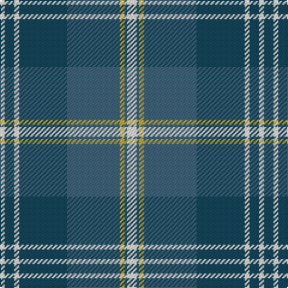

In pattern [WBWBBYBW](/patterns/wbwbbybw/).

This was sourced from register-of-tartans.  It is a [8 stripes tartan](/stripes/stripes8/).

Original link https://www.tartanregister.gov.uk/tartanDetails.aspx?ref=10390

## Thread count
W/4 DB8 W4 DB40 G44 O4 G2 W/8

## Palette
Each colour and its ΔE from the base-6 reference it is a variant of.

| Colour | Shade | Base | ΔE (OKLab) |
|---|---|---|---|
| DB | <code style="background-color:#14465C;">#14465C</code> `#14465C` | B <code style="background-color:#2C4084;">#2C4084</code> | 0.08 |
| G | <code style="background-color:#3E647A;">#3E647A</code> `#3E647A` | B <code style="background-color:#2C4084;">#2C4084</code> | 0.12 |
| O | <code style="background-color:#BFAB40;">#BFAB40</code> `#BFAB40` | Y <code style="background-color:#E8C000;">#E8C000</code> | 0.09 |
| W | <code style="background-color:#F7F1E8;">#F7F1E8</code> `#F7F1E8` | W <code style="background-color:#F4F4F0;">#F4F4F0</code> | 0.01 |

# Sample pattern

## Nearest tartans

The nearest existing variants by ΔTartan distance.

1. [Norwich No.052](/setts/s8/g38w2b24ba4b4ba4b4ba32-b1c1c50-ba5c8ca8-g006818-wfcfcfc/) — ΔT 1.05
1. [MacOrrell Family Tartan Tartan Number: 672. Earliest known date: Date unknown The MacOrrell tartan has similarities with the MacDonald, Lord of the Isles sett, which may point a connection with the name MacDonnell or MacDonald. The name Orr was used by a sept of the MacGregors and also of the Campbells of Argyll, suggesting that the root of the name originated in the Lochaber and Argyll districts. There is an undated sample of the tartan in the cloth archive of the Scottish Tartans Society. See products available Copyright © Blair Urquhart, Comrie, 2015](/setts/s9/b10y4b34g28w2g2w2g8y4-b2c2c80-g006818-we0e0e0-ye8c000/) — ΔT 1.08
1. [George (Personal)](/setts/s9/r12b4r2b16r6b32g56w4g8-b2c2c80-g006818-rc80000-we0e0e0/) — ΔT 1.20
1. [Unnamed, No 52](/setts/s8/g38w2b24ba4b4ba4b4ba32-b000050-ba8080d0-g008000-we0e0e0/) — ΔT 1.22
1. [Johnstone Clan Tartan Tartan Number: 1062. Earliest known date: pre 2003 This sett appears in Paton's collection which is housed at the Scottish Tartans Museum, Comrie in Perthshire, Scotland. The samples are undated but the collection is known to have been put together around the 1830's, with some additions during the Victorian period. See products available Copyright © Blair Urquhart, Comrie, 2015](/setts/s8/k6b6k6b44g52k4b2y6-b2c2c80-g006818-k101010-ye8c000/) — ΔT 1.22
1. [Bannockbane, Modern Silver](/setts/s8/b6r4b36r2w20g36r4g6-b304080-g808080-r703000-we0e0e0/) — ΔT 1.24
1. [Kruenaegel and Schropp](/setts/s8/b80r4w12ba4w8ba32g12w4-b2c5890-ba043c48-g549028-r902c58-we8e8e8/) — ΔT 1.25
1. [MacCord / McCord (Personal)](/setts/s7/g12r4b2r6b32ga40w4-b202060-g285800-ga048888-rc80000-we0e0e0/) — ΔT 1.25
1. [Dunn](/setts/s11/b90y12b6y12w6ba10w6ba10w40b4w6-b07648c-ba280032-wc0c0c0-yc89600/) — ΔT 1.25
1. [Ayrton](/setts/s9/r6b4k2b40k18g40k2g4r6-b3c82af-g005020-k101010-rdc0000/) — ΔT 1.27

## Neighbour map

Every grey dot is one of 15726 variants placed by the first two principal components of the ΔTartan feature space (44% of its variance). Red is this tartan; blue dots are its nearest — click one to open its page.

<svg viewBox="0 0 640 380" role="img" style="max-width:100%;height:auto;border:1px solid #e0e0e0;border-radius:4px;display:block" xmlns="http://www.w3.org/2000/svg"><image href="/nn/cloud.v1.png" width="640" height="380"/><a href="/setts/s8/g38w2b24ba4b4ba4b4ba32-b1c1c50-ba5c8ca8-g006818-wfcfcfc/"><circle cx="231.3" cy="171.5" r="4" fill="#3465a4"><title>Norwich No.052</title></circle></a><a href="/setts/s9/b10y4b34g28w2g2w2g8y4-b2c2c80-g006818-we0e0e0-ye8c000/"><circle cx="277.3" cy="158.4" r="4" fill="#3465a4"><title>MacOrrell Family Tartan Tartan Number: 672. Earliest known date: Date unknown The MacOrrell tartan has similarities with the MacDonald, Lord of the Isles sett, which may point a connection with the name MacDonnell or MacDonald. The name Orr was used by a sept of the MacGregors and also of the Campbells of Argyll, suggesting that the root of the name originated in the Lochaber and Argyll districts. There is an undated sample of the tartan in the cloth archive of the Scottish Tartans Society. See products available Copyright © Blair Urquhart, Comrie, 2015</title></circle></a><a href="/setts/s9/r12b4r2b16r6b32g56w4g8-b2c2c80-g006818-rc80000-we0e0e0/"><circle cx="302.5" cy="146.3" r="4" fill="#3465a4"><title>George (Personal)</title></circle></a><a href="/setts/s8/g38w2b24ba4b4ba4b4ba32-b000050-ba8080d0-g008000-we0e0e0/"><circle cx="203.0" cy="158.3" r="4" fill="#3465a4"><title>Unnamed, No 52</title></circle></a><a href="/setts/s8/k6b6k6b44g52k4b2y6-b2c2c80-g006818-k101010-ye8c000/"><circle cx="291.1" cy="152.5" r="4" fill="#3465a4"><title>Johnstone Clan Tartan Tartan Number: 1062. Earliest known date: pre 2003 This sett appears in Paton's collection which is housed at the Scottish Tartans Museum, Comrie in Perthshire, Scotland. The samples are undated but the collection is known to have been put together around the 1830's, with some additions during the Victorian period. See products available Copyright © Blair Urquhart, Comrie, 2015</title></circle></a><a href="/setts/s8/b6r4b36r2w20g36r4g6-b304080-g808080-r703000-we0e0e0/"><circle cx="220.3" cy="161.2" r="4" fill="#3465a4"><title>Bannockbane, Modern Silver</title></circle></a><a href="/setts/s8/b80r4w12ba4w8ba32g12w4-b2c5890-ba043c48-g549028-r902c58-we8e8e8/"><circle cx="277.4" cy="129.5" r="4" fill="#3465a4"><title>Kruenaegel and Schropp</title></circle></a><a href="/setts/s7/g12r4b2r6b32ga40w4-b202060-g285800-ga048888-rc80000-we0e0e0/"><circle cx="221.6" cy="154.2" r="4" fill="#3465a4"><title>MacCord / McCord (Personal)</title></circle></a><a href="/setts/s11/b90y12b6y12w6ba10w6ba10w40b4w6-b07648c-ba280032-wc0c0c0-yc89600/"><circle cx="287.8" cy="115.2" r="4" fill="#3465a4"><title>Dunn</title></circle></a><a href="/setts/s9/r6b4k2b40k18g40k2g4r6-b3c82af-g005020-k101010-rdc0000/"><circle cx="231.8" cy="155.1" r="4" fill="#3465a4"><title>Ayrton</title></circle></a><circle cx="273.6" cy="151.9" r="5" fill="#c00000"/></svg>

ID: /setts/s8/w8b2y4b44ba40w4ba8w4-b3e647a-ba14465c-wf7f1e8-ybfab40/
