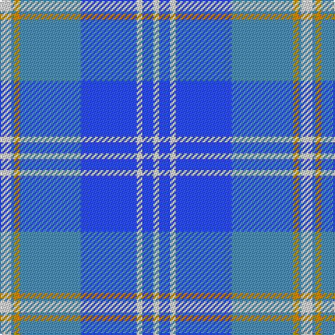

In pattern [WBWBBYBW](/patterns/wbwbbybw/).

This was sourced from tartans-authority.  It is a [8 stripes tartan](/stripes/stripes8/).

Original link http://www.tartansauthority.com/tartan-ferret/display/10390/

## Thread count
LN/8 B2 DY4 B44 Ba40 LN4 Ba8 LN/4

## Palette
Each colour and its ΔE from the base-6 reference it is a variant of.

| Colour | Shade | Base | ΔE (OKLab) |
|---|---|---|---|
| B | <code style="background-color:#5C8CA8;">#5C8CA8</code> `#5C8CA8` | B <code style="background-color:#2C4084;">#2C4084</code> | 0.23 |
| Ba | <code style="background-color:#3850C8;">#3850C8</code> `#3850C8` | B <code style="background-color:#2C4084;">#2C4084</code> | 0.12 |
| DY | <code style="background-color:#BC8C00;">#BC8C00</code> `#BC8C00` | Y <code style="background-color:#E8C000;">#E8C000</code> | 0.16 |
| LN | <code style="background-color:#E0E0E0;">#E0E0E0</code> `#E0E0E0` | W <code style="background-color:#F4F4F0;">#F4F4F0</code> | 0.06 |

# Sample pattern

## Nearest tartans

The nearest existing variants by ΔTartan distance.

1. [Bannockbane Blue #3](/setts/s8/b6ba4b60ba2w36wa28ba4wa6-b3850c8-ba2474e8-we0e0e0-waa8ace8/) — ΔT 1.27
1. [Edinburgh, '86](/setts/s11/b6w2b2w2b4w6b28ba4b4ba45r4-b304080-ba8080d0-rc00000-we0e0e0/) — ΔT 1.30
1. [Musselburgh](/setts/s9/b28w2b6y4b6w2b8ba48r6-b5480b0-ba304080-rc00000-we0e0e0-yf0c000/) — ΔT 1.32
1. [Edinburgh '86](/setts/s11/b6w2b2w2b4w6b28ba4b4ba45r4-b2c4084-ba0596fa-rdc0000-we0e0e0/) — ΔT 1.35
1. [Caleys Windsor (Corporate)](/setts/s11/b10w3b3w3b5w8b38ba8b8ba61r6-b003c64-ba2888c4-rc80000-we0e0e0/) — ΔT 1.42
1. [Saltire (Fashion)](/setts/s10/b20ba12w12wa8w6ba12b40ba92b4w4-b2c2c80-ba1474b4-w98c8e8-wafcfcfc/) — ΔT 1.48
1. [Musselburgh District Tartan Tartan Number: 620. Earliest known date: 1958 Designed for the town celebrations of 1958-59 by G. Lawson of the Musselburgh Co-operative Society. See products available Copyright © Blair Urquhart, Comrie, 2015](/setts/s9/b28w2b6y4b6w2b8ba48r6-b5c8ca8-ba2c2c80-rc80000-we0e0e0-ye8c000/) — ΔT 1.56
1. [Commonwealth Games 1986 (Corp)](/setts/s11/b6w2b2w2b4w6b30ba4b4ba44r4-b2c2c80-ba2888c4-rc80000-wfcfcfc/) — ΔT 1.58
1. [Bannockbane](/setts/s8/b4ba4b30ba2w20ba30b4ba4-b304080-ba8080d0-we0e0e0/) — ΔT 1.60
1. [U.S. Merchant Marine Academy (Corpo](/setts/s7/r74y4ra12y4r16b98r6-b2c2c80-r888888-ra901c38-ybc8c00/) — ΔT 1.63

## Neighbour map

Every grey dot is one of 15726 variants placed by the first two principal components of the ΔTartan feature space (44% of its variance). Red is this tartan; blue dots are its nearest — click one to open its page.

<svg viewBox="0 0 640 380" role="img" style="max-width:100%;height:auto;border:1px solid #e0e0e0;border-radius:4px;display:block" xmlns="http://www.w3.org/2000/svg"><image href="/nn/cloud.v1.png" width="640" height="380"/><a href="/setts/s8/b6ba4b60ba2w36wa28ba4wa6-b3850c8-ba2474e8-we0e0e0-waa8ace8/"><circle cx="272.5" cy="132.1" r="4" fill="#3465a4"><title>Bannockbane Blue #3</title></circle></a><a href="/setts/s11/b6w2b2w2b4w6b28ba4b4ba45r4-b304080-ba8080d0-rc00000-we0e0e0/"><circle cx="320.2" cy="125.5" r="4" fill="#3465a4"><title>Edinburgh, '86</title></circle></a><a href="/setts/s9/b28w2b6y4b6w2b8ba48r6-b5480b0-ba304080-rc00000-we0e0e0-yf0c000/"><circle cx="306.4" cy="135.1" r="4" fill="#3465a4"><title>Musselburgh</title></circle></a><a href="/setts/s11/b6w2b2w2b4w6b28ba4b4ba45r4-b2c4084-ba0596fa-rdc0000-we0e0e0/"><circle cx="299.8" cy="124.1" r="4" fill="#3465a4"><title>Edinburgh '86</title></circle></a><a href="/setts/s11/b10w3b3w3b5w8b38ba8b8ba61r6-b003c64-ba2888c4-rc80000-we0e0e0/"><circle cx="292.2" cy="136.2" r="4" fill="#3465a4"><title>Caleys Windsor (Corporate)</title></circle></a><a href="/setts/s10/b20ba12w12wa8w6ba12b40ba92b4w4-b2c2c80-ba1474b4-w98c8e8-wafcfcfc/"><circle cx="351.0" cy="145.5" r="4" fill="#3465a4"><title>Saltire (Fashion)</title></circle></a><a href="/setts/s9/b28w2b6y4b6w2b8ba48r6-b5c8ca8-ba2c2c80-rc80000-we0e0e0-ye8c000/"><circle cx="281.9" cy="123.5" r="4" fill="#3465a4"><title>Musselburgh District Tartan Tartan Number: 620. Earliest known date: 1958 Designed for the town celebrations of 1958-59 by G. Lawson of the Musselburgh Co-operative Society. See products available Copyright © Blair Urquhart, Comrie, 2015</title></circle></a><a href="/setts/s11/b6w2b2w2b4w6b30ba4b4ba44r4-b2c2c80-ba2888c4-rc80000-wfcfcfc/"><circle cx="287.6" cy="121.9" r="4" fill="#3465a4"><title>Commonwealth Games 1986 (Corp)</title></circle></a><a href="/setts/s8/b4ba4b30ba2w20ba30b4ba4-b304080-ba8080d0-we0e0e0/"><circle cx="257.4" cy="183.6" r="4" fill="#3465a4"><title>Bannockbane</title></circle></a><a href="/setts/s7/r74y4ra12y4r16b98r6-b2c2c80-r888888-ra901c38-ybc8c00/"><circle cx="342.8" cy="157.9" r="4" fill="#3465a4"><title>U.S. Merchant Marine Academy (Corpo</title></circle></a><circle cx="293.2" cy="156.4" r="5" fill="#c00000"/></svg>

ID: /setts/s8/w8b2y4b44ba40w4ba8w4-b5c8ca8-ba3850c8-we0e0e0-ybc8c00/
