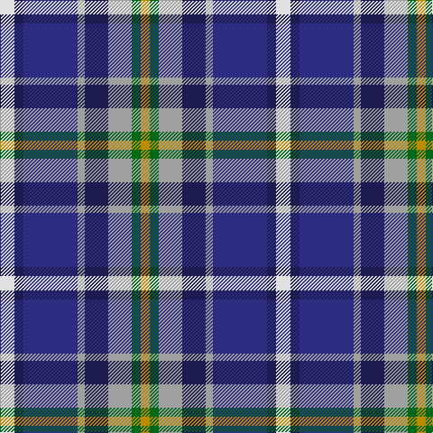

In pattern [WBBYBYGY](/stripes/wbbybygy/).

This was sourced from tartans-authority.  It is a [8 stripe tartan](/stripes/stripes8/).

Original link http://www.tartansauthority.com/tartan-ferret/display/7458/

## Attestations

This cloth appears in 2 source records; the oldest owns this page.

- 2004 — Waterford County Crest (Fashion) (tartans-authority, [record](http://www.tartansauthority.com/tartan-ferret/display/7458/))
- 01/05/2005 — Waterford County, Crest Range (register-of-tartans, [record](https://www.tartanregister.gov.uk/tartanDetails.aspx?ref=5011))

## Register references

External register numbers recorded for this tartan.

- Scottish Register of Tartans: [5011](https://www.tartanregister.gov.uk/tartanDetails.aspx?ref=5011)
- Scottish Tartans Authority (ITI): 7458
- Scottish Tartans World Register: 3102

## Thread count
LN/16 DBa10 DB60 N8 DBa26 N26 G10 DY/10

## Palette
Each colour and its ΔE from the base-6 reference it is a variant of.

| Colour | Shade | Base | ΔE (OKLab) |
|---|---|---|---|
| DB | <code style="background-color:#2C2C80;">#2C2C80</code> `#2C2C80` | B <code style="background-color:#2A418A;">#2A418A</code> | 0.06 |
| DBa | <code style="background-color:#1C1C50;">#1C1C50</code> `#1C1C50` | B <code style="background-color:#2A418A;">#2A418A</code> | 0.14 |
| DY | <code style="background-color:#BC8C00;">#BC8C00</code> `#BC8C00` | Y <code style="background-color:#F2BF00;">#F2BF00</code> | 0.16 |
| G | <code style="background-color:#006818;">#006818</code> `#006818` | G <code style="background-color:#006100;">#006100</code> | 0.02 |
| LN | <code style="background-color:#E0E0E0;">#E0E0E0</code> `#E0E0E0` | W <code style="background-color:#F7F7F7;">#F7F7F7</code> | 0.07 |
| N | <code style="background-color:#A0A0A0;">#A0A0A0</code> `#A0A0A0` | Y <code style="background-color:#F2BF00;">#F2BF00</code> | 0.21 |

# Sample pattern

## Nearest tartans

The nearest existing variants by ΔTartan distance.

1. [Lopatinsky (Personal)](/setts/s10/db24r6w6r6w6r6db25k12b36ly6/) — ΔT 0.67
1. [Meh Dundee](/setts/s6/db13ly2r4g2t8w2~x6/) — ΔT 0.90
1. [Cherokee](/setts/s8/g4t2g9k4g2r6db12w2~x2/) — ΔT 0.94
1. [Mitsukoshi](/setts/s10/y12k3w3k3w3k3y13n6db17r3~x2/) — ΔT 0.96
1. [East Lothian](/setts/s7/t6db17dp4db2k11g3ly4~x2/) — ΔT 0.96
1. [Caitriot](/setts/s9/w3t2n14lr8t14db16n13t2w3~x2/) — ΔT 1.05
1. [Renfrewshire District Tartan Tartan Number: 2560. Earliest known date: 1998 Designed for anyone residing in the County of Renfrewshire See products available Copyright © Blair Urquhart, Comrie, 2015](/setts/s7/m4db2t7db20k7g10ly4~x2/) — ΔT 1.07
1. [Manchester City Football Club "Blue](/setts/s11/db4b13r2db2k2db2w5db2ly2db2b2~x2/) — ΔT 1.09
1. [Deeside District Tartan Tartan Number: 1833. Earliest known date: 1963 The name Deas is described as an 'alias' for Davidson in historic records, and is a recognised sept of Clan Dhai (Davidson). See products available Copyright © Blair Urquhart, Comrie, 2015](/setts/s7/w1o1dp2o7g1db5ly1~x4/) — ΔT 1.10
1. [Curd (2013)](/setts/s8/db1t9w3ly3db9ly1g1r1~x4/) — ΔT 1.10

## Neighbour map

Every grey dot is one of 14299 variants placed by the first two principal components of the ΔTartan feature space (44% of its variance). Red is this tartan; blue dots are its nearest — click one to open its page.

<svg viewBox="0 0 640 380" role="img" style="max-width:100%;height:auto;border:1px solid #e0e0e0;border-radius:4px;display:block" xmlns="http://www.w3.org/2000/svg"><image href="/nn/cloud.v1.png" width="640" height="380"/><a href="/setts/s10/db24r6w6r6w6r6db25k12b36ly6/"><circle cx="91.4" cy="167.4" r="4" fill="#3465a4"><title>Lopatinsky (Personal)</title></circle></a><a href="/setts/s6/db13ly2r4g2t8w2~x6/"><circle cx="136.9" cy="188.9" r="4" fill="#3465a4"><title>Meh Dundee</title></circle></a><a href="/setts/s8/g4t2g9k4g2r6db12w2~x2/"><circle cx="90.5" cy="190.9" r="4" fill="#3465a4"><title>Cherokee</title></circle></a><a href="/setts/s10/y12k3w3k3w3k3y13n6db17r3~x2/"><circle cx="96.8" cy="175.7" r="4" fill="#3465a4"><title>Mitsukoshi</title></circle></a><a href="/setts/s7/t6db17dp4db2k11g3ly4~x2/"><circle cx="135.7" cy="186.2" r="4" fill="#3465a4"><title>East Lothian</title></circle></a><a href="/setts/s9/w3t2n14lr8t14db16n13t2w3~x2/"><circle cx="114.1" cy="193.6" r="4" fill="#3465a4"><title>Caitriot</title></circle></a><a href="/setts/s7/m4db2t7db20k7g10ly4~x2/"><circle cx="139.2" cy="183.8" r="4" fill="#3465a4"><title>Renfrewshire District Tartan Tartan Number: 2560. Earliest known date: 1998 Designed for anyone residing in the County of Renfrewshire See products available Copyright © Blair Urquhart, Comrie, 2015</title></circle></a><a href="/setts/s11/db4b13r2db2k2db2w5db2ly2db2b2~x2/"><circle cx="112.2" cy="148.3" r="4" fill="#3465a4"><title>Manchester City Football Club &quot;Blue</title></circle></a><a href="/setts/s7/w1o1dp2o7g1db5ly1~x4/"><circle cx="158.4" cy="169.7" r="4" fill="#3465a4"><title>Deeside District Tartan Tartan Number: 1833. Earliest known date: 1963 The name Deas is described as an 'alias' for Davidson in historic records, and is a recognised sept of Clan Dhai (Davidson). See products available Copyright © Blair Urquhart, Comrie, 2015</title></circle></a><a href="/setts/s8/db1t9w3ly3db9ly1g1r1~x4/"><circle cx="109.3" cy="143.5" r="4" fill="#3465a4"><title>Curd (2013)</title></circle></a><circle cx="99.5" cy="171.8" r="5" fill="#c00000"/></svg>

ID: /setts/s8/w8db5db30lr4db13lr13g5lo5~x2/
