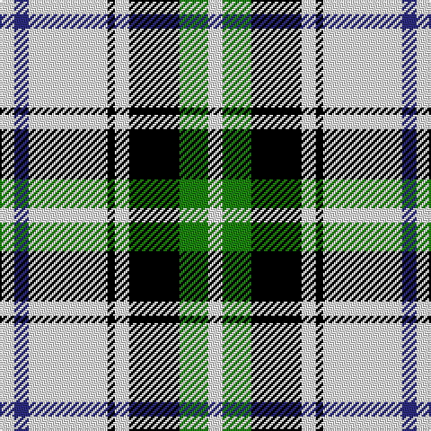

In pattern [WBWKWKGW](/patterns/wbwkwkgw/).

This was sourced from tartans-authority.  It is a [8 stripes tartan](/stripes/stripes8/).

Original link http://www.tartansauthority.com/tartan-ferret/display/3490/

## Thread count
W/8 DB8 W44 K4 W8 K28 G16 W/8

## Palette
Each colour and its ΔE from the base-6 reference it is a variant of.

| Colour | Shade | Base | ΔE (OKLab) |
|---|---|---|---|
| DB | <code style="background-color:#2C2C80;">#2C2C80</code> `#2C2C80` | B <code style="background-color:#2A418A;">#2A418A</code> | 0.06 |
| G | <code style="background-color:#188400;">#188400</code> `#188400` | G <code style="background-color:#006100;">#006100</code> | 0.11 |
| K | <code style="background-color:#000000;">#000000</code> `#000000` | K <code style="background-color:#000000;">#000000</code> | 0.00 |
| W | <code style="background-color:#F8F8F8;">#F8F8F8</code> `#F8F8F8` | W <code style="background-color:#F7F7F7;">#F7F7F7</code> | 0.00 |

# Sample pattern

## Nearest tartans

The nearest existing variants by ΔTartan distance.

1. [MacPherson Dress (1951)](/setts/s7/w6b6w60k40w6k18y6-b940094-k101010-we0e0e0-ye8c000/) — ΔT 1.00
1. [Puffin (Personal)](/setts/s9/k16w4k4w36g4w4g4w4r16-g006818-k101010-r946400-wfcfcfc/) — ΔT 1.07
1. [Kierson](/setts/s8/k44w32g4w28g4w32k44r6-g006818-k101010-r880000-wf8f8f8/) — ΔT 1.12
1. [Hannay Family Tartan Tartan Number: 1255. Earliest known date: c.1810-44 The Hannay tartan has been long established in the South West of Scotland. An old kilt worn by Commander Alex Hannay (1788 - 1844) was discovered by his descendant, Miss Anne Hannay, in the family chest and came into the possession of Councillor John Hannay, a well known tartan designer and collector. He created a new design based on the old which included a red stripe. This sett was produced around 1950 by Messrs Galt of Galloway. The black and white check is a common feature of Lowland tartans, originally woven with the undyed wool and found in the earliest of tartans, the Shepherds Plaid. It is interesting to note that the colours of the armourial bearings of the Chiefly House of Hannay of Scorbie are Sable, Argent and Azure - black, silver and blue. See products available Copyright © Blair Urquhart, Comrie, 2015](/setts/s10/k18w8k4w8k4w60k18w8b28y4-b2c2c80-k101010-we0e0e0-ye8c000/) — ΔT 1.17
1. [Black and White Golf](/setts/s7/y18k64g12w40y6w18k10-g008b00-k101010-wffffff-yd9b666/) — ΔT 1.18
1. [Puffin](/setts/s9/k12w4k4w24g4w4g4w4r12-g008000-k000000-r806050-we0e0e0/) — ΔT 1.19
1. [Hannay](/setts/s10/k18w8k4w8k4w60k18w8b28y4-b304080-k000000-we0e0e0-yf0c000/) — ΔT 1.19
1. [Hannay (Clan)](/setts/s10/k18w8k4w8k4w60k18w8b28y4-b3850c8-k101010-we8ccb8-yd09800/) — ΔT 1.23
1. [Hannay](/setts/s10/k18w8k4w8k4w58k18w8b28y4-b3850c8-k101010-wffffff-yd09800/) — ΔT 1.24
1. [Rui (Personal)](/setts/s6/r4w48k4wa8k20r4-k000000-rc80000-wc8c8c8-wafcfcfc/) — ΔT 1.26

## Neighbour map

Every grey dot is one of 15726 variants placed by the first two principal components of the ΔTartan feature space (44% of its variance). Red is this tartan; blue dots are its nearest — click one to open its page.

<svg viewBox="0 0 640 380" role="img" style="max-width:100%;height:auto;border:1px solid #e0e0e0;border-radius:4px;display:block" xmlns="http://www.w3.org/2000/svg"><image href="/nn/cloud.v1.png" width="640" height="380"/><a href="/setts/s7/w6b6w60k40w6k18y6-b940094-k101010-we0e0e0-ye8c000/"><circle cx="246.2" cy="166.6" r="4" fill="#3465a4"><title>MacPherson Dress (1951)</title></circle></a><a href="/setts/s9/k16w4k4w36g4w4g4w4r16-g006818-k101010-r946400-wfcfcfc/"><circle cx="213.1" cy="150.2" r="4" fill="#3465a4"><title>Puffin (Personal)</title></circle></a><a href="/setts/s8/k44w32g4w28g4w32k44r6-g006818-k101010-r880000-wf8f8f8/"><circle cx="209.1" cy="185.8" r="4" fill="#3465a4"><title>Kierson</title></circle></a><a href="/setts/s10/k18w8k4w8k4w60k18w8b28y4-b2c2c80-k101010-we0e0e0-ye8c000/"><circle cx="244.2" cy="132.9" r="4" fill="#3465a4"><title>Hannay Family Tartan Tartan Number: 1255. Earliest known date: c.1810-44 The Hannay tartan has been long established in the South West of Scotland. An old kilt worn by Commander Alex Hannay (1788 - 1844) was discovered by his descendant, Miss Anne Hannay, in the family chest and came into the possession of Councillor John Hannay, a well known tartan designer and collector. He created a new design based on the old which included a red stripe. This sett was produced around 1950 by Messrs Galt of Galloway. The black and white check is a common feature of Lowland tartans, originally woven with the undyed wool and found in the earliest of tartans, the Shepherds Plaid. It is interesting to note that the colours of the armourial bearings of the Chiefly House of Hannay of Scorbie are Sable, Argent and Azure - black, silver and blue. See products available Copyright © Blair Urquhart, Comrie, 2015</title></circle></a><a href="/setts/s7/y18k64g12w40y6w18k10-g008b00-k101010-wffffff-yd9b666/"><circle cx="176.1" cy="176.3" r="4" fill="#3465a4"><title>Black and White Golf</title></circle></a><a href="/setts/s9/k12w4k4w24g4w4g4w4r12-g008000-k000000-r806050-we0e0e0/"><circle cx="170.6" cy="184.1" r="4" fill="#3465a4"><title>Puffin</title></circle></a><a href="/setts/s10/k18w8k4w8k4w60k18w8b28y4-b304080-k000000-we0e0e0-yf0c000/"><circle cx="240.3" cy="133.3" r="4" fill="#3465a4"><title>Hannay</title></circle></a><a href="/setts/s10/k18w8k4w8k4w60k18w8b28y4-b3850c8-k101010-we8ccb8-yd09800/"><circle cx="250.1" cy="133.4" r="4" fill="#3465a4"><title>Hannay (Clan)</title></circle></a><a href="/setts/s10/k18w8k4w8k4w58k18w8b28y4-b3850c8-k101010-wffffff-yd09800/"><circle cx="231.7" cy="130.7" r="4" fill="#3465a4"><title>Hannay</title></circle></a><a href="/setts/s6/r4w48k4wa8k20r4-k000000-rc80000-wc8c8c8-wafcfcfc/"><circle cx="259.4" cy="155.6" r="4" fill="#3465a4"><title>Rui (Personal)</title></circle></a><circle cx="223.5" cy="166.0" r="5" fill="#c00000"/></svg>

ID: /setts/s8/w8g16k28w8k4w44b8w8-b2c2c80-g188400-k000000-wf8f8f8/
