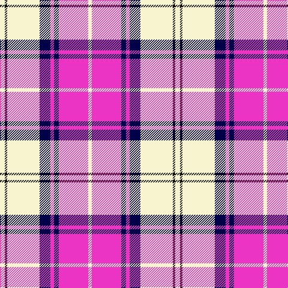

In pattern [WKWBRBRW](/stripes/wkwbrbrw/).

This was sourced from register-of-tartans.  It is a [8 stripe tartan](/stripes/stripes8/).

Original link https://www.tartanregister.gov.uk/tartanDetails.aspx?ref=11142

## Register references

External register numbers recorded for this tartan.

- Scottish Register of Tartans: [11142](https://www.tartanregister.gov.uk/tartanDetails.aspx?ref=11142)

## Thread count
LY/8 K4 LY54 DB18 LR6 DB8 LR49 LY/6

## Palette
Each colour and the base-6 reference it is a variant of.

| Colour | Shade | Base |
|---|---|---|
| DB | <code style="background-color:#000048;">#000048</code> `oklch(18.2% 0.126 264.1)` <small>#000048</small> | B <code style="background-color:#2A418A;">#2A418A</code> |
| K | <code style="background-color:#101010;">#101010</code> `oklch(17.3% 0.000 89.9)` <small>#101010</small> | K <code style="background-color:#000000;">#000000</code> |
| LR | <code style="background-color:#EC34C4;">#EC34C4</code> `oklch(65.8% 0.255 338.8)` <small>#EC34C4</small> | R <code style="background-color:#CC0000;">#CC0000</code> |
| LY | <code style="background-color:#F8F4D0;">#F8F4D0</code> `oklch(96.1% 0.047 102.0)` <small>#F8F4D0</small> | W <code style="background-color:#F7F7F7;">#F7F7F7</code> |

# Sample pattern

## Nearest tartans

The nearest existing variants by ΔTartan distance, with this tartan at the top so the swatches line up against it.

ΔTartan

Tartan

Sett

—

<a href="/ttd/edit/#slug=w8k4w54db18m6db8m49w6">Merida Dance</a> <a class="nn-out" href="/setts/s8/w8k4w54db18m6db8m49w6/" title="open its dictionary page">↗</a>

0.72

<a href="/ttd/edit/#slug=w8k6w54db16m6db8m49w6">Meridia Dance</a> <a class="nn-out" href="/setts/s8/w8k6w54db16m6db8m49w6/" title="open its dictionary page">↗</a>

1.06

<a href="/ttd/edit/#slug=dp8db2dp24db5w26k2w8~x2">Lennox Purple Dress District Tartan Tartan Number: 8189. Earliest known date: pre 2003 Families with the surname 'Lennox' are usually considered related to Clans Stewart or MacFarlane. Some of this surname also choose to wear the distinctive and ancient 'Lennox' tartan. D W Stewart reproduced the sett from a 'lost' portrait of the Countess of Lennox dating from the 16th century./Threadcount and colours aren't 100% original. Generated manually./ See products available Copyright © Blair Urquhart, Comrie, 2015</a> <a class="nn-out" href="/setts/s7/dp8db2dp24db5w26k2w8~x2/" title="open its dictionary page">↗</a>

1.08

<a href="/ttd/edit/#slug=w5k3w31p26w4p10t4~x2">MacPherson, dress (purple)</a> <a class="nn-out" href="/setts/s7/w5k3w31p26w4p10t4~x2/" title="open its dictionary page">↗</a>

1.08

<a href="/ttd/edit/#slug=w5dp2w34dp34k2dp2t4~x2">Cunningham Dress Purple (Dance)</a> <a class="nn-out" href="/setts/s7/w5dp2w34dp34k2dp2t4~x2/" title="open its dictionary page">↗</a>

1.09

<a href="/ttd/edit/#slug=w5k3w31dp26w4dp10t4~x2">MacPherson Dress Purple</a> <a class="nn-out" href="/setts/s7/w5k3w31dp26w4dp10t4~x2/" title="open its dictionary page">↗</a>

1.23

<a href="/ttd/edit/#slug=w4db2w1r2w16db16r16db12db1w4~x2">Spirit of Russia, The</a> <a class="nn-out" href="/setts/s10/w4db2w1r2w16db16r16db12db1w4~x2/" title="open its dictionary page">↗</a>

1.26

<a href="/ttd/edit/#slug=t1dp3k2w1dp8w1k2w9k1w3t1~x6">MacRae, Dress Purple (Dance)</a> <a class="nn-out" href="/setts/s11/t1dp3k2w1dp8w1k2w9k1w3t1~x6/" title="open its dictionary page">↗</a>

1.40

<a href="/ttd/edit/#slug=t2dp1k1dp20w20dp1w2~x4">Cunningham Dress Purple (Dance) Fashion Tartan Tartan Number: 6531. Earliest known date: 01/01/1986 A dancers' tartan from D C Dalgliesh of Selkirk. See products available Copyright © Blair Urquhart, Comrie, 2015</a> <a class="nn-out" href="/setts/s7/t2dp1k1dp20w20dp1w2~x4/" title="open its dictionary page">↗</a>

1.42

<a href="/ttd/edit/#slug=w30b4w3dp2r2dp24w2~x2">St Andrews Links Dress</a> <a class="nn-out" href="/setts/s7/w30b4w3dp2r2dp24w2~x2/" title="open its dictionary page">↗</a>

1.43

<a href="/ttd/edit/#slug=m18w2m2t3m2w2m4k10m2w25k3~x2">MacKellar Dress, Cerise (Dance)</a> <a class="nn-out" href="/setts/s11/m18w2m2t3m2w2m4k10m2w25k3~x2/" title="open its dictionary page">↗</a>

## Neighbour map

Every grey dot is one of 14299 variants placed by the first two principal components of the ΔTartan feature space (44% of its variance). Red is this tartan; blue dots are its nearest — click one to open its page.

<svg viewBox="0 0 640 380" role="img" style="max-width:100%;height:auto;border:1px solid #e0e0e0;border-radius:4px;display:block" xmlns="http://www.w3.org/2000/svg"><image href="/nn/cloud.v1.png" width="640" height="380"/><a href="/setts/s8/w8k6w54db16m6db8m49w6/"><circle cx="205.8" cy="149.5" r="4" fill="#3465a4"><title>Meridia Dance</title></circle></a><a href="/setts/s7/dp8db2dp24db5w26k2w8~x2/"><circle cx="237.8" cy="159.9" r="4" fill="#3465a4"><title>Lennox Purple Dress District Tartan Tartan Number: 8189. Earliest known date: pre 2003 Families with the surname 'Lennox' are usually considered related to Clans Stewart or MacFarlane. Some of this surname also choose to wear the distinctive and ancient 'Lennox' tartan. D W Stewart reproduced the sett from a 'lost' portrait of the Countess of Lennox dating from the 16th century./Threadcount and colours aren't 100% original. Generated manually./ See products available Copyright © Blair Urquhart, Comrie, 2015</title></circle></a><a href="/setts/s7/w5k3w31p26w4p10t4~x2/"><circle cx="250.3" cy="163.0" r="4" fill="#3465a4"><title>MacPherson, dress (purple)</title></circle></a><a href="/setts/s7/w5dp2w34dp34k2dp2t4~x2/"><circle cx="280.2" cy="123.8" r="4" fill="#3465a4"><title>Cunningham Dress Purple (Dance)</title></circle></a><a href="/setts/s7/w5k3w31dp26w4dp10t4~x2/"><circle cx="251.6" cy="164.2" r="4" fill="#3465a4"><title>MacPherson Dress Purple</title></circle></a><a href="/setts/s10/w4db2w1r2w16db16r16db12db1w4~x2/"><circle cx="193.1" cy="135.7" r="4" fill="#3465a4"><title>Spirit of Russia, The</title></circle></a><a href="/setts/s11/t1dp3k2w1dp8w1k2w9k1w3t1~x6/"><circle cx="180.9" cy="142.5" r="4" fill="#3465a4"><title>MacRae, Dress Purple (Dance)</title></circle></a><a href="/setts/s7/t2dp1k1dp20w20dp1w2~x4/"><circle cx="301.0" cy="119.8" r="4" fill="#3465a4"><title>Cunningham Dress Purple (Dance) Fashion Tartan Tartan Number: 6531. Earliest known date: 01/01/1986 A dancers' tartan from D C Dalgliesh of Selkirk. See products available Copyright © Blair Urquhart, Comrie, 2015</title></circle></a><a href="/setts/s7/w30b4w3dp2r2dp24w2~x2/"><circle cx="248.3" cy="114.5" r="4" fill="#3465a4"><title>St Andrews Links Dress</title></circle></a><a href="/setts/s11/m18w2m2t3m2w2m4k10m2w25k3~x2/"><circle cx="181.3" cy="104.9" r="4" fill="#3465a4"><title>MacKellar Dress, Cerise (Dance)</title></circle></a><circle cx="218.5" cy="130.9" r="5" fill="#c00000"/></svg>

ID: /setts/s8/w8k4w54db18m6db8m49w6/
