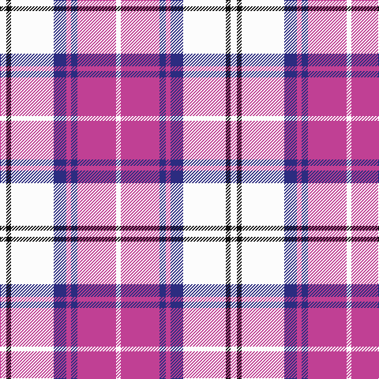

In pattern [WKWBRBRW](/patterns/wkwbrbrw/).

This was sourced from tartans-authority.  It is a [8 stripes tartan](/stripes/stripes8/).

Original link http://www.tartansauthority.com/tartan-ferret/display/11142/

## Thread count
W/8 K6 W54 DB16 P6 DB8 P49 W/6

## Palette
Each colour and its ΔE from the base-6 reference it is a variant of.

| Colour | Shade | Base | ΔE (OKLab) |
|---|---|---|---|
| DB | <code style="background-color:#2C2C80;">#2C2C80</code> `#2C2C80` | B <code style="background-color:#2A418A;">#2A418A</code> | 0.06 |
| K | <code style="background-color:#101010;">#101010</code> `#101010` | K <code style="background-color:#000000;">#000000</code> | 0.17 |
| P | <code style="background-color:#C04094;">#C04094</code> `#C04094` | R <code style="background-color:#CC0000;">#CC0000</code> | 0.16 |
| W | <code style="background-color:#FCFCFC;">#FCFCFC</code> `#FCFCFC` | W <code style="background-color:#F7F7F7;">#F7F7F7</code> | 0.01 |

# Sample pattern

## Nearest tartans

The nearest existing variants by ΔTartan distance.

1. [Merida Dance](/setts/s8/w8k4w54b18r6b8r49w6-b000048-k101010-rec34c4-wf8f4d0/) — ΔT 0.72
1. [MacPherson Dress Purple](/setts/s7/w10k6w62b52w8b20ba8-b780078-ba5c8ca8-k101010-we0e0e0/) — ΔT 1.00
1. [MacPherson, dress (purple)](/setts/s7/w10k6w62b52w8b20ba8-b800080-ba5480b0-k000000-we0e0e0/) — ΔT 1.01
1. [MacRae, Dress Purple (Dance)](/setts/s11/b6ba18k12w6ba48w6k12w54k6w18b6-b2888c4-ba780078-k101010-wf8f8f8/) — ΔT 1.05
1. [Lennox Purple Dress District Tartan Tartan Number: 8189. Earliest known date: pre 2003 Families with the surname 'Lennox' are usually considered related to Clans Stewart or MacFarlane. Some of this surname also choose to wear the distinctive and ancient 'Lennox' tartan. D W Stewart reproduced the sett from a 'lost' portrait of the Countess of Lennox dating from the 16th century./Threadcount and colours aren't 100% original. Generated manually./ See products available Copyright © Blair Urquhart, Comrie, 2015](/setts/s7/b16ba4b48ba10w52k4w16-b780078-ba2c2c80-k101010-we0e0e0/) — ΔT 1.17
1. [Cunningham Dress Purple (Dance)](/setts/s7/w10b4w68b68k4b4ba8-b780078-ba2888c4-k101010-wf8f8f8/) — ΔT 1.41
1. [Spirit of Russia, The](/setts/s10/w8b4w2r4w32b32r32b24ba2w8-b2c2c80-ba202060-rc80000-wfcfcfc/) — ΔT 1.45
1. [St Andrews Links Dress](/setts/s7/w60b8w6ba4r4ba48wa4-b8968cd-ba551a8b-rcd5555-wfdf5e6-waffffff/) — ΔT 1.48
1. [Winnipeg Embroiderers' Guild](/setts/s6/r24b4y4w4b8w12-b2b5e89-rf261c6-wf5f1f0-yffc83c/) — ΔT 1.50
1. [MacPherson Blue/White Clan Tartan Tartan Number: 1868. Earliest known date: 1980 There are a great number of variations of the Dress MacPherson, many of them modern trade designs which are popular with country dancers. Hugh Macpherson of Edinburgh, kiltmaker and tartan designer some decades ago, supplied samples of these to the Scottish Tartan Society around 1980. See products available Copyright © Blair Urquhart, Comrie, 2015](/setts/s7/w10r6w52b42w6b16y6-b2c2c80-rc80000-we0e0e0-ye8c000/) — ΔT 1.50

## Neighbour map

Every grey dot is one of 15726 variants placed by the first two principal components of the ΔTartan feature space (44% of its variance). Red is this tartan; blue dots are its nearest — click one to open its page.

<svg viewBox="0 0 640 380" role="img" style="max-width:100%;height:auto;border:1px solid #e0e0e0;border-radius:4px;display:block" xmlns="http://www.w3.org/2000/svg"><image href="/nn/cloud.v1.png" width="640" height="380"/><a href="/setts/s8/w8k4w54b18r6b8r49w6-b000048-k101010-rec34c4-wf8f4d0/"><circle cx="217.2" cy="134.8" r="4" fill="#3465a4"><title>Merida Dance</title></circle></a><a href="/setts/s7/w10k6w62b52w8b20ba8-b780078-ba5c8ca8-k101010-we0e0e0/"><circle cx="250.7" cy="167.3" r="4" fill="#3465a4"><title>MacPherson Dress Purple</title></circle></a><a href="/setts/s7/w10k6w62b52w8b20ba8-b800080-ba5480b0-k000000-we0e0e0/"><circle cx="249.5" cy="166.3" r="4" fill="#3465a4"><title>MacPherson, dress (purple)</title></circle></a><a href="/setts/s11/b6ba18k12w6ba48w6k12w54k6w18b6-b2888c4-ba780078-k101010-wf8f8f8/"><circle cx="178.7" cy="145.5" r="4" fill="#3465a4"><title>MacRae, Dress Purple (Dance)</title></circle></a><a href="/setts/s7/b16ba4b48ba10w52k4w16-b780078-ba2c2c80-k101010-we0e0e0/"><circle cx="236.4" cy="162.7" r="4" fill="#3465a4"><title>Lennox Purple Dress District Tartan Tartan Number: 8189. Earliest known date: pre 2003 Families with the surname 'Lennox' are usually considered related to Clans Stewart or MacFarlane. Some of this surname also choose to wear the distinctive and ancient 'Lennox' tartan. D W Stewart reproduced the sett from a 'lost' portrait of the Countess of Lennox dating from the 16th century./Threadcount and colours aren't 100% original. Generated manually./ See products available Copyright © Blair Urquhart, Comrie, 2015</title></circle></a><a href="/setts/s7/w10b4w68b68k4b4ba8-b780078-ba2888c4-k101010-wf8f8f8/"><circle cx="278.6" cy="127.2" r="4" fill="#3465a4"><title>Cunningham Dress Purple (Dance)</title></circle></a><a href="/setts/s10/w8b4w2r4w32b32r32b24ba2w8-b2c2c80-ba202060-rc80000-wfcfcfc/"><circle cx="190.7" cy="138.3" r="4" fill="#3465a4"><title>Spirit of Russia, The</title></circle></a><a href="/setts/s7/w60b8w6ba4r4ba48wa4-b8968cd-ba551a8b-rcd5555-wfdf5e6-waffffff/"><circle cx="246.0" cy="117.4" r="4" fill="#3465a4"><title>St Andrews Links Dress</title></circle></a><a href="/setts/s6/r24b4y4w4b8w12-b2b5e89-rf261c6-wf5f1f0-yffc83c/"><circle cx="185.7" cy="203.4" r="4" fill="#3465a4"><title>Winnipeg Embroiderers' Guild</title></circle></a><a href="/setts/s7/w10r6w52b42w6b16y6-b2c2c80-rc80000-we0e0e0-ye8c000/"><circle cx="236.2" cy="178.5" r="4" fill="#3465a4"><title>MacPherson Blue/White Clan Tartan Tartan Number: 1868. Earliest known date: 1980 There are a great number of variations of the Dress MacPherson, many of them modern trade designs which are popular with country dancers. Hugh Macpherson of Edinburgh, kiltmaker and tartan designer some decades ago, supplied samples of these to the Scottish Tartan Society around 1980. See products available Copyright © Blair Urquhart, Comrie, 2015</title></circle></a><circle cx="204.5" cy="153.0" r="5" fill="#c00000"/></svg>

ID: /setts/s8/w8k6w54b16r6b8r49w6-b2c2c80-k101010-rc04094-wfcfcfc/
