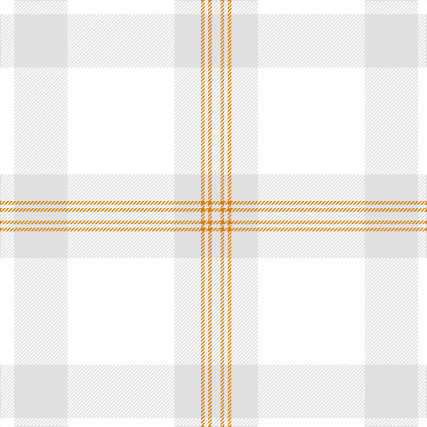

This page is one **sett** — a single exact thread-count. It belongs to the [tartan](/tartans/w8wi30w60wi15lo2wi2lo2wi5/)
(the same proportion at any scale), whose colour order is pattern [WWWWYWYW](/stripes/wwwwywyw/).

Sourced from register-of-tartans.  It is a [8 stripe tartan](/stripes/stripes8/).

Original link https://www.tartanregister.gov.uk/tartanDetails.aspx?ref=11104

## Register references

External register numbers recorded for this tartan.

- Scottish Register of Tartans: [11104](https://www.tartanregister.gov.uk/tartanDetails.aspx?ref=11104)

## Thread count
W/16 LN60 W120 LN30 O4 LN4 O4 LN/10

## Palette

Palette: <strong>Tartan Register</strong>
<table><thead><tr><th>Colour</th><th>Threads</th><th>Shade</th><th>Base</th><th>OKLCh</th></tr></thead><tbody><tr><td>W/</td><td style="text-align:right;font-variant-numeric:tabular-nums">16</td><td><code style="background-color:#FFFFFF;">#FFFFFF</code> <small style="color:#888">#FFFFFF</small></td><td>W <code style="background-color:#F7F7F7;">#F7F7F7</code></td><td><small style="color:#888">oklch(100.0% 0.000 89.9)</small></td></tr><tr><td>LN</td><td style="text-align:right;font-variant-numeric:tabular-nums">60</td><td><code style="background-color:#E0E0E0;">#E0E0E0</code> <small style="color:#888">#E0E0E0</small></td><td>W <code style="background-color:#F7F7F7;">#F7F7F7</code></td><td><small style="color:#888">oklch(90.7% 0.000 89.9)</small></td></tr><tr><td>W</td><td style="text-align:right;font-variant-numeric:tabular-nums">120</td><td><code style="background-color:#FFFFFF;">#FFFFFF</code> <small style="color:#888">#FFFFFF</small></td><td>W <code style="background-color:#F7F7F7;">#F7F7F7</code></td><td><small style="color:#888">oklch(100.0% 0.000 89.9)</small></td></tr><tr><td>LN</td><td style="text-align:right;font-variant-numeric:tabular-nums">30</td><td><code style="background-color:#E0E0E0;">#E0E0E0</code> <small style="color:#888">#E0E0E0</small></td><td>W <code style="background-color:#F7F7F7;">#F7F7F7</code></td><td><small style="color:#888">oklch(90.7% 0.000 89.9)</small></td></tr><tr><td>O</td><td style="text-align:right;font-variant-numeric:tabular-nums">4</td><td><code style="background-color:#D87C00;">#D87C00</code> <small style="color:#888">#D87C00</small></td><td>Y <code style="background-color:#F2BF00;">#F2BF00</code></td><td><small style="color:#888">oklch(67.3% 0.155 61.8)</small></td></tr><tr><td>LN</td><td style="text-align:right;font-variant-numeric:tabular-nums">4</td><td><code style="background-color:#E0E0E0;">#E0E0E0</code> <small style="color:#888">#E0E0E0</small></td><td>W <code style="background-color:#F7F7F7;">#F7F7F7</code></td><td><small style="color:#888">oklch(90.7% 0.000 89.9)</small></td></tr><tr><td>O</td><td style="text-align:right;font-variant-numeric:tabular-nums">4</td><td><code style="background-color:#D87C00;">#D87C00</code> <small style="color:#888">#D87C00</small></td><td>Y <code style="background-color:#F2BF00;">#F2BF00</code></td><td><small style="color:#888">oklch(67.3% 0.155 61.8)</small></td></tr><tr><td>LN/</td><td style="text-align:right;font-variant-numeric:tabular-nums">10</td><td><code style="background-color:#E0E0E0;">#E0E0E0</code> <small style="color:#888">#E0E0E0</small></td><td>W <code style="background-color:#F7F7F7;">#F7F7F7</code></td><td><small style="color:#888">oklch(90.7% 0.000 89.9)</small></td></tr></tbody></table>

# Sample pattern

## Nearest tartans

The nearest existing variants by ΔTartan distance, with this tartan at the top so the swatches line up against it.

ΔTartan

Tartan

Sett

—

<a href="/ttd/edit/#slug=w8wi30w60wi15lo2wi2lo2wi5~x2">Amazon</a> <a class="nn-out" href="/setts/s8/w8wi30w60wi15lo2wi2lo2wi5~x2/" title="open its dictionary page">↗</a>

2.36

<a href="/ttd/edit/#slug=w60lr15w3lr3w3lr3w5lr15~x2">Walk the Walk</a> <a class="nn-out" href="/setts/s8/w60lr15w3lr3w3lr3w5lr15~x2/" title="open its dictionary page">↗</a>

3.58

<a href="/ttd/edit/#slug=w4o28t48ly3~x2">McKerrell of Hillhouse Dress (Clan)</a> <a class="nn-out" href="/setts/s4/w4o28t48ly3~x2/" title="open its dictionary page">↗</a>

3.82

<a href="/ttd/edit/#slug=t48o28w4o28t48ly3~x2">McKerrell of Hillhouse Dress</a> <a class="nn-out" href="/setts/s6/t48o28w4o28t48ly3~x2/" title="open its dictionary page">↗</a>

3.84

<a href="/ttd/edit/#slug=lri3lb3lri1y25lri15lr5lb4ly2~x2">Rikaco Morning Dew #2</a> <a class="nn-out" href="/setts/s8/lri3lb3lri1y25lri15lr5lb4ly2~x2/" title="open its dictionary page">↗</a>

3.86

<a href="/ttd/edit/#slug=w8lb30w60lb15lo2lb2lo2lb5~x2">Amazon</a> <a class="nn-out" href="/setts/s8/w8lb30w60lb15lo2lb2lo2lb5~x2/" title="open its dictionary page">↗</a>

3.95

<a href="/ttd/edit/#slug=lb25w5r1w1r1w20~x4">Masai Shuka 13 (Artefact)</a> <a class="nn-out" href="/setts/s6/lb25w5r1w1r1w20~x4/" title="open its dictionary page">↗</a>

3.96

<a href="/ttd/edit/#slug=y32w2y9ly2y12o21r1~x2">Weathered Cyclist</a> <a class="nn-out" href="/setts/s7/y32w2y9ly2y12o21r1~x2/" title="open its dictionary page">↗</a>

3.99

<a href="/ttd/edit/#slug=o32w2o9ly2o12lo21r1~x2">Weathered Cyclist (Corporate)</a> <a class="nn-out" href="/setts/s7/o32w2o9ly2o12lo21r1~x2/" title="open its dictionary page">↗</a>

4.15

<a href="/ttd/edit/#slug=lo5n2y8n1y8n4y4n6y18lr1lo5~x2">Bute Heather, Ancient Wth'd (Fashion</a> <a class="nn-out" href="/setts/s11/lo5n2y8n1y8n4y4n6y18lr1lo5~x2/" title="open its dictionary page">↗</a>

4.16

<a href="/ttd/edit/#slug=y52ly2n24r3lo26n4~x2">Outlander #1</a> <a class="nn-out" href="/setts/s6/y52ly2n24r3lo26n4~x2/" title="open its dictionary page">↗</a>

## Neighbour map

Every grey dot is one of 14359 variants placed by the first two principal components of the ΔTartan feature space (44% of its variance). Red is this tartan; blue dots are its nearest — click one to open its page.

<svg viewBox="0 0 640 380" role="img" style="max-width:100%;height:auto;border:1px solid #e0e0e0;border-radius:4px;display:block" xmlns="http://www.w3.org/2000/svg"><image href="/nn/cloud.v1.png" width="640" height="380"/><a href="/setts/s8/w60lr15w3lr3w3lr3w5lr15~x2/"><circle cx="626.0" cy="241.4" r="4" fill="#3465a4"><title>Walk the Walk</title></circle></a><a href="/setts/s4/w4o28t48ly3~x2/"><circle cx="501.7" cy="294.2" r="4" fill="#3465a4"><title>McKerrell of Hillhouse Dress (Clan)</title></circle></a><a href="/setts/s6/t48o28w4o28t48ly3~x2/"><circle cx="550.9" cy="329.0" r="4" fill="#3465a4"><title>McKerrell of Hillhouse Dress</title></circle></a><a href="/setts/s8/lri3lb3lri1y25lri15lr5lb4ly2~x2/"><circle cx="374.3" cy="191.3" r="4" fill="#3465a4"><title>Rikaco Morning Dew #2</title></circle></a><a href="/setts/s8/w8lb30w60lb15lo2lb2lo2lb5~x2/"><circle cx="481.9" cy="177.7" r="4" fill="#3465a4"><title>Amazon</title></circle></a><a href="/setts/s6/lb25w5r1w1r1w20~x4/"><circle cx="448.0" cy="205.6" r="4" fill="#3465a4"><title>Masai Shuka 13 (Artefact)</title></circle></a><a href="/setts/s7/y32w2y9ly2y12o21r1~x2/"><circle cx="560.6" cy="225.1" r="4" fill="#3465a4"><title>Weathered Cyclist</title></circle></a><a href="/setts/s7/o32w2o9ly2o12lo21r1~x2/"><circle cx="609.4" cy="248.7" r="4" fill="#3465a4"><title>Weathered Cyclist (Corporate)</title></circle></a><a href="/setts/s11/lo5n2y8n1y8n4y4n6y18lr1lo5~x2/"><circle cx="560.0" cy="292.3" r="4" fill="#3465a4"><title>Bute Heather, Ancient Wth'd (Fashion</title></circle></a><a href="/setts/s6/y52ly2n24r3lo26n4~x2/"><circle cx="424.3" cy="230.2" r="4" fill="#3465a4"><title>Outlander #1</title></circle></a><circle cx="566.3" cy="226.8" r="5" fill="#c00000"/></svg>

ID: /setts/s8/w8wi30w60wi15lo2wi2lo2wi5~x2/
