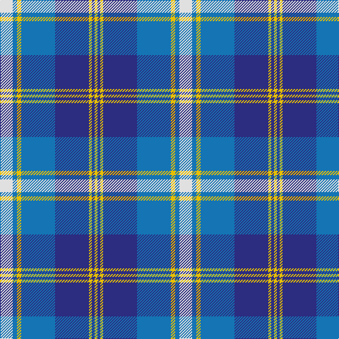

In pattern [WBYBBYBY](/patterns/wbybbyby/).

This was sourced from tartans-authority.  It is a [8 stripes tartan](/stripes/stripes8/).

Original link http://www.tartansauthority.com/tartan-ferret/display/7661/

## Attestations

This cloth appears in 2 source records; the oldest owns this page.

- pre 2008 — Halesowen (District) (tartans-authority, [record](http://www.tartansauthority.com/tartan-ferret/display/7661/))
- undated — Halesowen (register-of-tartans, [record](https://www.tartanregister.gov.uk/tartanDetails.aspx?ref=5667))

## Register references

External register numbers recorded for this tartan.

- Scottish Register of Tartans: [5667](https://www.tartanregister.gov.uk/tartanDetails.aspx?ref=5667)
- Scottish Tartans Authority (ITI): 7661
- Scottish Tartans World Register: 3279

## Thread count
LN/18 B6 Y6 B48 DB48 Y4 DB4 Y/4

## Palette
Each colour and its ΔE from the base-6 reference it is a variant of.

| Colour | Shade | Base | ΔE (OKLab) |
|---|---|---|---|
| B | <code style="background-color:#1474B4;">#1474B4</code> `#1474B4` | B <code style="background-color:#2A418A;">#2A418A</code> | 0.15 |
| DB | <code style="background-color:#2C2C80;">#2C2C80</code> `#2C2C80` | B <code style="background-color:#2A418A;">#2A418A</code> | 0.06 |
| LN | <code style="background-color:#E0E0E0;">#E0E0E0</code> `#E0E0E0` | W <code style="background-color:#F7F7F7;">#F7F7F7</code> | 0.07 |
| Y | <code style="background-color:#E8C000;">#E8C000</code> `#E8C000` | Y <code style="background-color:#F2BF00;">#F2BF00</code> | 0.02 |

# Sample pattern

## Nearest tartans

The nearest existing variants by ΔTartan distance.

1. [Keela (Corporate)](/setts/s7/b7w3b2w6b16ba26r4~b003c64-ba5c8ca8-r880000-wfcfcfc~x2/) — ΔT 0.91
1. [Halesowen #2](/setts/s8/w9b3y3b24ba24y2ba2y2~b1c0070-ba003c64-we0e0e0-ye8c000~x2/) — ΔT 1.08
1. [Bannockbane Trade Tartan Tartan Number: 27. Earliest known date: 1984 A fashion pattern originating the early 1970s. Other variants of the design including this one appeared up to 1984. No place or family of the name is known and the pattern has no association with Bannockburn, or famous battle of 1314. Donald Broun may have been a designer with Edinburgh Woollen Mills. See products available Copyright © Blair Urquhart, Comrie, 2015](/setts/s8/b2ba2b15w10b1ba15b2ba2~b2888c4-ba2c2c80-we0e0e0~x2/) — ΔT 1.11
1. [Bannockbane Blue #2](/setts/s8/b3ba2b14ba1w10wa16ba2wa3~b1c0070-ba2c2c80-wc0c0c0-waa8ace8~x2/) — ΔT 1.15
1. [Thorburn #1 (Name)](/setts/s9/b12w2b2ba6b4w3b4w18r1~b2c2c80-ba2888c4-rc80000-w98c8e8~x4/) — ΔT 1.18
1. [Bannockbane Light Blue](/setts/s8/b2ba2b15w10b1ba15b2ba2~b2888c4-ba2c2c80-wfcfcfc~x2/) — ΔT 1.20
1. [Arran (Pendleton)](/setts/s8/b12k1b1k1b1ba8w9g2~b3c82af-ba080848-g808080-k101010-we0e0e0~x4/) — ΔT 1.21
1. [Thorburn (1992)](/setts/s9/b12w4b4ba12b8w5b8w35r4~b2c2c80-ba2888c4-rc80000-w98c8e8~x2/) — ΔT 1.22
1. [Yale College, Wrexham](/setts/s8/b57k5b9r29k18w9r9w5~b2383bf-k101010-rc52e8b-wffffff/) — ΔT 1.26
1. [Highlands Country Club](/setts/s12/b15w11wa2w1wa1g4wa1w1wa2w11b15g5~b1c0070-g006818-wa8ace8-wac0c0c0~x4/) — ΔT 1.26

## Neighbour map

Every grey dot is one of 15726 variants placed by the first two principal components of the ΔTartan feature space (44% of its variance). Red is this tartan; blue dots are its nearest — click one to open its page.

<svg viewBox="0 0 640 380" role="img" style="max-width:100%;height:auto;border:1px solid #e0e0e0;border-radius:4px;display:block" xmlns="http://www.w3.org/2000/svg"><image href="/nn/cloud.v1.png" width="640" height="380"/><a href="/setts/s7/b7w3b2w6b16ba26r4~b003c64-ba5c8ca8-r880000-wfcfcfc~x2/"><circle cx="210.2" cy="182.1" r="4" fill="#3465a4"><title>Keela (Corporate)</title></circle></a><a href="/setts/s8/w9b3y3b24ba24y2ba2y2~b1c0070-ba003c64-we0e0e0-ye8c000~x2/"><circle cx="198.7" cy="167.6" r="4" fill="#3465a4"><title>Halesowen #2</title></circle></a><a href="/setts/s8/b2ba2b15w10b1ba15b2ba2~b2888c4-ba2c2c80-we0e0e0~x2/"><circle cx="243.6" cy="185.5" r="4" fill="#3465a4"><title>Bannockbane Trade Tartan Tartan Number: 27. Earliest known date: 1984 A fashion pattern originating the early 1970s. Other variants of the design including this one appeared up to 1984. No place or family of the name is known and the pattern has no association with Bannockburn, or famous battle of 1314. Donald Broun may have been a designer with Edinburgh Woollen Mills. See products available Copyright © Blair Urquhart, Comrie, 2015</title></circle></a><a href="/setts/s8/b3ba2b14ba1w10wa16ba2wa3~b1c0070-ba2c2c80-wc0c0c0-waa8ace8~x2/"><circle cx="180.5" cy="160.3" r="4" fill="#3465a4"><title>Bannockbane Blue #2</title></circle></a><a href="/setts/s9/b12w2b2ba6b4w3b4w18r1~b2c2c80-ba2888c4-rc80000-w98c8e8~x4/"><circle cx="246.6" cy="157.6" r="4" fill="#3465a4"><title>Thorburn #1 (Name)</title></circle></a><a href="/setts/s8/b2ba2b15w10b1ba15b2ba2~b2888c4-ba2c2c80-wfcfcfc~x2/"><circle cx="230.7" cy="179.7" r="4" fill="#3465a4"><title>Bannockbane Light Blue</title></circle></a><a href="/setts/s8/b12k1b1k1b1ba8w9g2~b3c82af-ba080848-g808080-k101010-we0e0e0~x4/"><circle cx="154.7" cy="148.3" r="4" fill="#3465a4"><title>Arran (Pendleton)</title></circle></a><a href="/setts/s9/b12w4b4ba12b8w5b8w35r4~b2c2c80-ba2888c4-rc80000-w98c8e8~x2/"><circle cx="224.0" cy="181.7" r="4" fill="#3465a4"><title>Thorburn (1992)</title></circle></a><a href="/setts/s8/b57k5b9r29k18w9r9w5~b2383bf-k101010-rc52e8b-wffffff/"><circle cx="221.2" cy="168.7" r="4" fill="#3465a4"><title>Yale College, Wrexham</title></circle></a><a href="/setts/s12/b15w11wa2w1wa1g4wa1w1wa2w11b15g5~b1c0070-g006818-wa8ace8-wac0c0c0~x4/"><circle cx="205.3" cy="146.2" r="4" fill="#3465a4"><title>Highlands Country Club</title></circle></a><circle cx="207.5" cy="167.7" r="5" fill="#c00000"/></svg>

ID: /setts/s8/w9b3y3b24ba24y2ba2y2~b1474b4-ba2c2c80-we0e0e0-ye8c000~x2/
