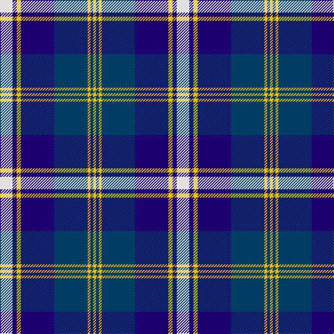

**Bands:** [WBYBBYBY](/stripes/wbybbyby/) · **Stripes:** [W DB LY DB DT LY DT LY](/stripes/stripes8/) W DB LY DB DT LY DT LY

This was sourced from register-of-tartans.  It is a [8 band tartan](/bands/bands8/).

Original link https://www.tartanregister.gov.uk/tartanDetails.aspx?ref=5797

## Register references

External register numbers recorded for this tartan.

- Scottish Register of Tartans: [5797](https://www.tartanregister.gov.uk/tartanDetails.aspx?ref=5797)
- Scottish Tartans Authority (ITI): 7845

## Thread count
LN/18 DB6 Y6 DB48 DBa48 Y4 DBa4 Y/4

## Palette
Each colour and its ΔE from the base-6 reference it is a variant of.

| Colour | Shade | Base | ΔE (OKLab) |
|---|---|---|---|
| DB | <code style="background-color:#1C0070;">#1C0070</code> `#1C0070` | B <code style="background-color:#2A418A;">#2A418A</code> | 0.14 |
| DBa | <code style="background-color:#003C64;">#003C64</code> `#003C64` | B <code style="background-color:#2A418A;">#2A418A</code> | 0.08 |
| LN | <code style="background-color:#E0E0E0;">#E0E0E0</code> `#E0E0E0` | W <code style="background-color:#F7F7F7;">#F7F7F7</code> | 0.07 |
| Y | <code style="background-color:#E8C000;">#E8C000</code> `#E8C000` | Y <code style="background-color:#F2BF00;">#F2BF00</code> | 0.02 |

# Sample pattern

## Nearest tartans

The nearest existing variants by ΔTartan distance.

1. [Scottish Knights Templar MTS (Corp)](/setts/s10/lb4r2db20k6lb5k4lb3k2r2db2~x2/) — ΔT 1.05
1. [Halesowen (District)](/setts/s8/w9b3ly3b24db24ly2db2ly2~x2/) — ΔT 1.08
1. [Highlands School (N. Carolina) Corporate Tartan Tartan Number: 2109. Earliest known date: 1990 Highlands in North Carolina is the home of the Scottish Tartans Society's Museum Extension. The school tartan was designed by Bob Martin who is a 'Fellow of the Society'. Blue and Gold are the school colours. See products available Copyright © Blair Urquhart, Comrie, 2015](/setts/s8/ly12db2ly2db30db3db2db13w4~x2/) — ΔT 1.10
1. [Sabema](/setts/s8/db25k3db7k15b25k2b2w4~x2/) — ΔT 1.14
1. [Kinnaird](/setts/s8/lb33k4lb4k5lb4k7db41r4~x2/) — ΔT 1.15
1. [Mina Perhonen](/setts/s7/ly4k4t5n24ly2k24w4~x2/) — ΔT 1.16
1. [Banff, and Buchan](/setts/s8/db26w2db3db15t26db2t3ly4~x2/) — ΔT 1.17
1. [Highlands School (North Carolina)](/setts/s8/lo12db2lo2db30dt2db2dt13lb4~x2/) — ΔT 1.21
1. [Loch Ness in Scotland](/setts/s7/g2db14lg6lr1g1lr6r1~x4/) — ΔT 1.22
1. [Loch Ness (Fashion)](/setts/s7/lb2k17lg11t21r2t2r2~x2/) — ΔT 1.23

## Neighbour map

Every grey dot is one of 14313 variants placed by the first two principal components of the ΔTartan feature space (44% of its variance). Red is this tartan; blue dots are its nearest — click one to open its page.

<svg viewBox="0 0 640 380" role="img" style="max-width:100%;height:auto;border:1px solid #e0e0e0;border-radius:4px;display:block" xmlns="http://www.w3.org/2000/svg"><image href="/nn/cloud.v1.png" width="640" height="380"/><a href="/setts/s10/lb4r2db20k6lb5k4lb3k2r2db2~x2/"><circle cx="208.9" cy="161.8" r="4" fill="#3465a4"><title>Scottish Knights Templar MTS (Corp)</title></circle></a><a href="/setts/s8/w9b3ly3b24db24ly2db2ly2~x2/"><circle cx="211.1" cy="168.7" r="4" fill="#3465a4"><title>Halesowen (District)</title></circle></a><a href="/setts/s8/ly12db2ly2db30db3db2db13w4~x2/"><circle cx="260.5" cy="155.8" r="4" fill="#3465a4"><title>Highlands School (N. Carolina) Corporate Tartan Tartan Number: 2109. Earliest known date: 1990 Highlands in North Carolina is the home of the Scottish Tartans Society's Museum Extension. The school tartan was designed by Bob Martin who is a 'Fellow of the Society'. Blue and Gold are the school colours. See products available Copyright © Blair Urquhart, Comrie, 2015</title></circle></a><a href="/setts/s8/db25k3db7k15b25k2b2w4~x2/"><circle cx="215.5" cy="194.5" r="4" fill="#3465a4"><title>Sabema</title></circle></a><a href="/setts/s8/lb33k4lb4k5lb4k7db41r4~x2/"><circle cx="203.1" cy="157.1" r="4" fill="#3465a4"><title>Kinnaird</title></circle></a><a href="/setts/s7/ly4k4t5n24ly2k24w4~x2/"><circle cx="187.4" cy="168.4" r="4" fill="#3465a4"><title>Mina Perhonen</title></circle></a><a href="/setts/s8/db26w2db3db15t26db2t3ly4~x2/"><circle cx="182.1" cy="164.4" r="4" fill="#3465a4"><title>Banff, and Buchan</title></circle></a><a href="/setts/s8/lo12db2lo2db30dt2db2dt13lb4~x2/"><circle cx="273.2" cy="160.5" r="4" fill="#3465a4"><title>Highlands School (North Carolina)</title></circle></a><a href="/setts/s7/g2db14lg6lr1g1lr6r1~x4/"><circle cx="200.2" cy="156.6" r="4" fill="#3465a4"><title>Loch Ness in Scotland</title></circle></a><a href="/setts/s7/lb2k17lg11t21r2t2r2~x2/"><circle cx="169.5" cy="170.4" r="4" fill="#3465a4"><title>Loch Ness (Fashion)</title></circle></a><circle cx="202.6" cy="167.4" r="5" fill="#c00000"/></svg>

ID: /setts/s8/w9db3ly3db24dt24ly2dt2ly2~x2/
