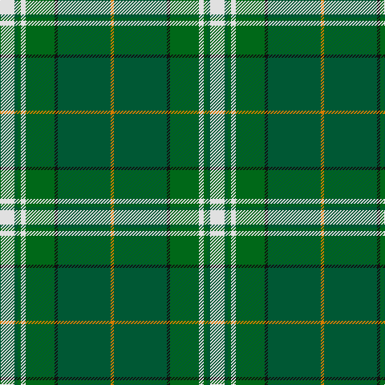

In pattern [WGGWGKGY](/patterns/wggwgkgy/).

This was sourced from tartans-authority.  It is a [8 stripes tartan](/stripes/stripes8/).

Original link http://www.tartansauthority.com/tartan-ferret/display/10281/

## Thread count
LN/18 G4 Ga4 LN6 Ga36 K4 G66 O/4

## Palette
Each colour and its ΔE from the base-6 reference it is a variant of.

| Colour | Shade | Base | ΔE (OKLab) |
|---|---|---|---|
| G | <code style="background-color:#005834;">#005834</code> `#005834` | G <code style="background-color:#006100;">#006100</code> | 0.06 |
| Ga | <code style="background-color:#006818;">#006818</code> `#006818` | G <code style="background-color:#006100;">#006100</code> | 0.02 |
| K | <code style="background-color:#101010;">#101010</code> `#101010` | K <code style="background-color:#000000;">#000000</code> | 0.17 |
| LN | <code style="background-color:#E0E0E0;">#E0E0E0</code> `#E0E0E0` | W <code style="background-color:#F7F7F7;">#F7F7F7</code> | 0.07 |
| O | <code style="background-color:#D87C00;">#D87C00</code> `#D87C00` | Y <code style="background-color:#F2BF00;">#F2BF00</code> | 0.17 |

# Sample pattern

## Nearest tartans

The nearest existing variants by ΔTartan distance.

1. [Manitoba](/setts/s8/b2g1b1g12ga2g1r6y2x4~b5480b0-g008000-ga003000-r802040-yf0c000/) — ΔT 1.00
1. [Alberta (District)](/setts/s7/g12k1r1k1b2k1y4x8~b2474e8-g006818-k101010-re87878-yd8b000/) — ΔT 1.05
1. [160th SOAR(A) Night Stalkers (Mil.)](/setts/s9/k2b8k6g35k8y2w2k2y2x2~b1474b4-g006818-k101010-wfcfcfc-ybc8c00/) — ΔT 1.05
1. [Boucherville (Tartan de..) District Tartan Tartan Number: 2119. Earliest known date: 1990 From the notes accompanying the petition for accreditation. "Les symboles ont cette remarquable propriete de reunir en une expression imagee des notions diverses. Ils refletent l'histoire, les croyances, les idealogies et les aspirations de groupes humains habitant un territoire precis. Les tisserands, c'est nous tous....!" See products available Copyright © Blair Urquhart, Comrie, 2015](/setts/s9/g20y2r5w4g2r2g2r2b6x2~b2c2c80-g006818-r888888-we0e0e0-ye8c000/) — ΔT 1.05
1. [Humphries (Name)](/setts/s8/g18r1w2k1w2r1ra6k2x4~g007800-k000000-r8c0000-ra8c6428-wc8c8c8/) — ΔT 1.08
1. [Alberta (Province)](/setts/s7/g13k1r1k1b2k1y4x8~b2474e8-g006818-k101010-re87878-yd8b000/) — ΔT 1.08
1. [Gift of Life Michigan (Corporate)](/setts/s7/r2b1r1b11g16ga1w1x2~b2888c4-g289c18-ga003820-rc80000-wfcfcfc/) — ΔT 1.14
1. [O'Neill (Name)](/setts/s8/w6g5r5g45k4y24k4g5x2~g006818-k101010-ra00024-we0e0e0-ya08858/) — ΔT 1.15
1. [Alberta District Tartan Tartan Number: 2055. Earliest known date: 1961 Designed for the Edmonton Rehabilitation Society as a project for handloom weaving by disabled students. The Provincial Legislative of Alberta gave formal approval for the Alberta tartan in 1961. See products available Copyright © Blair Urquhart, Comrie, 2015](/setts/s7/g12k1r1k1b2k1y4x2~b5c8ca8-g006818-k101010-rd05054-ye8c000/) — ΔT 1.15
1. [Montgomery, Stuart (Personal)](/setts/s10/b6g24k1w2k1g24ga24w3k1w3x2~b2c2c80-g006818-ga289c18-k101010-wfcfcfc/) — ΔT 1.18

## Neighbour map

Every grey dot is one of 15726 variants placed by the first two principal components of the ΔTartan feature space (44% of its variance). Red is this tartan; blue dots are its nearest — click one to open its page.

<svg viewBox="0 0 640 380" role="img" style="max-width:100%;height:auto;border:1px solid #e0e0e0;border-radius:4px;display:block" xmlns="http://www.w3.org/2000/svg"><image href="/nn/cloud.v1.png" width="640" height="380"/><a href="/setts/s8/b2g1b1g12ga2g1r6y2x4~b5480b0-g008000-ga003000-r802040-yf0c000/"><circle cx="265.1" cy="164.4" r="4" fill="#3465a4"><title>Manitoba</title></circle></a><a href="/setts/s7/g12k1r1k1b2k1y4x8~b2474e8-g006818-k101010-re87878-yd8b000/"><circle cx="268.1" cy="156.4" r="4" fill="#3465a4"><title>Alberta (District)</title></circle></a><a href="/setts/s9/k2b8k6g35k8y2w2k2y2x2~b1474b4-g006818-k101010-wfcfcfc-ybc8c00/"><circle cx="288.0" cy="132.5" r="4" fill="#3465a4"><title>160th SOAR(A) Night Stalkers (Mil.)</title></circle></a><a href="/setts/s9/g20y2r5w4g2r2g2r2b6x2~b2c2c80-g006818-r888888-we0e0e0-ye8c000/"><circle cx="255.7" cy="161.6" r="4" fill="#3465a4"><title>Boucherville (Tartan de..) District Tartan Tartan Number: 2119. Earliest known date: 1990 From the notes accompanying the petition for accreditation. &quot;Les symboles ont cette remarquable propriete de reunir en une expression imagee des notions diverses. Ils refletent l'histoire, les croyances, les idealogies et les aspirations de groupes humains habitant un territoire precis. Les tisserands, c'est nous tous....!&quot; See products available Copyright © Blair Urquhart, Comrie, 2015</title></circle></a><a href="/setts/s8/g18r1w2k1w2r1ra6k2x4~g007800-k000000-r8c0000-ra8c6428-wc8c8c8/"><circle cx="287.3" cy="128.9" r="4" fill="#3465a4"><title>Humphries (Name)</title></circle></a><a href="/setts/s7/g13k1r1k1b2k1y4x8~b2474e8-g006818-k101010-re87878-yd8b000/"><circle cx="288.2" cy="152.6" r="4" fill="#3465a4"><title>Alberta (Province)</title></circle></a><a href="/setts/s7/r2b1r1b11g16ga1w1x2~b2888c4-g289c18-ga003820-rc80000-wfcfcfc/"><circle cx="286.8" cy="153.1" r="4" fill="#3465a4"><title>Gift of Life Michigan (Corporate)</title></circle></a><a href="/setts/s8/w6g5r5g45k4y24k4g5x2~g006818-k101010-ra00024-we0e0e0-ya08858/"><circle cx="297.4" cy="165.2" r="4" fill="#3465a4"><title>O'Neill (Name)</title></circle></a><a href="/setts/s7/g12k1r1k1b2k1y4x2~b5c8ca8-g006818-k101010-rd05054-ye8c000/"><circle cx="267.9" cy="155.4" r="4" fill="#3465a4"><title>Alberta District Tartan Tartan Number: 2055. Earliest known date: 1961 Designed for the Edmonton Rehabilitation Society as a project for handloom weaving by disabled students. The Provincial Legislative of Alberta gave formal approval for the Alberta tartan in 1961. See products available Copyright © Blair Urquhart, Comrie, 2015</title></circle></a><a href="/setts/s10/b6g24k1w2k1g24ga24w3k1w3x2~b2c2c80-g006818-ga289c18-k101010-wfcfcfc/"><circle cx="292.6" cy="129.7" r="4" fill="#3465a4"><title>Montgomery, Stuart (Personal)</title></circle></a><circle cx="267.4" cy="146.8" r="5" fill="#c00000"/></svg>

ID: /setts/s8/w9g2ga2w3ga18k2g33y2x2~g005834-ga006818-k101010-we0e0e0-yd87c00/
