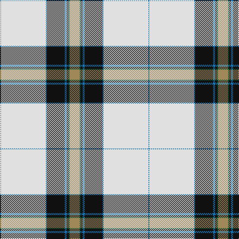

In pattern [BWBKBKGY](/patterns/bwbkbkgy/).

This was sourced from tartans-authority.  It is a [8 stripes tartan](/stripes/stripes8/).

Original link http://www.tartansauthority.com/tartan-ferret/display/7522/

## Thread count
Ba/2 LN90 B2 K36 Ba4 K4 G2 LT/20

## Palette
Each colour and its ΔE from the base-6 reference it is a variant of.

| Colour | Shade | Base | ΔE (OKLab) |
|---|---|---|---|
| B | <code style="background-color:#1474B4;">#1474B4</code> `#1474B4` | B <code style="background-color:#2A418A;">#2A418A</code> | 0.15 |
| Ba | <code style="background-color:#1474B4;">#1474B4</code> `#1474B4` | B <code style="background-color:#2A418A;">#2A418A</code> | 0.15 |
| G | <code style="background-color:#005430;">#005430</code> `#005430` | G <code style="background-color:#006100;">#006100</code> | 0.07 |
| K | <code style="background-color:#101010;">#101010</code> `#101010` | K <code style="background-color:#000000;">#000000</code> | 0.17 |
| LN | <code style="background-color:#E0E0E0;">#E0E0E0</code> `#E0E0E0` | W <code style="background-color:#F7F7F7;">#F7F7F7</code> | 0.07 |
| LT | <code style="background-color:#A08858;">#A08858</code> `#A08858` | Y <code style="background-color:#F2BF00;">#F2BF00</code> | 0.21 |

# Sample pattern

## Nearest tartans

The nearest existing variants by ΔTartan distance.

1. [Canmore Highland Games Dress (Corp)](/setts/s12/w52b2k7w3k2ba2k1b9g8k2g3y2~b2c2c80-ba780078-g006818-k101010-we0e0e0-ye8c000~x2/) — ΔT 1.05
1. [Stewart Dress](/setts/s12/w36b5k5y1k1w1k1g8r4k1r2w1~b000060-g004c00-k000000-rc80000-wd0d0d0-yffc800/) — ΔT 1.14
1. [Bruce of Kinnaird Dress (Dance)](/setts/s10/w45r9k2w8k2y1k10b8ba12w2~b2c2c80-ba780078-k101010-rc80000-wf8f8f8-ye8c000~x2/) — ΔT 1.21
1. [Stuart/Stewart Dress Blue](/setts/s11/w72b20y2b3w2b3g16ga6b2ga5w2~b080848-g808080-ga503c14-we0e0e0-ye8c000~x2/) — ΔT 1.24
1. [Drummond of Perth Dress (Dance)](/setts/s9/w50k3g10ga11w1k1r20w3r5~g006818-ga408060-k101010-r800028-we0e0e0~x2/) — ΔT 1.26
1. [Saskatchewan Dress (Dance)](/setts/s8/w2k1g6ga11w26r2w1y2~g006818-ga604000-k101010-rc80000-we0e0e0-ye8c000~x2/) — ΔT 1.30
1. [Stewart dress, Blue](/setts/s11/w72b20y2b3w2b3g16r6b2r5w2~b000050-g808080-r806050-we0e0e0-yf0c000~x2/) — ΔT 1.31
1. [Canmore Highland Games Dress](/setts/s12/w52b2k7w3k2ba2k1b9g8k2g3r2~b000099-ba660066-g006666-k101010-r996600-wffffff~x2/) — ΔT 1.32
1. [Bennet Dress (Fashion)](/setts/s11/w64b18wa2b3w2b3ba14bb8k2bb4w2~b000060-ba306084-bb3070fc-k000000-we8dcc8-wa94acfc~x2/) — ΔT 1.35
1. [Pritchard](/setts/s11/w24b2k2y1k1w1g6ba4g1ba1w1~b00008c-ba683c8c-g146400-k000000-wfcfcfc-yc89800~x4/) — ΔT 1.37

## Neighbour map

Every grey dot is one of 15726 variants placed by the first two principal components of the ΔTartan feature space (44% of its variance). Red is this tartan; blue dots are its nearest — click one to open its page.

<svg viewBox="0 0 640 380" role="img" style="max-width:100%;height:auto;border:1px solid #e0e0e0;border-radius:4px;display:block" xmlns="http://www.w3.org/2000/svg"><image href="/nn/cloud.v1.png" width="640" height="380"/><a href="/setts/s12/w52b2k7w3k2ba2k1b9g8k2g3y2~b2c2c80-ba780078-g006818-k101010-we0e0e0-ye8c000~x2/"><circle cx="314.6" cy="17.1" r="4" fill="#3465a4"><title>Canmore Highland Games Dress (Corp)</title></circle></a><a href="/setts/s12/w36b5k5y1k1w1k1g8r4k1r2w1~b000060-g004c00-k000000-rc80000-wd0d0d0-yffc800/"><circle cx="289.0" cy="29.3" r="4" fill="#3465a4"><title>Stewart Dress</title></circle></a><a href="/setts/s10/w45r9k2w8k2y1k10b8ba12w2~b2c2c80-ba780078-k101010-rc80000-wf8f8f8-ye8c000~x2/"><circle cx="266.1" cy="42.2" r="4" fill="#3465a4"><title>Bruce of Kinnaird Dress (Dance)</title></circle></a><a href="/setts/s11/w72b20y2b3w2b3g16ga6b2ga5w2~b080848-g808080-ga503c14-we0e0e0-ye8c000~x2/"><circle cx="311.0" cy="52.0" r="4" fill="#3465a4"><title>Stuart/Stewart Dress Blue</title></circle></a><a href="/setts/s9/w50k3g10ga11w1k1r20w3r5~g006818-ga408060-k101010-r800028-we0e0e0~x2/"><circle cx="288.5" cy="64.3" r="4" fill="#3465a4"><title>Drummond of Perth Dress (Dance)</title></circle></a><a href="/setts/s8/w2k1g6ga11w26r2w1y2~g006818-ga604000-k101010-rc80000-we0e0e0-ye8c000~x2/"><circle cx="280.4" cy="79.9" r="4" fill="#3465a4"><title>Saskatchewan Dress (Dance)</title></circle></a><a href="/setts/s11/w72b20y2b3w2b3g16r6b2r5w2~b000050-g808080-r806050-we0e0e0-yf0c000~x2/"><circle cx="311.5" cy="52.2" r="4" fill="#3465a4"><title>Stewart dress, Blue</title></circle></a><a href="/setts/s12/w52b2k7w3k2ba2k1b9g8k2g3r2~b000099-ba660066-g006666-k101010-r996600-wffffff~x2/"><circle cx="305.0" cy="14.0" r="4" fill="#3465a4"><title>Canmore Highland Games Dress</title></circle></a><a href="/setts/s11/w64b18wa2b3w2b3ba14bb8k2bb4w2~b000060-ba306084-bb3070fc-k000000-we8dcc8-wa94acfc~x2/"><circle cx="273.3" cy="43.8" r="4" fill="#3465a4"><title>Bennet Dress (Fashion)</title></circle></a><a href="/setts/s11/w24b2k2y1k1w1g6ba4g1ba1w1~b00008c-ba683c8c-g146400-k000000-wfcfcfc-yc89800~x4/"><circle cx="275.9" cy="45.9" r="4" fill="#3465a4"><title>Pritchard</title></circle></a><circle cx="297.5" cy="50.7" r="5" fill="#c00000"/></svg>

ID: /setts/s8/y10g1k2b2k18b1w45b1~b1474b4-g005430-k101010-we0e0e0-ya08858~x2/
