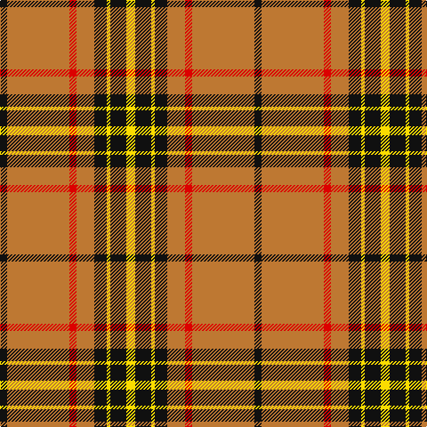

In pattern [KRRRKYKY](/patterns/krrrkyky/).

This was sourced from register-of-tartans.  It is a [8 stripes tartan](/stripes/stripes8/).

Original link https://www.tartanregister.gov.uk/tartanDetails.aspx?ref=5862

## Thread count
K/8 DO70 R8 DO20 K14 Y4 K18 Y/10

## Palette
Each colour and its ΔE from the base-6 reference it is a variant of.

| Colour | Shade | Base | ΔE (OKLab) |
|---|---|---|---|
| DO | <code style="background-color:#BE7832;">#BE7832</code> `#BE7832` | R <code style="background-color:#C80000;">#C80000</code> | 0.17 |
| K | <code style="background-color:#101010;">#101010</code> `#101010` | K <code style="background-color:#000000;">#000000</code> | 0.17 |
| R | <code style="background-color:#DC0000;">#DC0000</code> `#DC0000` | R <code style="background-color:#C80000;">#C80000</code> | 0.04 |
| Y | <code style="background-color:#FADC00;">#FADC00</code> `#FADC00` | Y <code style="background-color:#E8C000;">#E8C000</code> | 0.08 |

# Sample pattern

## Nearest tartans

The nearest existing variants by ΔTartan distance.

1. [MacFie Dress](/setts/s9/w4r48g8r8w64r8g8r48y4-g006818-r880000-we0e0e0-yd09800/) — ΔT 1.09
1. [MacGregor](/setts/s6/r70g32r10g10w4k6-g008000-k000000-rc00000-we0e0e0/) — ΔT 1.12
1. [Denny, hunting](/setts/s6/b2r32g12k2g12k2-b304080-g008000-k000000-rc00000/) — ΔT 1.13
1. [Melieres Michel..](/setts/s9/k4r2g16r6g6r28y2r2w4-g008000-k000000-rc00000-we0e0e0-yf0c000/) — ΔT 1.14
1. [MacAulay](/setts/s6/k4r32g12r6g16w2-g008000-k000000-rc00000-we0e0e0/) — ΔT 1.17
1. [Cumming, Comyn](/setts/s10/r8g16w2g16r8g8r4g8r48k4-g008000-k000000-rc00000-we0e0e0/) — ΔT 1.19
1. [Braken Tartan Tartan Number: 1449. Earliest known date: pre 1992 Originally spelt 'Braken'. See products available Copyright © Blair Urquhart, Comrie, 2015](/setts/s9/y20b27r6b15y8b11y78ba10r12-b202060-ba2c2c80-rc80000-ye8c000/) — ΔT 1.19
1. [Morgan of Wales](/setts/s11/r4y34b20y4b8y6ra2y5b2y3r4-b441800-r901c38-rac80000-ye8c000/) — ΔT 1.19
1. [Bracken](/setts/s9/y10b18r6b10y4b8y52ba6r8-b202060-ba5c8ca8-rc80000-ye8c000/) — ΔT 1.25
1. [Baluch Regiment (Military)](/setts/s9/r10g40r10g6r8g10r72b4w8-b4c3428-g006818-rc80000-wfcfcfc/) — ΔT 1.28

## Neighbour map

Every grey dot is one of 15726 variants placed by the first two principal components of the ΔTartan feature space (44% of its variance). Red is this tartan; blue dots are its nearest — click one to open its page.

<svg viewBox="0 0 640 380" role="img" style="max-width:100%;height:auto;border:1px solid #e0e0e0;border-radius:4px;display:block" xmlns="http://www.w3.org/2000/svg"><image href="/nn/cloud.v1.png" width="640" height="380"/><a href="/setts/s9/w4r48g8r8w64r8g8r48y4-g006818-r880000-we0e0e0-yd09800/"><circle cx="309.2" cy="137.2" r="4" fill="#3465a4"><title>MacFie Dress</title></circle></a><a href="/setts/s6/r70g32r10g10w4k6-g008000-k000000-rc00000-we0e0e0/"><circle cx="381.2" cy="163.2" r="4" fill="#3465a4"><title>MacGregor</title></circle></a><a href="/setts/s6/b2r32g12k2g12k2-b304080-g008000-k000000-rc00000/"><circle cx="323.2" cy="170.1" r="4" fill="#3465a4"><title>Denny, hunting</title></circle></a><a href="/setts/s9/k4r2g16r6g6r28y2r2w4-g008000-k000000-rc00000-we0e0e0-yf0c000/"><circle cx="286.6" cy="132.1" r="4" fill="#3465a4"><title>Melieres Michel..</title></circle></a><a href="/setts/s6/k4r32g12r6g16w2-g008000-k000000-rc00000-we0e0e0/"><circle cx="315.4" cy="182.4" r="4" fill="#3465a4"><title>MacAulay</title></circle></a><a href="/setts/s10/r8g16w2g16r8g8r4g8r48k4-g008000-k000000-rc00000-we0e0e0/"><circle cx="365.9" cy="135.9" r="4" fill="#3465a4"><title>Cumming, Comyn</title></circle></a><a href="/setts/s9/y20b27r6b15y8b11y78ba10r12-b202060-ba2c2c80-rc80000-ye8c000/"><circle cx="281.1" cy="144.2" r="4" fill="#3465a4"><title>Braken Tartan Tartan Number: 1449. Earliest known date: pre 1992 Originally spelt 'Braken'. See products available Copyright © Blair Urquhart, Comrie, 2015</title></circle></a><a href="/setts/s11/r4y34b20y4b8y6ra2y5b2y3r4-b441800-r901c38-rac80000-ye8c000/"><circle cx="308.3" cy="119.5" r="4" fill="#3465a4"><title>Morgan of Wales</title></circle></a><a href="/setts/s9/y10b18r6b10y4b8y52ba6r8-b202060-ba5c8ca8-rc80000-ye8c000/"><circle cx="269.1" cy="142.2" r="4" fill="#3465a4"><title>Bracken</title></circle></a><a href="/setts/s9/r10g40r10g6r8g10r72b4w8-b4c3428-g006818-rc80000-wfcfcfc/"><circle cx="384.0" cy="142.1" r="4" fill="#3465a4"><title>Baluch Regiment (Military)</title></circle></a><circle cx="330.7" cy="143.8" r="5" fill="#c00000"/></svg>

ID: /setts/s8/y10k18y4k14r20ra8r70k8-k101010-rbe7832-radc0000-yfadc00/
