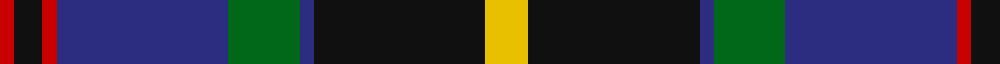

In pattern [RKRBGBKY](/patterns/rkrbgbky/).

This was sourced from register-of-tartans.  It is a [8 stripes tartan](/stripes/stripes8/).

Original link https://www.tartanregister.gov.uk/tartanDetails.aspx?ref=3650

## Attestations

This cloth appears in 2 source records; the oldest owns this page.

- 01/07/2006 — Sandberg of Greenock (Personal) (register-of-tartans, [record](https://www.tartanregister.gov.uk/tartanDetails.aspx?ref=3650))
- 2006 July — Sandberg of Greenock (Personal) (tartans-authority, [record](http://www.tartansauthority.com/tartan-ferret/display/6974/))

## Thread count
R/4 K8 R4 DB48 G20 DB4 K48 Y/12

## Palette
Each colour and its ΔE from the base-6 reference it is a variant of.

| Colour | Shade | Base | ΔE (OKLab) |
|---|---|---|---|
| DB | <code style="background-color:#2C2C80;">#2C2C80</code> `#2C2C80` | B <code style="background-color:#2C4084;">#2C4084</code> | 0.05 |
| G | <code style="background-color:#006818;">#006818</code> `#006818` | G <code style="background-color:#006400;">#006400</code> | 0.02 |
| K | <code style="background-color:#101010;">#101010</code> `#101010` | K <code style="background-color:#000000;">#000000</code> | 0.17 |
| R | <code style="background-color:#C80000;">#C80000</code> `#C80000` | R <code style="background-color:#C80000;">#C80000</code> | 0.00 |
| Y | <code style="background-color:#E8C000;">#E8C000</code> `#E8C000` | Y <code style="background-color:#E8C000;">#E8C000</code> | 0.00 |

# Sample pattern

## Nearest tartans

The nearest existing variants by ΔTartan distance.

1. [Scotch House 2000, antique](/setts/s8/b44r6b4r6b4k34ra36g8-b304080-g004010-k000000-rc00000-ra806050/) — ΔT 0.57
1. [MacRae Hunting #2](/setts/s9/g28k4g8r4g8k28b30k2w6-b5a008c-g006428-k101010-r960028-we0e0e0/) — ΔT 0.60
1. [Genet, Citizen (Commem)](/setts/s7/r8k36g48b32r4b4w4-b1c0070-g006818-k101010-rc80000-we0e0e0/) — ΔT 0.66
1. [MacLeod Clan Tartan Tartan Number: 1583. Earliest known date: 1831 This design appears in many early collections including Logans 'The Scottish Gael'(1831) and Smibert (1850). The sett has its source in the MacKenzie tartan used in 1777 by John MacKenzie called Lord MacLeod when he raised a regiment called 'Lord MacLeod's Highlanders'. The family claimed to be heirs of the last chief of Lewis, Roderick, who had died in 1595. (Tartans of Clan MacLeod. Rhuairidh MacLeod (1990).) This tartan was approved by Chief Norman Magnus, 26th Chief, in 1910, and has been the usual modern sett since then. The present Chief, John MacLeod, lives in Dunvegan Castle, Skye. See products available Copyright © Blair Urquhart, Comrie, 2015](/setts/s7/r6k4g30k20b40k4y4-b2c2c80-g006818-k101010-rc80000-ye8c000/) — ΔT 0.76
1. [Watson (Name)](/setts/s10/b48k4b4r4b4k40g32y4g4y6-b2c2c80-g006818-k101010-rc80000-ye8c000/) — ΔT 0.77
1. [MacLeod Small Clan Tartan Tartan Number: 15833. Earliest known date: See products available Copyright © Blair Urquhart, Comrie, 2015](/setts/s7/r2k2g14k10b20k2y2-b2c2c80-g006818-k101010-rc80000-ye8c000/) — ΔT 0.77
1. [McWilliams Wedding (Personal)](/setts/s9/g4b2k2b28ka4b2k24g20r4-b38409c-g006818-k101010-ka000000-rd40000/) — ΔT 0.79
1. [Colquhoun (Clan)](/setts/s7/b5k10b48k72w12g48r5-b1c1c50-g285800-k101010-rc80000-wfcfcfc/) — ΔT 0.79
1. [Curry (Personal)](/setts/s8/r6g4r12g40k30g6b36w4-b2c2c80-g00643c-k101010-rc80000-wfcfcfc/) — ΔT 0.81
1. [Ofally, County](/setts/s10/r12b4g10b36g20b4k56b4g20y6-b1c0070-g006818-k101010-rd05054-yd09800/) — ΔT 0.85

## Neighbour map

Every grey dot is one of 15726 variants placed by the first two principal components of the ΔTartan feature space (44% of its variance). Red is this tartan; blue dots are its nearest — click one to open its page.

<svg viewBox="0 0 640 380" role="img" style="max-width:100%;height:auto;border:1px solid #e0e0e0;border-radius:4px;display:block" xmlns="http://www.w3.org/2000/svg"><image href="/nn/cloud.v1.png" width="640" height="380"/><a href="/setts/s8/b44r6b4r6b4k34ra36g8-b304080-g004010-k000000-rc00000-ra806050/"><circle cx="163.4" cy="171.8" r="4" fill="#3465a4"><title>Scotch House 2000, antique</title></circle></a><a href="/setts/s9/g28k4g8r4g8k28b30k2w6-b5a008c-g006428-k101010-r960028-we0e0e0/"><circle cx="179.1" cy="162.8" r="4" fill="#3465a4"><title>MacRae Hunting #2</title></circle></a><a href="/setts/s7/r8k36g48b32r4b4w4-b1c0070-g006818-k101010-rc80000-we0e0e0/"><circle cx="166.2" cy="180.2" r="4" fill="#3465a4"><title>Genet, Citizen (Commem)</title></circle></a><a href="/setts/s7/r6k4g30k20b40k4y4-b2c2c80-g006818-k101010-rc80000-ye8c000/"><circle cx="180.1" cy="191.3" r="4" fill="#3465a4"><title>MacLeod Clan Tartan Tartan Number: 1583. Earliest known date: 1831 This design appears in many early collections including Logans 'The Scottish Gael'(1831) and Smibert (1850). The sett has its source in the MacKenzie tartan used in 1777 by John MacKenzie called Lord MacLeod when he raised a regiment called 'Lord MacLeod's Highlanders'. The family claimed to be heirs of the last chief of Lewis, Roderick, who had died in 1595. (Tartans of Clan MacLeod. Rhuairidh MacLeod (1990).) This tartan was approved by Chief Norman Magnus, 26th Chief, in 1910, and has been the usual modern sett since then. The present Chief, John MacLeod, lives in Dunvegan Castle, Skye. See products available Copyright © Blair Urquhart, Comrie, 2015</title></circle></a><a href="/setts/s10/b48k4b4r4b4k40g32y4g4y6-b2c2c80-g006818-k101010-rc80000-ye8c000/"><circle cx="188.3" cy="150.6" r="4" fill="#3465a4"><title>Watson (Name)</title></circle></a><a href="/setts/s7/r2k2g14k10b20k2y2-b2c2c80-g006818-k101010-rc80000-ye8c000/"><circle cx="191.7" cy="190.6" r="4" fill="#3465a4"><title>MacLeod Small Clan Tartan Tartan Number: 15833. Earliest known date: See products available Copyright © Blair Urquhart, Comrie, 2015</title></circle></a><a href="/setts/s9/g4b2k2b28ka4b2k24g20r4-b38409c-g006818-k101010-ka000000-rd40000/"><circle cx="191.7" cy="161.5" r="4" fill="#3465a4"><title>McWilliams Wedding (Personal)</title></circle></a><a href="/setts/s7/b5k10b48k72w12g48r5-b1c1c50-g285800-k101010-rc80000-wfcfcfc/"><circle cx="203.1" cy="178.6" r="4" fill="#3465a4"><title>Colquhoun (Clan)</title></circle></a><a href="/setts/s8/r6g4r12g40k30g6b36w4-b2c2c80-g00643c-k101010-rc80000-wfcfcfc/"><circle cx="159.2" cy="184.8" r="4" fill="#3465a4"><title>Curry (Personal)</title></circle></a><a href="/setts/s10/r12b4g10b36g20b4k56b4g20y6-b1c0070-g006818-k101010-rd05054-yd09800/"><circle cx="166.2" cy="160.0" r="4" fill="#3465a4"><title>Ofally, County</title></circle></a><circle cx="183.5" cy="167.2" r="5" fill="#c00000"/></svg>

ID: /setts/s8/y12k48b4g20b48r4k8r4-b2c2c80-g006818-k101010-rc80000-ye8c000/
