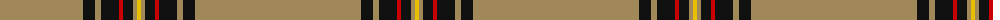
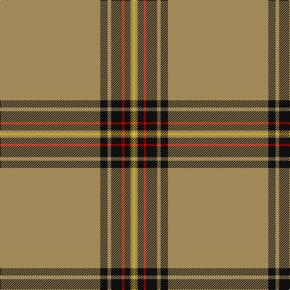

In pattern [YKYKRKYY](/patterns/ykykrkyy/).

This was sourced from register-of-tartans.  It is a [8 stripes tartan](/stripes/stripes8/).

Original link https://www.tartanregister.gov.uk/tartanDetails.aspx?ref=793

## Attestations

This cloth appears in 2 source records; the oldest owns this page.

- 01/05/2003 — Crane of Cluny Hunting (Personal) (register-of-tartans, [record](https://www.tartanregister.gov.uk/tartanDetails.aspx?ref=793))
- pre 2004 — Crane of Cluny Htg (Personal) (tartans-authority, [record](http://www.tartansauthority.com/tartan-ferret/display/6143/))

## Thread count
LT/166 K12 LT6 K18 R4 K10 LT4 Y/4

## Palette
Each colour and its ΔE from the base-6 reference it is a variant of.

| Colour | Shade | Base | ΔE (OKLab) |
|---|---|---|---|
| K | <code style="background-color:#101010;">#101010</code> `#101010` | K <code style="background-color:#000000;">#000000</code> | 0.17 |
| LT | <code style="background-color:#A08858;">#A08858</code> `#A08858` | Y <code style="background-color:#E8C000;">#E8C000</code> | 0.21 |
| R | <code style="background-color:#C80000;">#C80000</code> `#C80000` | R <code style="background-color:#C80000;">#C80000</code> | 0.00 |
| Y | <code style="background-color:#E8C000;">#E8C000</code> `#E8C000` | Y <code style="background-color:#E8C000;">#E8C000</code> | 0.00 |

# Sample pattern

## Nearest tartans

The nearest existing variants by ΔTartan distance.

1. [Reece (Name)](/setts/s7/w4y88b16y4b4y6r2-b2c2c80-rc80000-we0e0e0-ya08858/) — ΔT 1.32
1. [KIltwalk, The (Corporate)](/setts/s9/g4w4y8g10y10g92y14g2wa4-g604000-w98c8e8-wafcfcfc-ya08858/) — ΔT 1.72
1. [Glenlivet Dress Reproduction (Corp)](/setts/s8/g12r4g84b4g10w32g10b4-b2c2c80-g604000-rb03000-we0e0e0/) — ΔT 1.84
1. [Crail](/setts/s7/b140k3w16k3ba16k3ba16-b606060-ba381c0c-k000000-we0e0e0/) — ΔT 1.90
1. [Bro-Dreger](/setts/s7/w6k10y6r6y64k4y6-k101010-r880000-we0e0e0-yb0840c/) — ΔT 2.01
1. [Kinfauns Castle (Corporate)](/setts/s6/r8b24g4b4g92w2-b780078-g006818-rc80000-we0e0e0/) — ΔT 2.11
1. [Gairloch](/setts/s8/g48g2k18g2g18g4w4b4-b2c2c80-g808080-k101010-we0e0e0/) — ΔT 2.17
1. [Kozmyk (Corporate)](/setts/s7/y6g14b10g58ga3g8w2-b2c2c80-g604000-ga006818-we0e0e0-ye8c000/) — ΔT 2.20
1. [Glenlivet Dress Reproduction](/setts/s14/w32g10b4g84r4g12r4g84b4g10w32g10b4g10-b2c2c80-g604000-rb03000-we0e0e0/) — ΔT 2.20
1. [Morris (Welsh Name)](/setts/s8/b6b3y3b2y3b4y48b4-b202060-ye8c000/) — ΔT 2.20

## Neighbour map

Every grey dot is one of 15726 variants placed by the first two principal components of the ΔTartan feature space (44% of its variance). Red is this tartan; blue dots are its nearest — click one to open its page.

<svg viewBox="0 0 640 380" role="img" style="max-width:100%;height:auto;border:1px solid #e0e0e0;border-radius:4px;display:block" xmlns="http://www.w3.org/2000/svg"><image href="/nn/cloud.v1.png" width="640" height="380"/><a href="/setts/s7/w4y88b16y4b4y6r2-b2c2c80-rc80000-we0e0e0-ya08858/"><circle cx="589.0" cy="116.9" r="4" fill="#3465a4"><title>Reece (Name)</title></circle></a><a href="/setts/s9/g4w4y8g10y10g92y14g2wa4-g604000-w98c8e8-wafcfcfc-ya08858/"><circle cx="549.7" cy="110.7" r="4" fill="#3465a4"><title>KIltwalk, The (Corporate)</title></circle></a><a href="/setts/s8/g12r4g84b4g10w32g10b4-b2c2c80-g604000-rb03000-we0e0e0/"><circle cx="452.2" cy="137.3" r="4" fill="#3465a4"><title>Glenlivet Dress Reproduction (Corp)</title></circle></a><a href="/setts/s7/b140k3w16k3ba16k3ba16-b606060-ba381c0c-k000000-we0e0e0/"><circle cx="500.1" cy="109.8" r="4" fill="#3465a4"><title>Crail</title></circle></a><a href="/setts/s7/w6k10y6r6y64k4y6-k101010-r880000-we0e0e0-yb0840c/"><circle cx="470.1" cy="145.9" r="4" fill="#3465a4"><title>Bro-Dreger</title></circle></a><a href="/setts/s6/r8b24g4b4g92w2-b780078-g006818-rc80000-we0e0e0/"><circle cx="516.2" cy="137.7" r="4" fill="#3465a4"><title>Kinfauns Castle (Corporate)</title></circle></a><a href="/setts/s8/g48g2k18g2g18g4w4b4-b2c2c80-g808080-k101010-we0e0e0/"><circle cx="470.3" cy="146.4" r="4" fill="#3465a4"><title>Gairloch</title></circle></a><a href="/setts/s7/y6g14b10g58ga3g8w2-b2c2c80-g604000-ga006818-we0e0e0-ye8c000/"><circle cx="548.3" cy="145.2" r="4" fill="#3465a4"><title>Kozmyk (Corporate)</title></circle></a><a href="/setts/s14/w32g10b4g84r4g12r4g84b4g10w32g10b4g10-b2c2c80-g604000-rb03000-we0e0e0/"><circle cx="436.8" cy="115.2" r="4" fill="#3465a4"><title>Glenlivet Dress Reproduction</title></circle></a><a href="/setts/s8/b6b3y3b2y3b4y48b4-b202060-ye8c000/"><circle cx="473.9" cy="116.6" r="4" fill="#3465a4"><title>Morris (Welsh Name)</title></circle></a><circle cx="560.9" cy="93.6" r="5" fill="#c00000"/></svg>

ID: /setts/s8/y166k12y6k18r4k10y4ya4-k101010-rc80000-ya08858-yae8c000/
