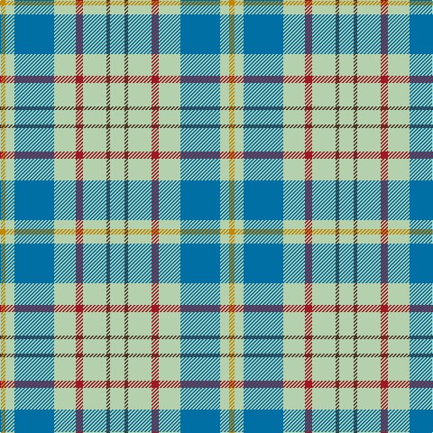

In pattern [YBYRYBYY](/patterns/ybyrybyy/).

This was sourced from house-of-tartan.  It is a [8 stripes tartan](/stripes/stripes8/).

Original link http://www.house-of-tartan.scotland.net/house/TartanViewjs.asp?colr=Def&tnam=2262

## Thread count
DY/6 N10 B44 N24 DR8 N26 T4 N/16

## Palette
Each colour and its ΔE from the base-6 reference it is a variant of.

| Colour | Shade | Base | ΔE (OKLab) |
|---|---|---|---|
| B | <code style="background-color:#0070A4;">#0070A4</code> `#0070A4` | B <code style="background-color:#2A418A;">#2A418A</code> | 0.13 |
| DR | <code style="background-color:#A01824;">#A01824</code> `#A01824` | R <code style="background-color:#CC0000;">#CC0000</code> | 0.09 |
| DY | <code style="background-color:#C48800;">#C48800</code> `#C48800` | Y <code style="background-color:#F2BF00;">#F2BF00</code> | 0.16 |
| LG | <code style="background-color:#6CAC84;">#6CAC84</code> `#6CAC84` | Y <code style="background-color:#F2BF00;">#F2BF00</code> | 0.21 |
| N | <code style="background-color:#B4D0AC;">#B4D0AC</code> `#B4D0AC` | Y <code style="background-color:#F2BF00;">#F2BF00</code> | 0.14 |
| T | <code style="background-color:#4C3428;">#4C3428</code> `#4C3428` | B <code style="background-color:#2A418A;">#2A418A</code> | 0.17 |

# Sample pattern

## Nearest tartans

The nearest existing variants by ΔTartan distance.

1. [MacPherson Dress Blue (Dance) #2](/setts/s7/w10r6w52g42w6g16y6-g408060-r800028-we0e0e0-ye8c000/) — ΔT 1.37
1. [Cornish National Day](/setts/s8/k10w4y72b94r6b94y72w4-b2888c4-k101010-rc80000-wfcfcfc-ye8c000/) — ΔT 1.38
1. [Manx Laxey (Blue)](/setts/s6/b8g32y4ba14b56w8-b6098b4-ba780078-g005834-we0e0e0-ye8c000/) — ΔT 1.49
1. [Supporter.com](/setts/s7/b60g9r7y12g33y33b26-b2888c4-g006818-rc80000-yfccc00/) — ΔT 1.50
1. [Roseberry (Name)](/setts/s6/w8b30g5w3ba8r5-b5c8ca8-ba2c2c80-g289c18-rc80000-we0e0e0/) — ΔT 1.53
1. [Milne dress green](/setts/s9/w28b6w28y2g40w30b6w14ba6-b3c82af-ba5a008c-g006428-we0e0e0-ye8c000/) — ΔT 1.55
1. [Bagpipe Shop (Switzerland)](/setts/s5/b100w30y30g10r10-b646464-g4ca412-rff0000-wf8f4d0-ya4a8a8/) — ΔT 1.58
1. [Bagpipe Shop (Corporate)](/setts/s5/b100w30wa30g10r10-b5c5c5c-g289c18-rc80000-we0e0e0-wac0c0c0/) — ΔT 1.59
1. [Manx Laxey](/setts/s6/b8g32y4ba14b56w8-b8080d0-ba800080-g008000-we0e0e0-yf0c000/) — ΔT 1.60
1. [Lennox Turquoise Dress District Tartan Tartan Number: 8190. Earliest known date: pre 2003 Families with the surname 'Lennox' are usually considered related to Clans Stewart or MacFarlane. Some of this surname also choose to wear the distinctive and ancient 'Lennox' tartan. D W Stewart reproduced the sett from a 'lost' portrait of the Countess of Lennox dating from the 16th century./Threadcount and colours aren't 100% original. Generated manually./ See products available Copyright © Blair Urquhart, Comrie, 2015](/setts/s7/b16ba4b48ba10w52k4w16-b5c8ca8-ba2c2c80-k101010-we0e0e0/) — ΔT 1.61

## Neighbour map

Every grey dot is one of 15726 variants placed by the first two principal components of the ΔTartan feature space (44% of its variance). Red is this tartan; blue dots are its nearest — click one to open its page.

<svg viewBox="0 0 640 380" role="img" style="max-width:100%;height:auto;border:1px solid #e0e0e0;border-radius:4px;display:block" xmlns="http://www.w3.org/2000/svg"><image href="/nn/cloud.v1.png" width="640" height="380"/><a href="/setts/s7/w10r6w52g42w6g16y6-g408060-r800028-we0e0e0-ye8c000/"><circle cx="261.8" cy="190.2" r="4" fill="#3465a4"><title>MacPherson Dress Blue (Dance) #2</title></circle></a><a href="/setts/s8/k10w4y72b94r6b94y72w4-b2888c4-k101010-rc80000-wfcfcfc-ye8c000/"><circle cx="294.0" cy="138.8" r="4" fill="#3465a4"><title>Cornish National Day</title></circle></a><a href="/setts/s6/b8g32y4ba14b56w8-b6098b4-ba780078-g005834-we0e0e0-ye8c000/"><circle cx="270.7" cy="179.0" r="4" fill="#3465a4"><title>Manx Laxey (Blue)</title></circle></a><a href="/setts/s7/b60g9r7y12g33y33b26-b2888c4-g006818-rc80000-yfccc00/"><circle cx="206.9" cy="215.9" r="4" fill="#3465a4"><title>Supporter.com</title></circle></a><a href="/setts/s6/w8b30g5w3ba8r5-b5c8ca8-ba2c2c80-g289c18-rc80000-we0e0e0/"><circle cx="233.2" cy="179.0" r="4" fill="#3465a4"><title>Roseberry (Name)</title></circle></a><a href="/setts/s9/w28b6w28y2g40w30b6w14ba6-b3c82af-ba5a008c-g006428-we0e0e0-ye8c000/"><circle cx="295.3" cy="143.2" r="4" fill="#3465a4"><title>Milne dress green</title></circle></a><a href="/setts/s5/b100w30y30g10r10-b646464-g4ca412-rff0000-wf8f4d0-ya4a8a8/"><circle cx="276.7" cy="187.7" r="4" fill="#3465a4"><title>Bagpipe Shop (Switzerland)</title></circle></a><a href="/setts/s5/b100w30wa30g10r10-b5c5c5c-g289c18-rc80000-we0e0e0-wac0c0c0/"><circle cx="273.5" cy="187.4" r="4" fill="#3465a4"><title>Bagpipe Shop (Corporate)</title></circle></a><a href="/setts/s6/b8g32y4ba14b56w8-b8080d0-ba800080-g008000-we0e0e0-yf0c000/"><circle cx="269.5" cy="173.7" r="4" fill="#3465a4"><title>Manx Laxey</title></circle></a><a href="/setts/s7/b16ba4b48ba10w52k4w16-b5c8ca8-ba2c2c80-k101010-we0e0e0/"><circle cx="247.5" cy="177.1" r="4" fill="#3465a4"><title>Lennox Turquoise Dress District Tartan Tartan Number: 8190. Earliest known date: pre 2003 Families with the surname 'Lennox' are usually considered related to Clans Stewart or MacFarlane. Some of this surname also choose to wear the distinctive and ancient 'Lennox' tartan. D W Stewart reproduced the sett from a 'lost' portrait of the Countess of Lennox dating from the 16th century./Threadcount and colours aren't 100% original. Generated manually./ See products available Copyright © Blair Urquhart, Comrie, 2015</title></circle></a><circle cx="259.1" cy="182.2" r="5" fill="#c00000"/></svg>

ID: /setts/s8/y16b4y26r8y24ba44y10ya6-b4c3428-ba0070a4-ra01824-yb4d0ac-yac48800/
