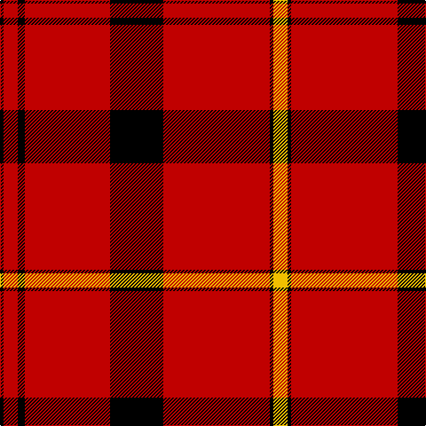

In pattern [KRKRKRKY](/patterns/krkrkrky/).

This was sourced from weddslist.  It is a [8 stripes tartan](/stripes/stripes8/).

Original link http://www.weddslist.com/cgi-bin/tartans/pg.pl?source=sts

## Thread count
K/4 R16 K8 R96 K60 R120 K4 Y/16

## Palette
Each colour and its ΔE from the base-6 reference it is a variant of.

| Colour | Shade | Base | ΔE (OKLab) |
|---|---|---|---|
| K | <code style="background-color:#000000;">#000000</code> `#000000` | K <code style="background-color:#000000;">#000000</code> | 0.00 |
| R | <code style="background-color:#C00000;">#C00000</code> `#C00000` | R <code style="background-color:#C80000;">#C80000</code> | 0.02 |
| Y | <code style="background-color:#F0C000;">#F0C000</code> `#F0C000` | Y <code style="background-color:#E8C000;">#E8C000</code> | 0.01 |

# Sample pattern

## Nearest tartans

The nearest existing variants by ΔTartan distance.

1. [Oilmens (Corporate)](/setts/s8/y16k4r120k60r96k8r16k4-k101010-rc80000-ye8c000/) — ΔT 0.91
1. [Duke of Sussex](/setts/s7/r36g2k10g2k2g2r18-g289c18-k000000-rc80000/) — ΔT 1.03
1. [Knights Templar Hunting](/setts/s8/k44w2k24r86w2r86k24w2-k101010-rc80000-wf8f8f8/) — ΔT 1.16
1. [Aberdeen F. C. (2002) (Sports)](/setts/s8/k8r8y4r82k8r8k24w4-k101010-rc80000-wfcfcfc-yfccc00/) — ΔT 1.47
1. [Aberdeen Football Club (2002)](/setts/s8/k8r8y4r82k8r8k24w4-k101010-rdc0000-we0e0e0-ye8c000/) — ΔT 1.51
1. [Stuart of Bute](/setts/s9/r12g6k1g2k1g1k6r24w2-g004c00-k000000-rc80000-wd0d0d0/) — ΔT 1.52
1. [Oilmens](/setts/s14/r16k8r96k60r120k4y16k4r120k60r96k8r16k4-k101010-rc80000-ye8c000/) — ΔT 1.60
1. [Lougheed](/setts/s8/w12r12k16w8r72k4r8k8-k101010-r880000-we8ccb8/) — ΔT 1.60
1. [Barkwell (Personal)](/setts/s8/r40k2y6k2r120k60r96k8-k101010-rc80000-yfccc00/) — ΔT 1.60
1. [Virgin](/setts/s8/r102ra4r12k20r4k8ra6k6-k101010-re80000-ra888888/) — ΔT 1.61

## Neighbour map

Every grey dot is one of 15726 variants placed by the first two principal components of the ΔTartan feature space (44% of its variance). Red is this tartan; blue dots are its nearest — click one to open its page.

<svg viewBox="0 0 640 380" role="img" style="max-width:100%;height:auto;border:1px solid #e0e0e0;border-radius:4px;display:block" xmlns="http://www.w3.org/2000/svg"><image href="/nn/cloud.v1.png" width="640" height="380"/><a href="/setts/s8/y16k4r120k60r96k8r16k4-k101010-rc80000-ye8c000/"><circle cx="495.8" cy="146.6" r="4" fill="#3465a4"><title>Oilmens (Corporate)</title></circle></a><a href="/setts/s7/r36g2k10g2k2g2r18-g289c18-k000000-rc80000/"><circle cx="491.4" cy="159.5" r="4" fill="#3465a4"><title>Duke of Sussex</title></circle></a><a href="/setts/s8/k44w2k24r86w2r86k24w2-k101010-rc80000-wf8f8f8/"><circle cx="451.0" cy="138.6" r="4" fill="#3465a4"><title>Knights Templar Hunting</title></circle></a><a href="/setts/s8/k8r8y4r82k8r8k24w4-k101010-rc80000-wfcfcfc-yfccc00/"><circle cx="438.6" cy="122.7" r="4" fill="#3465a4"><title>Aberdeen F. C. (2002) (Sports)</title></circle></a><a href="/setts/s8/k8r8y4r82k8r8k24w4-k101010-rdc0000-we0e0e0-ye8c000/"><circle cx="436.7" cy="119.2" r="4" fill="#3465a4"><title>Aberdeen Football Club (2002)</title></circle></a><a href="/setts/s9/r12g6k1g2k1g1k6r24w2-g004c00-k000000-rc80000-wd0d0d0/"><circle cx="400.5" cy="120.8" r="4" fill="#3465a4"><title>Stuart of Bute</title></circle></a><a href="/setts/s14/r16k8r96k60r120k4y16k4r120k60r96k8r16k4-k101010-rc80000-ye8c000/"><circle cx="504.2" cy="131.4" r="4" fill="#3465a4"><title>Oilmens</title></circle></a><a href="/setts/s8/w12r12k16w8r72k4r8k8-k101010-r880000-we8ccb8/"><circle cx="424.0" cy="157.4" r="4" fill="#3465a4"><title>Lougheed</title></circle></a><a href="/setts/s8/r40k2y6k2r120k60r96k8-k101010-rc80000-yfccc00/"><circle cx="563.7" cy="134.9" r="4" fill="#3465a4"><title>Barkwell (Personal)</title></circle></a><a href="/setts/s8/r102ra4r12k20r4k8ra6k6-k101010-re80000-ra888888/"><circle cx="520.6" cy="120.6" r="4" fill="#3465a4"><title>Virgin</title></circle></a><circle cx="474.3" cy="140.8" r="5" fill="#c00000"/></svg>

ID: /setts/s8/y16k4r120k60r96k8r16k4-k000000-rc00000-yf0c000/
