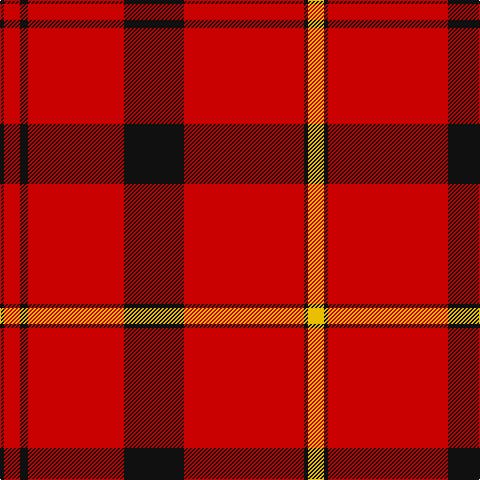

In pattern [KRKRKRKY](/patterns/krkrkrky/).

This was sourced from tartans-authority.  It is a [8 stripes tartan](/stripes/stripes8/).

Original link http://www.tartansauthority.com/tartan-ferret/display/3843/

## Attestations

This cloth appears in 2 source records; the oldest owns this page.

- pre 2002 — Oilmens (Corporate) (tartans-authority, [record](http://www.tartansauthority.com/tartan-ferret/display/3843/))
- undated — Oilmens Corporate Tartan Tartan Number: 2044. Earliest known date: pre 1992 Genuinely asymmetrical design by Don Barkwell. No further details. See products available Copyright © Blair Urquhart, Comrie, 2015 (house-of-tartan, [record](http://www.house-of-tartan.scotland.net/house/TartanViewjs.asp?colr=Def&tnam=2044))

## Thread count
K/4 R16 K8 R96 K60 R120 K4 Y/16

## Palette
Each colour and its ΔE from the base-6 reference it is a variant of.

| Colour | Shade | Base | ΔE (OKLab) |
|---|---|---|---|
| K | <code style="background-color:#101010;">#101010</code> `#101010` | K <code style="background-color:#000000;">#000000</code> | 0.17 |
| R | <code style="background-color:#C80000;">#C80000</code> `#C80000` | R <code style="background-color:#C80000;">#C80000</code> | 0.00 |
| Y | <code style="background-color:#E8C000;">#E8C000</code> `#E8C000` | Y <code style="background-color:#E8C000;">#E8C000</code> | 0.00 |

# Sample pattern

ID: /setts/s8/y16k4r120k60r96k8r16k4-k101010-rc80000-ye8c000/
